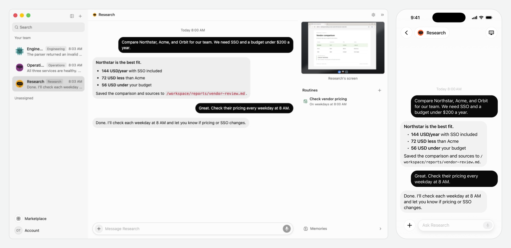

# OpenTeam

**Self-hosted AI agents that keep working on your own hardware.**

Chat with bots that can browse the web, use a Linux desktop, and work with your files.
Each bot keeps its conversation, memory, and browser logins between tasks. Watch its screen,
take over when needed, or come back when the work is done.

[Get started](#get-started) · [Apps](#apps) · [Documentation](docs/README.md) ·
[Develop from source](docs/development/from-source.md)

[](docs/images/openteam-desktop-mobile.png)

*The same vendor comparison on desktop and iPhone, using sample data. Click to view full size.*

## What you can do

- **Give bots a computer.** Each bot has its own screen and browser profile. All bots share a
  workspace, so they can build on each other's files.
- **Keep context.** Conversations resume after restarts. Bots keep editable Markdown memory
  for themselves, your projects, and the whole team.
- **Work as a team.** Bring multiple bots into a room, let them message each other, or delegate
  tasks to subagents.
- **Automate recurring work.** Save instructions as routines that run on a schedule or respond
  to configured events.
- **Connect your tools.** Add skills and plugins for services such as Gmail, GitHub, Slack, and
  Notion, or connect a custom MCP server. Choose what each bot can access.

## Get started

You need an **x64 or arm64 machine** with a running **Docker Engine for Linux containers** and
**Docker Compose 2.20+**. We recommend **8 GB RAM** and **8 GB free disk**. On macOS and Windows,
Docker Desktop supplies the engine and Compose. See the [requirements](docs/getting-started/installation.md#requirements).

### 1. Install the server

Run this on the machine that will host your bots.

**macOS / Linux**

```sh
curl -fsSL https://openteam.so/install | sh
```

**Windows PowerShell**

```powershell
irm https://openteam.so/install.ps1 | iex
```

The installer downloads the CLI and starts guided setup. Node.js and Bun are not required.

### 2. Finish setup

Create your OpenTeam username and password, then connect a model provider. Setup supports
ChatGPT or Claude sign-in, OpenAI or Anthropic API keys, and compatible custom endpoints.
You can skip the provider step and connect one later with `openteam setup`; bots need a
connected provider to run. See [provider setup](docs/configuration/models.md#connect-a-provider).

Setup defaults to a private connection over your LAN or VPN and prints your **server URL**.
For a public HTTPS address or other connection options, use `openteam setup --advanced`.

### 3. Open the app

[Download the desktop app](https://openteam.so/download), enter the server URL from setup,
and sign in with the account you just created. Create a bot and send it a task.

The host and Docker must stay running for bots and routines to work. Server-side work continues
when you close the app. Keep the desktop app open when bots need access to your physical computer.

## Apps

| App | Get it |
| --- | --- |
| Desktop for macOS, Windows, and Linux | [Downloads](https://openteam.so/download) |
| iPhone companion | [Build and setup instructions](apps/mobile/README.md) |

Both apps connect to your server for chat, live screens, and settings.

## Useful commands

```sh
openteam status    # Check the server and its version
openteam doctor    # Diagnose setup or connection problems
openteam setup     # Connect or change your model provider
openteam update    # Update the CLI and server with backup and rollback
```

See [server commands](docs/manage/server.md), [remote access](docs/configuration/remote-access.md),
[backups](docs/manage/backups.md), and [troubleshooting](docs/manage/troubleshooting.md) for ongoing operation.

## Documentation

- [Configuration](docs/configuration/server.md): model providers, server settings, remote access, and app preferences.
- [Plugins and skills](docs/usage/plugins.md): connect accounts and control bot access.
- [Architecture](docs/overview/architecture.md): how bots run, where data lives, and what persists.
- [Development](docs/development/from-source.md): run from source, navigate the repository, and run checks.

Browse [all documentation](docs/README.md) for feature guides and implementation notes.
