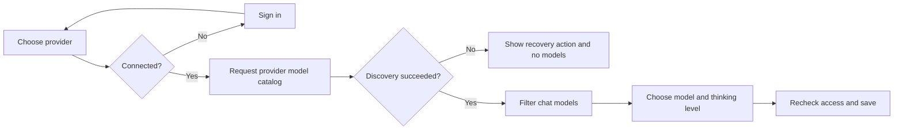

# Provider-first model selection

The chat registry contains Anthropic, OpenAI API access, OpenAI ChatGPT subscription access, and
explicitly configured custom endpoints. Credentials stay with their provider. Transcription has
separate endpoint settings and credentials.



## Discovery protocols

| Provider | Discovery | Authentication |
| --- | --- | --- |
| OpenAI API | `https://api.openai.com/v1/models` | API key as Bearer token |
| Anthropic | `https://api.anthropic.com/v1/models` | API key and API version, or supported OAuth headers |
| ChatGPT subscription | Codex account model catalog | ChatGPT OAuth; separate from API-key access |
| OpenAI-compatible custom | `<base-url>/models` | Saved credential, or explicit `--no-auth` |
| Google-compatible custom | `<base-url>/models` with `/v1beta` base | Saved API key |

[OpenAI documents its model-list API](https://developers.openai.com/api/reference/resources/models/methods/list).
[Anthropic documents its paginated catalog and capability metadata](https://platform.claude.com/docs/en/api/models/list).
The [Codex implementation](https://github.com/openai/codex/blob/main/codex-rs/codex-api/src/endpoint/models.rs)
uses a separate subscription model endpoint.
[Ollama](https://docs.ollama.com/api/openai-compatibility),
[LM Studio](https://lmstudio.ai/docs/developer/openai-compat/models), and
[vLLM](https://docs.vllm.ai/en/latest/serving/online_serving/openai_compatible_server/)
offer OpenAI-compatible APIs. [Google documents its model-list format and pagination](https://ai.google.dev/api/models).

## Failure behavior and limits

- Disconnected providers remain available to connect, with no selectable models.
- Authentication errors, unavailable endpoints, malformed responses, timeouts, and invalid
  pagination show a recovery message. A failure in one provider does not hide another's models.
- Listing never falls back to the bundled catalog. It does not change the saved model or issue
  inference requests. Switching rechecks current access; newly discovered model definitions are
  saved so the runtime can load them after restarting.
- Known retired subscription models stay excluded. Hidden subscription catalog entries stay hidden.
- Capabilities take precedence when identifying chat versus transcription. Otherwise the registry
  uses known model families. Opaque custom IDs inherit the purpose of the endpoint the user added;
  model-list APIs cannot reliably prove every model's task or tool support.
- Provider-reported access does not prove quota, billing, generation success, or tool support.
  `openteam doctor` performs a real inference probe. Listing itself has no generation charges.
- Chat discovery must be supported by the endpoint. Transcription retains manual model entry for
  audio servers without a model-list endpoint.
- `--no-auth` uses no account credential. The OpenAI SDK sends the nonsecret placeholder
  `openteam-no-auth` on inference requests; discovery sends no Authorization header.

## Delegated Task configuration

Task workers inherit the parent's actual model and reasoning level. Browser and desktop work
use one `computerUse` worker by default, with structured browser tools, desktop controls,
Shell and Read. Existing `browserUse` sessions remain resumable. Child workers cannot launch
nested Tasks. Background execution is the default; `run_in_background: false` waits for the
result. Resume retains the worker's model, reasoning, session and graphical mode.

The authenticated owner API `GET /api/server-settings/tasks` returns the database-backed
configuration. `PATCH` replaces it. There is no environment-variable configuration or separate
Task settings screen. The default is:

```json
{ "combinedComputerUse": true, "executorProfiles": [] }
```

With no executor profiles, Task has no model parameter. To offer named effort levels, configure
profiles using provider/model IDs already available in the deployment:

```json
{
  "combinedComputerUse": true,
  "executorProfiles": [
    {
      "name": "quick",
      "description": "Small, well-defined jobs",
      "providerId": "YOUR_CONFIGURED_PROVIDER_ID",
      "modelId": "YOUR_AVAILABLE_MODEL_ID",
      "reasoning": "low"
    }
  ],
  "defaultExecutorProfile": "quick"
}
```

The server checks every profile against the inference service before saving. Task then exposes
`model` as an enum of profile names. It selects an effort level for new executors only; other
worker types and resumed workers ignore it. Omitting it selects the configured default profile,
or inherits the parent model if there is no default. Unknown profile names fail explicitly.
Configuration is snapshotted for each run, including prompt refresh after compaction; changing
settings does not change an active parent's advertised profiles or Task selection.

Set `combinedComputerUse` to `false` for separate `browserUse` and `computerUse` workers.
The Task schema, available-types context, worker prompts and tool surfaces follow that mode.
The worker also queries the authenticated computer capability endpoint at each run. Graphical
workers appear only when the desktop stack and box are available. Disabling any `BROWSER_*`,
`OPENAI_COMPUTER_USE`, `SHELL`, or `READ` identifier selects split mode and removes the disabled
tools from graphical workers. Optional database settings `graphicalAvailable: false` and
`disabledToolIdentifiers: ["BROWSER_CDP"]` allow operator overrides. Child records preserve
their launch configuration across resume; this includes legacy browser workers. Nested tasks
remain unavailable. Combined workers use browser tools for page interaction and Computer for
native UI or a demonstrated technical browser limitation; permission denials never justify
changing tools to bypass a restriction.

Apply the database schema and rebuild server, worker, computer and desktop when updating.

## Validation

After building the computer image, run
`bash scripts/test-computer-image.sh IMAGE` to check its authenticated capability
endpoint in an isolated container. The check uses the packaged gateway and desktop
binaries, without user volumes, credentials, or inference requests. The release
workflow runs this check against the published computer image before completing
the release.

`apps/computer/test/chat-provider-registry.test.ts` covers authentication isolation, disconnected
providers, rejected access, response failures, pagination, retirement, and model-type filtering.
`provider-registry.integration.test.ts` runs the actual provider CLI and Pi runtime against a local
HTTP server with isolated credentials. It adds an empty custom provider, discovers and selects a
model, restarts, completes an inference request, and verifies access revocation.

CLI tests cover provider-first keyboard navigation, sign-in handoff, preserved drafts, grouped
output, and terminal sizes. `bun run preview:model --gallery ../../output/model-ui` from `apps/cli`
renders the terminal states for visual review.
