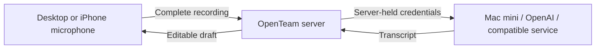

# Voice notes

Desktop and iPhone record a complete voice note and send it to the OpenTeam server. The server calls the selected transcription provider and returns text to the composer. Both clients also offer an explicit “Transcribe and send” action. Recording does not stream audio or use Apple speech recognition.

On desktop, recording shows a stop/timer/waveform pill inside the composer. Click the pill or press Enter to stop and review the transcript in your draft; click the arrow to transcribe and send. Escape cancels recording or transcription. With the draft focused, tap ⌘D (Ctrl+D on Windows/Linux) to toggle dictation, or hold it for at least half a second and release to stop. A second Enter during transcription requests sending when the transcript arrives. Failed transcription retains the audio for retry; retry returns text to the draft for review.

On iPhone, the text field and keyboard stay visible during recording. A red stop/timer pill returns the transcript to the draft; the arrow transcribes and sends. The left-hand cancel button discards the recording or pending transcription. The microphone remains available alongside Send when the draft already contains text, so you can dictate more than once. Main conversations and thread replies use the same server configuration on both platforms; opening a thread cancels recording in the main composer.

Dictation inserts at the cursor or replaces selected text. Desktop preserves existing mention tokens. The agent receives the submitted draft through the normal text-message path, including its usual timestamp, reply and mention context. No extra language-model rewrite is applied to transcription. Recognition can still mishear words; review names, numbers and consequential instructions before sending.



## Configure

In the desktop app, open **Settings → Server → Transcription**. Settings apply to every client connected to that server.

1. Choose **Custom / OpenAI-compatible** or **OpenAI**.
2. Enter the full base URL (including `/v1` when the provider uses it), model ID, and API key if required. OpenAI uses `https://api.openai.com/v1` and defaults to `whisper-1`; you can enter another transcription model supported by that endpoint.
3. Leave language blank for automatic detection, or enter a supported language code.
4. Enable voice notes, save, then use **Test connection**.

The microphone stays visible and greyed out while transcription is disabled, missing, or invalid. Older servers that do not report transcription capability also leave it disabled. Connected clients pick up configuration changes on their runtime refresh (approximately 30 seconds); reopening the app refreshes its initial state.

On desktop, **Settings → General → System → Microphone** selects System Default or a specific input. The choice is saved on that computer and shared across its app windows; it is independent of the server and its transcription provider. The device list refreshes when microphones connect or disconnect. If the selected input becomes unavailable, recording tries the system default once and shows a notice, keeping your preference for when that input reconnects. Permission denial does not trigger fallback. Recordings request echo cancellation, noise suppression, and automatic gain control.

**Test microphone** shows a local input-level meter without recording a file or uploading audio. It works before transcription is configured. The test requests microphone access only when clicked and stops after 30 seconds, when cancelled, when settings close or the app becomes hidden, when the input choice changes, or when the microphone disconnects. Missing hardware and denied access have separate recovery messages. Doctor checks the server/provider; use this local test to check each desktop's microphone.

Use an address reachable **from the OpenTeam server**. If OpenTeam runs in Docker, `localhost` refers to the container, not the Mac. A reachable LAN or Tailscale address works, for example `http://100.x.y.z:18080/v1`. Only the OpenTeam server needs connectivity to that service. The phone continues using its normal OpenTeam URL.

The custom provider contract is `POST <baseUrl>/audio/transcriptions` with multipart `file`, `model`, `response_format=json`, optional `language`, and optional Bearer authentication. It must return `{ "text": "..." }` and accept the clients' WAV and WebM recordings. Services with different protocols require a separate adapter; an arbitrary transcription API URL is not sufficient. See [OpenAI speech-to-text documentation](https://developers.openai.com/api/docs/guides/speech-to-text).

## Self-host on an Apple silicon Mac

The included `scripts/transcription/serve_mlx.py` serves one model using [MLX Audio](https://github.com/Blaizzy/mlx-audio). The default is `mlx-community/parakeet-tdt-0.6b-v3`. Run it natively on macOS for Metal acceleration. The Parakeet helper detects language automatically; the general provider language setting is intended for providers that support a language hint.

Requirements: Apple silicon, Python 3.12+, ffmpeg, and enough memory for the model. From the repository root:

```sh
python3.12 -m venv ~/.local/share/openteam/transcription/.venv
~/.local/share/openteam/transcription/.venv/bin/pip install -r scripts/transcription/requirements.txt
python3.12 -c 'from pathlib import Path; import secrets; p=Path.home()/".local/share/openteam/transcription/api-key"; p.touch(mode=0o600, exist_ok=False); p.write_text(secrets.token_urlsafe(48))'
~/.local/share/openteam/transcription/.venv/bin/python scripts/transcription/serve_mlx.py \
  --host 127.0.0.1 --port 18080 \
  --api-key-file ~/.local/share/openteam/transcription/api-key
```

Install ffmpeg first if needed (`brew install ffmpeg`). The key-generation command intentionally refuses to replace an existing key. Copy the generated key into the password field in Transcription settings, without committing it or putting it in chat. To accept server connections from another machine or a container, replace `127.0.0.1` with the Mac's reachable private interface address. Use HTTPS if traffic is not already protected by a private encrypted network.

The helper loads the model before serving requests, authenticates every endpoint, exposes `/health` and `/v1/models`, and accepts one note at a time. It normalizes audio using ffmpeg and deletes its temporary files afterward. Requests cannot choose a different model or invoke model-management endpoints. For persistent hosting, run the same command using launchd with absolute paths and a PATH containing ffmpeg. The first start may download missing model files; later starts reuse the Hugging Face cache.

## Doctor and operating limits

`openteam doctor` includes a **Voice notes / Transcription** check. It reads the configured provider through the server using the installation control token and checks that the model is discoverable from the server's network. No microphone, audio upload, or billed transcription is used for diagnostics.

- Not configured or disabled: warning; the rest of OpenTeam still works.
- Listed model and valid connection: pass. This verifies discovery, not transcription quality.
- Discovery unsupported (404/405) or model not listed: warning; try a note to verify a service that loads models on demand.
- Invalid credentials, unreachable endpoint, or corrupt settings: failure with a corrective message.

Clients stop recordings at five minutes and reject notes shorter than half a second. The server accepts at most 25 MiB per recording, two concurrent notes, and a two-minute upload/transcription deadline. The MLX helper independently enforces the five-minute duration and serializes GPU use; a second request receives a retryable busy error.

Stopping produces a transcript for review; cancellation discards the recording and aborts the request. A provider may finish computation already in progress after cancellation, but its late result is ignored. Failed transcriptions retain the recording for explicit retry or discard. Navigating away discards it. iPhone cancels active recording when backgrounded or interrupted.

Audio is not stored as a chat attachment. Desktop keeps it in memory; iPhone uses a temporary file removed on success, cancellation, or navigation (abandoned files older than a day are removed before a new recording). The OpenTeam server holds audio in memory only; the Mac helper uses temporary decode files. A selected external provider has its own retention policy.

Settings are stored in `transcription.json` within the server's agent-data volume. API keys are encrypted with a key derived from `OPENTEAM_AUTH_SECRET` (or its supported `BETTER_AUTH_SECRET` fallback), and the file is written atomically with mode 0600. Back up the auth secret with the volume. Changing that secret requires saving the transcription key again. Changing the provider or base URL clears the old key instead of forwarding it to a new endpoint. API responses expose only whether a key is saved.
