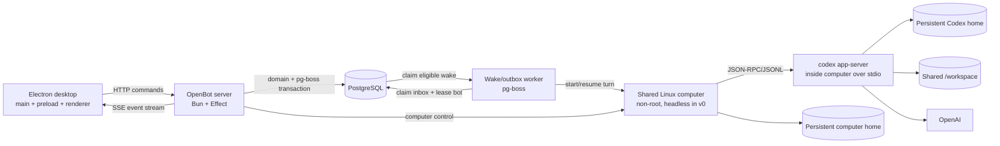

# System architecture

> Implementation update (2026-08-24): `apps/computer` now includes the per-bot Xvfb/noVNC `ScreenBroker`, Chromium, Thunar, terminal, and agent/human input controls described in `20-graphical-computer-implementation.md`. References below to a headless-only v0 describe the initial boundary.

Status: proposed for MVP v0  
Last updated: 2026-08-24

## Shape of the system



The desktop is intentionally thin. The server owns bot state, turn serialization, event persistence, approvals, and computer coordination. One headless Linux computer belongs to the installation's implicit user. All bots share its durable filesystem while retaining separate conversation context. Closing Electron does not stop a run. Graphical apps and bot-specific screens are added behind the same computer boundary after v0.

## Proposed monorepo

```text
OpenBot/
  apps/
    desktop/
      src/main/          Electron main process + privileged host bridge
      src/preload/       narrow typed IPC bridge
      src/renderer/      React 19 desktop UI + OpenBot client
        client/          HTTP transport, typed commands, and SSE adapter
        state/           React-facing snapshot and mutation state
        components/
          ai-elements/   pinned copied AI Elements source
          ui/            shadcn primitives
          openbot/       bot rail, activity inspector, product forms
    server/
      src/main.ts        HTTP and SSE endpoints
      src/app-service.ts lifecycle and domain-service facade
      src/services/      bot, channel, run, screen, snapshot, and native-tool domains
    worker/
      src/               pg-boss wake, outbox, and recovery workers
    computer/
      src/gateway/       TypeScript control/health gateway inside the Linux image
      image/             v0 runner image; later desktop packages
  packages/
    api/                 shared Effect Schema request/event contracts
    codex-client/        typed app-server JSON-RPC adapter
    config/              validated environment/config layers
    db/                  Prisma schema, client, migrations
    domain/              entities, errors, and Effect service interfaces
    plugin-manifest/     post-v0; not scaffolded in v0
    plugin-registry/     post-v0; not scaffolded in v0
    connector-runtime/   post-v0; not scaffolded in v0
    connection-broker/   post-v0; not scaffolded in v0
    tool-policy/         post-v0; not scaffolded in v0
    native-tools/        post-v0 delivery/state/tool-discovery adapters
    artifacts/           post-v0 immutable file/image normalization
    agent-mailbox/       durable v0 inbox/wake contracts; peer/group channels extend it later
    ui/                  shared OpenBot tokens and framework-neutral view contracts
  infra/
    docker/              image and entrypoint assets
  plans/
  docker-compose.yml
  package.json
  bun.lock
  bunfig.toml
  turbo.json
  tsconfig.json
```

The first protocol spike may run the Codex child directly under `apps/server`, but the v0 Compose contract moves execution into `apps/computer`. This gives the replaceable Linux image, shared home, workspace, and Codex process an explicit lifecycle. The post-v0 graphical milestone extends this image with displays, Chrome/Chromium, Thunar, terminal, and screen streaming without changing bot or conversation persistence.

The post-v0 packages shown above are reserved boundaries, not folders required in the initial scaffold. Create a package only when its milestone begins. Their selected architectures are in `11-plugin-architecture-research.md` through `15-agent-group-chat-runtime.md`.

## Process responsibilities

### Electron main process

- owns the native window, app lifecycle, menu, and deep links;
- owns native-only capabilities and keeps privileged values out of renderer code;
- validates renderer IPC through a narrow preload API;
- never gets direct database or Codex process access;

### Renderer

- displays bots, conversations, run items, approvals, and runtime state;
- composes pinned source-owned AI Elements with OpenBot shell components and shadcn primitives;
- maps the versioned OpenBot transcript/run-item union into component props through one pure adapter;
- sends idempotent commands through the server API;
- owns the HTTP/SSE connection lifecycle and reconnects after focus, sleep, or restart;
- stores renderer-only, non-secret preferences such as theme and last-opened channel;
- treats streamed deltas as provisional and completed items as authoritative;
- does not call a model, AI Gateway, Codex process, database, filesystem, or shell directly;
- does not contain agent orchestration logic.

### OpenBot server

- is the source of truth for product-level bot and conversation state;
- exposes versioned JSON endpoints and a replayable SSE stream;
- serializes turns so a conversation has at most one active turn;
- owns Prisma transactions and idempotency;
- commits durable inbox events and pg-boss wake jobs atomically;
- supervises or coordinates the Codex app-server process on the shared computer;
- maps Codex requests/events to durable OpenBot runs, items, and approvals;
- provisions organizational bot folders within the shared workspace;
- continues running with no desktop connected.

### Wake/outbox worker

- runs pg-boss workers for fixed infrastructure queues rather than creating one queue per bot;
- treats `InboxEvent` as the authoritative mailbox and pg-boss as the wake/lease mechanism;
- acquires the strict bot run lease before starting or resuming a turn;
- supports low-latency `LISTEN/NOTIFY` with polling fallback, retries, heartbeats, and dead letters;
- writes visible/tool delivery through idempotent transactional outbox records;
- may run on pinned Bun only after its pg-boss contract suite passes; otherwise only this service uses Node 22 while all source remains TypeScript in the Bun monorepo.

### Shared computer service

- runs one non-root Linux user for the installation;
- exposes the shared persistent home and `/workspace` to every bot;
- provides the pinned Codex runtime plus shell/file execution in v0;
- gains Chrome/Chromium, Thunar, a terminal, graphical-session infrastructure, bot-screen leases, streaming, and human takeover only in the post-v0 graphical milestone;
- can be rebuilt while its durable home/workspace volumes remain;
- never claims that bot screens isolate files, cookies, logins, or command-line credentials.

### Codex adapter

- starts the pinned `codex app-server` binary over stdio;
- performs the initialize/initialized handshake once per process;
- correlates request IDs and server-initiated requests;
- exposes Effect services rather than JSON-RPC details to the domain layer;
- converts generated protocol types into stable OpenBot domain events;
- rejects unrecognized protocol messages safely and records diagnostics without secrets.

### PostgreSQL

- stores bots, conversations, messages, turns/runs, approvals, runtime metadata, and idempotency records;
- supports ordered event replay to reconnecting clients;
- stores the OpenBot inbox/outbox/run-lease records plus the independently migrated pg-boss schema;
- does not store the upstream API key.

## Compose topology

Target MVP Compose services:

1. `postgres`: pinned PostgreSQL image and named data volume.
2. `server`: a Bun-based OpenBot API/orchestration image.
3. `worker`: pg-boss wake, outbox, and recovery processing; Bun if the pinned contract suite passes, otherwise Node 22.
4. `computer`: a non-root headless Linux image containing the TypeScript gateway and pinned Codex CLI/app-server.

The protocol spike may temporarily combine `server` and `computer`; the public v0 Compose contract exposes the separate computer service. The same service gains the graphical desktop packages in the next milestone.

Named volumes:

- `openbot_postgres`: database files;
- `openbot_codex_home`: Codex configuration and thread rollouts;
- `openbot_computer_home`: durable non-workspace user-level computer state; later browser/profile state uses this computer-scoped boundary;
- `openbot_workspace`: the shared `/workspace` visible to all bots.

The server port maps to `127.0.0.1` by default because v0 has no app-level auth. Compose health depends on database connectivity, migrations, workspace writability, the Codex binary being executable, and the HTTP readiness endpoint. Upstream authentication can be reported separately so the UI can explain a missing credential.

## API shape

Use ordinary HTTP for idempotent commands and snapshots, plus SSE for ordered server-to-client events.

Initial endpoints:

```text
GET    /api/v0/health
GET    /api/v0/bootstrap
GET    /api/v0/bots
POST   /api/v0/bots
PATCH  /api/v0/bots/:botId
POST   /api/v0/bots/:botId/archive
GET    /api/v0/conversations/:conversationId
POST   /api/v0/conversations/:conversationId/messages
POST   /api/v0/runs/:runId/cancel
POST   /api/v0/approvals/:approvalId/decision
GET    /api/v0/events?after=<sequence>
```

Screen status, streaming, and takeover endpoints are post-v0 additions. The v0 bootstrap and event stream expose only real headless computer health and activity.

Every mutation accepts an idempotency key. Every SSE event has a monotonically increasing database sequence, entity IDs, a schema version, and a timestamp. The client reconnects with its last applied sequence.

## Effect usage

Effect should be structural, not ornamental. Define services for:

- `BotRepository`
- `InboxRepository`
- `WakeQueue`
- `BotRunCoordinator`
- `OutboxDispatcher`
- `ConversationRepository`
- `CodexRuntime`
- `RuntimeSupervisor`
- `ComputerManager`
- `ScreenManager` (post-v0 graphical milestone)
- `WorkspaceManager`
- `EventStore`
- `ApprovalCoordinator`
- `AgentMailbox`
- `BotScheduler`
- `ControlPlaneTools`
- `ArtifactStore` (graphical/rich-message milestone)
- `EffectiveToolCatalog` (post-v0)
- `ToolGateway` (post-v0)
- `HostBridge` (future, disabled by default)
- `IdGenerator`
- `Clock`

Use `Layer` composition for production and test implementations, `Scope` for the app-server process and subscriptions, `Schema` for configuration/API/event validation, and typed domain errors at boundaries. React view state does not need to be forced through Effect when ordinary component state is clearer.

## Important architecture constraints

- Pin Bun, Codex CLI, Prisma, PostgreSQL, and Electron versions once scaffolding begins.
- Generate app-server TypeScript schemas from the pinned Codex version and commit them.
- Use the stable app-server surface except for the pinned, tested thread-scoped `dynamicTools` callback used by OpenBot's two native communication tools.
- Never allow a renderer-provided filesystem path to escape the shared computer's allowed roots. A bot's default folder is a convenience, not an isolation boundary.
- Scope future credentials, browser sessions, and installed computer applications to the computer/user, not to a bot.
- Scope conversation instructions and active turn to the bot. Scope graphical screen state to the bot only when that capability is implemented.
- Do not point multiple independent Chrome processes at the same writable profile without a tested broker/locking design.
- The application transcript and Codex rollout can disagree after a crash; recovery rules in `04-domain-and-persistence.md` define which side is authoritative for each concern.
- Authenticate the private server-to-computer control channel and keep its credential out of the Codex child, agent command environment, workspace, transcript, and renderer. Do not rely only on an unpublished Compose port as model-to-control-plane authorization.
- The server must not rely on Electron being connected to make progress, except while an explicit user approval is pending.
- When plugins arrive, package installs and authenticated connections are installation/user-scoped, while skill enablement and connection grants are bot-scoped.
- All connector calls must pass through an OpenBot-owned policy gateway; UI filtering alone is never an authorization boundary.
- OpenBot must not make Codex app-server plugin methods marked under development its catalog or installation source of truth.
- Peer sends are durable asynchronous queue operations. A sender never blocks or polls for the recipient's reply in the same turn.
- Sender bot identity for first-party control-plane tools is host-bound and never accepted from model arguments.
- Preserve one active turn per bot across user, peer, group, routine, and background origins through the durable `BotRunLease`.
- pg-boss jobs wake bots but never replace immutable inbox/outbox domain records. Every turn still requires the strict OpenBot bot-run lease.
- First-party native tools bind bot/conversation/run identity from the runtime capability; model arguments never choose the caller.
- Codex remains the only model-facing shell/read path on the shared computer. OpenBot's tool gateway must not create an approval or sandbox bypass.
- Dynamic tool discovery is filtered to the bot's effective catalog, and every call is re-authorized at execution time.
- Physical-host tools remain absent until an enrolled, revocable host bridge exists; never substitute a broad host-home mount.
- The Electron renderer uses React 19, Vite, Tailwind CSS 4, shadcn CSS-variable mode, and selected AI Elements source. It does not add Next.js or use `useChat` as a second OpenBot transport.
- Treat AI-generated Markdown, tool output, links, diagrams, ANSI, and media as untrusted renderer input under a strict CSP and sandboxed Electron configuration.
