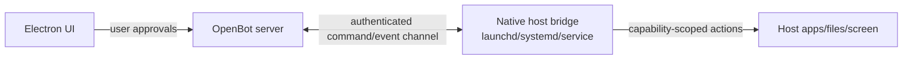

# Always-on computer

> Implementation update (2026-09-01): the graphical milestone and full computer-scoped browser authority are implemented. Current authority is `apps/computer/src/screen-broker.ts`, `apps/computer/src/browser-broker.ts`, `apps/computer/src/browser-profile-authority.ts`, and `30-canonical-context-handoff.md`.

Status: v0 boundary and forward design  
Last updated: 2026-08-24

## Two different meanings

"Work on my computer" and "have an always-on computer" are not the same capability.

1. **OpenBot computer**: one persistent self-hosted Linux environment shared by the installation's bots, where they can use a shell, browser, desktop apps, and files even when Electron is closed.
2. **Personal computer bridge**: native access to a user's Mac, Windows, or Linux desktop, apps, screen, and files.

v0 implements the first. The second requires installation, device identity, secure transport, capability negotiation, and per-action approvals, all of which conflict with a deliberately no-auth MVP.

## Confirmed Grok reference model

Grok's official documentation confirms one managed Linux VM per user/member. All bots share its files, `/workspace`, browser sessions, logins, and command-line credentials. Each bot has its own screen for parallel work, but a screen is not a security boundary. See `10-grok-computer-research.md`.

OpenBot should use the same conceptual split: computer-scoped state and bot-scoped screen/conversation state.

## v0 OpenBot computer

One headless Compose computer service owns:

```text
/home/openbot/                    persistent computer home
  .codex/                         mounted/persisted separately if desired
/workspace/                       shared across every bot
  bots/
    <bot-slug>/                   default folder, not private
  shared/
```

The server validates paths against computer-level allowed roots. A bot normally starts in its default folder, but another bot can read and continue its work. Bot personas stay in product/thread state; project instruction files stay with their projects.

Codex runs inside this computer, with the bot's default folder as `cwd` and `/workspace` intentionally available for collaboration. The Compose service stays up after the desktop closes. Docker restart policies bring the headless stack back after a host reboot, subject to Docker itself starting.

The first post-v0 graphical-computer milestone adds a lightweight desktop with Chrome/Chromium, Thunar, terminal, and bot-specific work surfaces. v0 remains honest headless execution over the same shared filesystem model.

## Runtime states

The right inspector presents shared-computer state plus the selected bot's current run state:

```text
offline -> starting -> ready -> busy
                     -> waiting for approval
                     -> degraded
```

- `offline`: server or runtime unavailable.
- `starting`: app-server process/handshake is in progress.
- `ready`: authenticated and able to accept a turn.
- `busy`: one or more conversations have active turns.
- `waiting for approval`: work is blocked on a user decision.
- `degraded`: product CRUD works but Codex or storage health does not.

The UI must distinguish Electron connectivity, shared-computer connectivity, Codex readiness, and selected bot run readiness. Screen readiness becomes a separate state only after the graphical milestone.

## Persistence contract

An always-on bot depends on all of:

- server process supervision;
- a named Codex home volume for thread rollouts;
- a named shared computer-home volume for browser state and supported sign-ins;
- a named `/workspace` volume for files shared across bots;
- Postgres for bot/run state;
- Docker restart policy;
- an upstream credential available to the restarted container.

If any one is absent, OpenBot should report partial recovery rather than claim the bot is fully online.

## Execution policy

The container is a useful default isolation boundary, but it is not a complete security sandbox by itself.

- Run the server as a non-root user.
- Do not mount the Docker socket.
- Do not mount the user's home directory by default.
- Use one non-root computer user and one shared allowed workspace root.
- Treat bot default directories as organizational only; never promise bot-to-bot secrecy.
- Start with conservative Codex sandbox and approval settings.
- Keep network access controlled and visible.
- Limit CPU, memory, process count, and log size in the Compose example.
- Never interpolate model-generated text into a shell command outside Codex's own execution/approval path.

Per-bot containers would break the intended shared-computer semantics unless a deliberate shared-state/session layer is added. Add a separate private-computer mode only as an explicit future security feature, especially before multi-user support.

## What the right-side inspector means in v0

The Grok reference shows a real bot-specific screen on the shared computer. During the headless vertical slice, do not fake it. Show a computer card with:

- runtime state;
- shared computer and default working-directory aliases;
- current turn and elapsed time;
- last command/tool/file activity;
- restart/runtime diagnostics action.

A terminal or file diff can expand from activity items. There is no screen thumbnail or `Open` action in v0. Once the graphical computer service exists, this pane gains the real selected-bot screen stream with takeover controls. Separate screens must share the computer's underlying filesystem and login state while serializing computer-use work per bot screen.

## Future native host bridge

When OpenBot adds physical-computer access, build it as a separate native background service, not as privilege inside Electron's renderer.

Proposed shape:



Required before shipping:

- explicit device enrollment and revocation;
- authenticated, encrypted transport;
- stable device identity and capability inventory;
- foreground approval UI for consequential actions;
- OS permission handling for accessibility, screen recording, automation, and files;
- action audit records;
- heartbeat, reconnect, update, and crash recovery;
- protection against a compromised renderer or remote server escalating to arbitrary host access.

Electron may install or manage the bridge, but quitting Electron must not ambiguously leave privileged automation running. The user needs a clear menu-bar/tray state and a one-click stop control.

The observed `ExternalRead` and `ExternalShell` names map to this bridge, never to a broader Compose mount. Ship granted, bounded file reads before command execution. A bot sees neither tool until a device is enrolled and the relevant capability is granted; every UI and audit row names the physical device so it cannot be confused with `Read` or `Shell` on the OpenBot computer. Full contracts are in `13-native-tool-surface.md`.

## Future routines

Routines should target a runtime host, not a desktop window. The v0 host abstraction makes it possible to add later:

- a schedule record;
- a scheduler/lease worker;
- idempotent run creation;
- missed-run and concurrency policy;
- approval behavior when no user is present;
- notifications and run history.

No routine may implicitly accept an approval merely because it was scheduled. Routines are out of v0 even though the reference UI exposes them.
