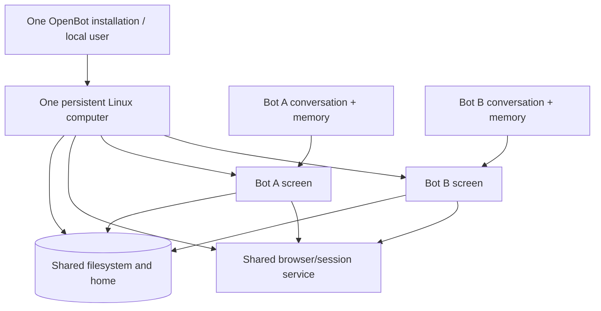

# Grok Bot computer research

> OpenBot implementation update (2026-09-01): this research led to the Xvfb/noVNC ScreenBroker, encrypted live BrowserBroker, stopped-profile authority, shared NSS store, and bot-owned target routing in `apps/computer/src/`. Separate bot screens, shared files, full computer-scoped browser state, and coordinated recovery are implemented.

Status: official behavior confirmed; implementation mechanism partly inferred  
Last updated: 2026-08-24

## Finding

The user's reading is correct: Grok Bot separates **bot identity and screen state**, but not the underlying computer security boundary.

Grok's official documentation says every bot owned by one user runs on the same persistent Linux cloud computer. Bots share files, browser cookies and signed-in sessions, command-line credentials, and local-computer permission state. Each bot receives a separate screen so GUI work can happen in parallel, but those screens are explicitly not separate security boundaries.

This is a user-scoped computer with bot-scoped work surfaces.

## Confirmed scope matrix

| Resource | Scope | Evidence and implication |
|---|---|---|
| Managed Linux VM | User/member | One computer is assigned to each member. |
| Filesystem | Computer/user | Every bot can see files saved by another bot. |
| Durable workspace | Computer/user | `/workspace` is shared; project folders are an organizational convention. |
| Browser cookies and logins | Computer/user | Signing in for one bot makes the browser session available to other bots. |
| Command-line credentials | Computer/user | Shell credentials are shared across bots. |
| Plugins/connectors | Account/user | Installed connectors are account-wide rather than isolated by bot. |
| Bot conversation and role memory | Bot | Bot identity, role context, and conversation remain distinct. |
| GUI screen | Bot | Each bot has a separate screen/work surface. |
| Computer-use concurrency | Bot screen | One bot runs at most one computer-use task on its screen, while several bots can work in parallel. |
| Routines | Bot | A routine has one owning bot even though it runs on the shared computer. |
| Local physical computer | Separate device | Cloud-computer access and local-computer access use different permissions and approval paths. |

Primary references:

- [Grok Bot overview](https://docs.x.ai/grok-bot/overview)
- [Use the computer and apps](https://docs.x.ai/grok-bot/computer-and-apps)
- [Files and results](https://docs.x.ai/grok-bot/files-and-results)
- [Grok Bot FAQ](https://docs.x.ai/grok-bot/faq)
- [Teams and enterprises](https://docs.x.ai/grok-bot/teams-and-enterprises)

The official pages were checked on 2026-08-24 and were last updated by xAI on August 11–20, 2026.

## Chrome, Thunar, and the desktop image

The supplied computer preview visibly contains Google Chrome, a file manager the user identifies as Thunar, and a terminal. Official documentation confirms a managed Linux VM with a browser, terminal/command line, filesystem, and graphical computer view, but it does not publish the base-image package list or name the desktop environment.

Thunar is commonly associated with Xfce, so an Xfce-like lightweight desktop is a reasonable inference from the screenshot. It is not yet an officially confirmed Grok implementation detail.

For OpenBot, Chrome/Chromium, Thunar, and a lightweight terminal are sensible explicit image choices regardless of Grok's unpublished internals. They cover browser work, human file inspection, and terminal takeover without adding a full desktop distribution.

## Durable versus replaceable computer state

Grok documents a useful two-tier model:

- shared `/workspace`, browser state, and supported sign-ins are designed to survive normal update and recovery;
- temporary directories, manually installed packages, and uncommitted application state should be treated as replaceable;
- update/recover can rebuild the compute layer while preserving durable state;
- reset can restore a durable snapshot and discard recent unsaved work;
- deleting a bot does not necessarily remove files or logins because those belong to the shared computer.

OpenBot should mirror the distinction between a replaceable computer image and durable mounted state. The container/VM is cattle; the shared home/workspace and product database are data.

## Likely architecture, clearly marked as inference

The public behavior is consistent with the following design, though xAI does not document the exact display implementation:

Separate screens could be implemented with virtual displays, nested compositors, desktop workspaces, or a browser/desktop broker. The official docs do not identify which. They only establish the product contract: separate parallel work surfaces over shared state.

The important conceptual point is that pixels and files are different boundaries. Several Chrome windows, desktop sessions, or virtual outputs can run under one Linux user and one filesystem namespace. Conversely, multiple containers could mount the same `/workspace`, but that alone would not share cookies, signed-in sessions, process state, or a safe writable Chrome profile. Grok's documented cookie sharing makes a computer-scoped browser/session broker or shared browser process more plausible than naive independent per-bot Chrome profiles, but this remains an inference.

## Revised OpenBot domain boundary

OpenBot should model:

### Computer

One per self-hosted installation in the no-auth MVP:

- replaceable image version;
- shared persistent home;
- shared `/workspace`;
- shared browser profile/session store;
- installed applications and capabilities;
- lifecycle state: provisioning, ready, degraded, recovering, resetting.

### BotScreen

One logical screen lease per bot:

- bot ID and computer ID;
- display/session handle;
- stream/takeover endpoint;
- screen state and last heartbeat;
- at most one active computer-use task;
- no claim of filesystem or credential isolation.

### Bot

Still owns:

- identity, instructions, conversation threads, memory, routines, and screen association;
- an optional default working directory such as `/workspace/bots/<slug>` for organization only.

The default directory must not be described as a sandbox boundary. Another bot can intentionally read and continue that work.

## Recommended self-hosted computer image

The target image can contain:

- a lightweight Linux desktop, likely Xfce;
- Thunar;
- Google Chrome or Chromium;
- a lightweight terminal;
- X/Wayland virtual-display infrastructure;
- a screen-stream/takeover service;
- the Codex CLI/app-server runtime;
- a non-root `openbot` user;
- mounted persistent home and `/workspace` volumes.

Keep the UI image separate from the OpenBot API image if doing so improves rebuild/recovery and limits privileges. This would add a `computer` service to Compose while preserving the single-Compose self-hosting goal.

OpenBot's selected direction is one computer service with a `ScreenBroker` and `BrowserBroker`: bot-scoped logical displays/input leases over computer-scoped home, workspace, and supported browser authentication. Do not mount the Docker socket merely to spawn a sibling desktop container for every bot. The live authority is `apps/computer/src/screen-broker.ts` and `apps/computer/src/browser-broker.ts`.

## Required technical spike

The uncertain part is not the shared filesystem. It is parallel GUI sessions with shared browser authentication.

Test these approaches before committing:

1. one graphical session with bot-scoped windows/workspaces;
2. multiple virtual displays under the same Linux user;
3. one persistent Chrome process controlled through a broker, with bot-scoped windows/tabs;
4. multiple Chrome processes with a safe shared session store rather than concurrent writes to one profile directory;
5. noVNC versus WebRTC/Xpra-style streaming and human takeover;
6. recovery of displays and Chrome without losing the durable profile.

Never point multiple independent Chrome processes at the same writable profile directory without proving the locking and corruption behavior. Sharing browser authentication is a product requirement; sharing one profile directory naively is not a valid architecture.

## MVP impact

The core v0 data and filesystem semantics should change now:

- one shared computer and workspace per installation;
- bot-specific default folders are organizational, not isolated;
- a file created by Bot A is intentionally available to Bot B;
- bot conversations and instruction context remain separate;
- credentials and browser sessions are computer-scoped.

The first chat/runtime vertical slice may remain headless, but a real separate screen per bot is required before claiming Grok-like computer parity. Until the graphical computer service exists, the right pane should show honest runtime activity rather than a fake screen.
