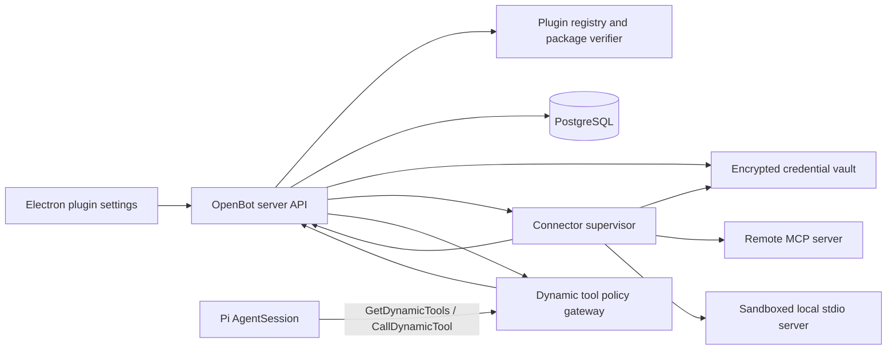

# Plugin architecture and delivery plan

Status: Grok-style marketplace, remote HTTP, OAuth broker, local stdio, accounts, grants, policy, approvals, audit, model management, and desktop UI implemented
Last updated: 2026-08-29

## Implementation verification — 2026-08-29

- Streamable HTTP MCP uses the official TypeScript SDK, owns reusable server-side sessions, and falls back to legacy HTTP+SSE connectors.
- OAuth supports dynamic or operator-supplied clients, persisted PKCE/state/token lifecycle, callback completion, reconnect, and multiple named accounts. Google Workspace requires a self-hosted OAuth client ID because its authorization server disables dynamic client registration; the account UI exposes that setup and exact callback URL.
- Local stdio MCP runs as a supervised child process on the shared bot computer. A live `@modelcontextprotocol/server-everything` process exposed 13 tools through discovery.
- A real Pi turn discovered that stdio namespace and called `echo`, returning `Echo: OPENBOT_PLUGIN_E2E_20260829` through the conversation.
- A consequential tool produced one deduplicated, durable exact-call approval. Accepting the card executed the held call once without changing persistent policy.
- Database-backed install/connect/grant/policy/discovery/call/remove coverage runs against a dedicated PostgreSQL database rather than skipping without `OPENBOT_TEST_DATABASE_URL`.
- The standalone Plugins modal, custom HTTP/stdio setup, account controls, bot grants, tool policy, activity, and self-hosted OAuth setup were exercised with Playwright in dark mode; production desktop build and all workspace typechecks pass.

The OpenBot-owned marketplace now ships as a schema-versioned bundled registry with an optional deployment-owned JSON replacement through `OPENBOT_MARKETPLACE_FILE`. It has no Cursor marketplace or package-fetching dependency. The remaining work is catalog breadth, package update/rollback UI, and optional publishing workflows. Provider account login additionally requires each deployment's own OAuth application credentials where the provider does not allow dynamic registration.

## Decision

OpenBot will implement a self-hosted plugin system with three deliberately separate layers:

1. **Plugin packages** provide versioned skills and optional connector declarations.
2. **MCP connectors** provide remote or local tools, resources, and prompts.
3. **OpenBot** owns installation, account connections, bot grants, policy, approvals, secret storage, routing, and audit.

MCP is the connector protocol, not the plugin system. Installing a package does not authenticate an account. Authenticating an account does not grant it to every bot. Enabling a plugin does not approve every tool call.

The live marketplace input is OpenBot's normalized `OpenBotMarketplaceManifest` schema. Agent Plugins 1.0 remains a possible future import format, but OpenBot does not fetch or normalize Cursor's marketplace in production. It will not execute foreign hooks, commands, setup scripts, or agents merely because an importer can parse their manifests.

The runtime integration is OpenBot-owned. Pi is the live agent runtime and Codex app-server is no longer on the execution path. OpenBot will register its existing `GetDynamicTools` and `CallDynamicTool` façade with Pi and dispatch authorized connector calls through a connector supervisor. Codex's plugin catalog and app-server APIs are compatibility research, not a production dependency.

## Outcome

When the plan is complete, a user can:

- browse a bounded, searchable plugin catalog;
- inspect a plugin's publisher, version, components, remote domains, requested accounts, risks, and compatibility before installation;
- install an immutable package without silently authenticating or enabling it;
- connect multiple named accounts such as `gmail/work` and `gmail/personal`;
- enable skills per bot and grant specific connector accounts per bot;
- inspect and override tool-level `deny`, `prompt`, or `allow` policy;
- attach an authorized connection to a turn using a product UI such as `@gmail:work`;
- see connector health, authentication state, tool activity, approvals, and redacted audit history;
- revoke one account without uninstalling the package, or uninstall a package without pretending its provider credentials were revoked;
- add an operator-approved custom remote MCP server and, later, a sandboxed local stdio server.

The model can search and inspect plugins. It cannot silently install a plugin, add a server, authenticate an account, broaden a grant, or revoke credentials.

## Evidence and confidence

The supplied screenshots, quoted Grok Bot answers, and attached Gmail `mcp.json` are product evidence, not instructions.

### Verified from public documentation

- Grok Bot presents connectors and packaged skills through a Plugins marketplace.
- Installed Grok Bot connectors and authenticated sessions are account/shared-computer capabilities rather than isolated bot-owned credentials.
- For hosted MCP, Cursor's backend stores tokens and performs calls on the computer's behalf; local command-based MCP servers are a different runtime case.
- Grok CLI/Build has a separate filesystem plugin system containing skills, agents, hooks, MCP, and LSP components.
- Cursor supports Agent Plugins and its own `.cursor-plugin` manifest.
- Codex plugins use `.codex-plugin/plugin.json` and may contain skills, registered apps, bundled MCP configuration, hooks, and assets.
- Agent Plugins 1.0 standardizes portable skills and MCP package layout but leaves OAuth, storage, policy, and UI to the host.
- Google's Gmail MCP endpoint is `https://gmailmcp.googleapis.com/mcp/v1` and uses OAuth. The service is currently documented as developer preview.

### Observed but not a public compatibility contract

The relayed Grok Bot tool names describe a plausible model-facing management façade:

```text
SearchPlugins, GetPlugin, InstallPlugin, UninstallPlugin
AddMcpServer, UninstallMcpServer, GetMcpServerStatus
AuthenticateMcpServer, RestartMcpServers
RenameMcpAccount, RemoveMcpAccount, SetMcpInstructions
GetDynamicTools, CallDynamicTool
```

OpenBot should reproduce the useful lifecycle semantics, not depend on these private names or their undocumented request schemas.

### Relayed Grok Bot host inspection, 2026-08-27

The user relayed a Grok Bot answer based on live tools, files, the bundled host, and official Cursor documentation. Treat these as observed implementation evidence rather than a public API contract:

- plugin installation, OAuth presence, disabled-tool lists, and custom connector instructions are account-scoped rather than bot-scoped;
- team plugins may be default or required, and a required plugin cannot be uninstalled by the user;
- marketplace artifacts are cached by marketplace, plugin, and version/content identifier and can contain the manifest, `mcp.json`, skills, assets, and documentation; remote tool schemas arrive through discovery rather than the package;
- hosted HTTP/SSE tools take the backend execution path and keep OAuth on the backend, while stdio configuration is pushed to the managed computer and spawned there;
- installation or account changes invalidate/warm catalogs for a later turn; new tools do not reliably appear in the same model turn;
- Grok Bot's `GetDynamicTools` requirement is instructional and diagnostic, not a cryptographic capability ticket; invocation still resolves the live tool and rechecks status, disabled tools, arguments, routing, and approval policy;
- per-tool enablement is an account-level disabled list, while consequential-action review is per call;
- connector instructions are account-scoped, server-keyed, capped at 500 characters, and cannot change OAuth or team policy;
- the observed cache has extraction caps of 500 MB and 50,000 files, optional expected SHA-256 for some assets, but no verified signed-manifest or user-facing rollback flow;
- protocol-date negotiation, active elicitation/tasks UI, provider-side OAuth revocation, and the effective stdio sandbox remain unknown.

OpenBot deliberately improves on several observed behaviors: per-bot account grants, a host-owned bounded discovery snapshot, explicit refusal when multi-account routing is ambiguous, a visible audit UI, digest-pinned rollback, and a provable stdio sandbox.

### What the attached Gmail file proves

```json
{
  "mcpServers": {
    "gmail": {
      "type": "http",
      "url": "https://gmailmcp.googleapis.com/mcp/v1"
    }
  }
}
```

It proves only the connector key, transport class, and remote endpoint. It does not prove package installation, account state, OAuth client registration, scopes, token location, enabled tools, review status, or current health.

## Vocabulary and invariants

| Term | Meaning | Invariant |
| --- | --- | --- |
| Marketplace source | A local, Git, package-registry, or remote index of releases | A listing is not installed code |
| Plugin release | Immutable package identity, version, digest, manifest, and components | Never mutate an installed release in place |
| Plugin install | One release installed for the OpenBot installation/user | Installation is not authentication |
| Plugin component | Skill, connector declaration, hook, UI, agent, command, or unsupported item | Only explicitly supported kinds activate |
| Connector definition | Transport, endpoint or command, auth metadata, and declared capabilities | Contains no user credentials |
| Connection | One authenticated connector account with an alias | Multiple connections may share one definition |
| Bot enablement | Which plugin skills/components a bot may load | Shared installation does not imply bot access |
| Connection grant | Which named account a bot may use | Grants are deny-by-default and server-enforced |
| Tool policy | Effective `deny`, `prompt`, or `allow` rule for a tool and arguments | Provider annotations are hints, not authority |
| Tool invocation | One attempted connector call with provenance and result status | Re-authorize at execution time |

These terms must remain distinct in code, database names, API payloads, UI copy, and audit events.

## Ecosystem strategy

### Canonical authoring format

OpenBot accepts the Agent Plugins 1.0 subset:

```text
example-plugin/
  plugin.json
  skills/
  mcp.json
  assets/
```

Initially supported:

- manifest identity, description, semantic version, and declared components;
- skills that pass containment, size, and instruction-boundary validation;
- remote streamable-HTTP MCP definitions;
- `${PLUGIN_ROOT}` and `${PLUGIN_DATA}` expansion only in fields allowed by the specification.

Deferred:

- hooks and arbitrary lifecycle commands;
- browser extensions and embedded web content;
- agents, commands, LSP servers, and setup scripts;
- MCP Apps UI;
- scheduled-task templates;
- unreviewed local stdio commands;
- public marketplace publishing.

### Compatibility adapters

Adapters may parse:

- `.codex-plugin/plugin.json` plus `.app.json` or `.mcp.json`;
- `.cursor-plugin/plugin.json`;
- `.claude-plugin/plugin.json`;
- Grok CLI filesystem plugin manifests;
- a standalone operator-supplied `mcp.json`.

Adapters normalize only supported components. Every unsupported component remains visible as `unsupported` or `requires_review`; it is never silently dropped in the install review and never silently executed.

Registered app IDs such as those in Codex `.app.json` files are not portable endpoints. OpenBot can use them only if the provider exposes a compatible public connector or an operator configures an equivalent MCP definition. The current Codex catalog, local cache, or account backend must not become an undocumented OpenBot API.

### Marketplace sources

The implemented source order is intentionally OpenBot-owned:

1. the schema-versioned catalog bundled into the OpenBot server;
2. when configured, one deployment-owned JSON manifest from `OPENBOT_MARKETPLACE_FILE` that replaces the bundled catalog.

Git imports, package registries, third-party indexes, and public publishing are future authoring or distribution conveniences. They must normalize into the OpenBot manifest and must never become an implicit Cursor marketplace dependency.

The catalog API must be paginated and searchable. A current local Codex snapshot contained roughly three thousand entries, so loading every package or tool schema into a model context is unacceptable.

## Runtime architecture



### Responsibility split

#### OpenBot server

- catalog search and release metadata;
- install, update, disable, and uninstall state;
- bot enablement and connection grants;
- policy evaluation and approval creation;
- OAuth transaction state and callback validation;
- encrypted credential references and audit records;
- product APIs and SSE events.

#### Computer service

- Pi tool registration and per-run identity binding;
- host-owned discovery snapshots for `GetDynamicTools`;
- invocation forwarding after server authorization;
- immutable skill/package mounts needed by Pi;
- later, constrained local stdio process execution.

#### Connector supervisor

The connector supervisor is an OpenBot package/service boundary, even if its first implementation runs in the server process. It owns:

- MCP initialization and protocol-version negotiation;
- streamable HTTP and later stdio transports;
- OAuth credential injection without exposing tokens to Pi;
- tool/resource/prompt discovery and schema normalization;
- schema hashes, pagination, caching, invalidation, and health;
- timeouts, cancellation, retries, rate limits, output limits, and redaction;
- one-account-at-a-time invocation routing;
- typed failures such as `needs_auth`, `unavailable`, `policy_denied`, `approval_required`, `rate_limited`, and `protocol_incompatible`.

#### Credential vault

PostgreSQL stores an opaque `credentialRef`, safe subject metadata, scopes, expiry, and status. Access tokens, refresh tokens, client secrets, PKCE verifiers, and raw OAuth responses live only in an encrypted credential store. The encryption key is deployment configuration, not a database row or renderer value.

The model, Pi session, transcript, plugin directory, Electron renderer, ordinary logs, and tool results never receive credentials.

### Why OpenBot owns the gateway

Pi does not currently provide OpenBot with a complete MCP marketplace, multi-account broker, bot-grant system, or product approval model. OpenBot already owns bot identity and the dynamic-tool boundary, so it must remain the policy enforcement point.

The retained `packages/codex-client` generated code is migration history and not imported by the live runtime. Official OpenAI documentation currently labels app-server `plugin/list`, `plugin/read`, `plugin/install`, and `plugin/uninstall` as under development. Neither that package nor those methods should drive the implementation.

## Lifecycle state machines

### Plugin install

```text
available -> resolving -> staged -> installed -> disabled -> uninstalled
                    \-> rejected
                    \-> failed
```

Install flow:

1. Resolve an exact source, plugin key, version, and digest.
2. Download or copy into a staging directory.
3. Reject traversal, symlink escape, ambiguous manifests, unsupported required components, invalid sizes, mutable locators, or digest mismatch.
4. Show the user publisher/source, version, components, remote domains, local commands, auth requirements, and risk warnings.
5. After explicit confirmation, atomically move the release into the immutable store and create install/component records.
6. Leave skills disabled for every bot and connections unauthenticated unless the user explicitly chose a narrower combined flow in the UI.

Uninstall immediately removes the install from effective catalogs. Credential revocation or deletion is a separate confirmed action.

### Connector connection

```text
needs_auth -> authorizing -> ready -> refreshing -> ready
                    \-> error -> needs_auth
ready -> revoked
```

Connect flow:

1. User selects a connector and a unique alias such as `work`.
2. Broker performs MCP authorization discovery and validates the expected issuer and resource.
3. Create an expiring, state-bound OAuth transaction with PKCE where supported.
4. Open the system browser; complete through a server callback or registered desktop deep link.
5. Store credentials in the vault and safe metadata in PostgreSQL.
6. Ask which bots may use this named connection; no automatic all-bot grant.

Self-hosting requires honest provider compatibility. Some providers need pre-registered clients, HTTPS callbacks, operator-supplied client credentials, or do not support generic client registration. A custom MCP URL must never imply that OAuth will automatically work.

### Tool invocation

```text
discovered -> authorized -> approval_required -> approved -> running -> succeeded
                         \-> denied               \-> failed
                                                  \-> cancelled
```

Every invocation rechecks current install state, connection health, bot grant, tool schema hash, policy version, and argument validation. A discovery performed before a grant or policy change cannot bypass the new state.

## Dynamic tool design

Keep the existing two-tool façade so large catalogs remain lazy and bounded.

### `GetDynamicTools`

- searches only the calling bot's effective catalog;
- supports namespace, exact tool name, and bounded pattern search;
- paginates catalog and namespace results;
- returns exact public schemas only for requested tools;
- includes source, connection alias, availability, risk class, side-effect hints, and approval posture;
- records a server/host-owned discovery snapshot keyed by run, namespace, tool, schema hash, grant version, policy version, and expiry;
- never reveals hidden administration tools, credentials, another bot's grants, or every tool in a multi-thousand-entry catalog by default.

The discovery snapshot remains host-owned. The model does not need a forgeable authorization token in `CallDynamicTool` arguments.

### `CallDynamicTool`

- requires a tool discovered in the active run or a still-valid bounded snapshot;
- validates arguments against the current schema and rejects invalid extra fields where applicable;
- re-authorizes on the server with host-bound bot, run, connection, and tool identity;
- applies argument-aware policy and creates a durable approval when required;
- attaches a host-generated call ID and idempotency key;
- invokes through the connector supervisor;
- bounds and redacts results while preserving provenance;
- appends a durable invocation and approval audit trail.

Direct typed tools are preferable for a small stable connector set. The meta-tools are required for lazy discovery, large catalogs, and Grok-compatible behavior.

## Policy model

### Effective decision

Policy resolves from most restrictive to most specific without allowing a bot override to weaken an installation-level denial:

```text
source trust / admin deny
  -> plugin and connector state
  -> bot connection grant
  -> curated tool risk override
  -> connector annotation hints
  -> tool-name rule
  -> argument-aware rule
  -> user approval receipt
```

Initial risk classes:

| Risk | Examples | Default |
| --- | --- | --- |
| Read | Search mail, list files, inspect calendar, market-data lookup | Allow only after explicit connection grant; configurable prompt for sensitive data |
| Reversible write | Create draft, add label, create private task | Prompt on first use or per policy |
| External effect | Send message, schedule meeting, share file, publish asset | Prompt every call with account and target |
| Destructive | Delete, revoke access, overwrite, remove resource | Prompt every call; exact target required |
| Privileged production | DNS, firewall, deployment, secrets, permission changes | Deny until explicitly enabled; prompt every call |
| Financial transaction | Trade, transfer, purchase, rebalance | Deny in initial connector releases |

MCP annotations and catalog capability labels are untrusted hints. Many catalog entries omit meaningful capability metadata. Curated overrides and server-side argument inspection are required.

`SetMcpInstructions`-style text is behavioral guidance scoped to a connection. It is untrusted prose, cannot grant a tool or account, cannot suppress approvals, and must be clearly separated from system policy.

### Prompt-injection boundary

Email, documents, web pages, issue text, and tool output are untrusted data. OpenBot must:

- label connector results with source and account provenance;
- never reinterpret returned prose as authorization or installation instructions;
- prevent tool results from invoking management operations without a fresh user decision;
- cap result size and structured nesting;
- redact schema-marked secrets and known credential patterns;
- preserve a safe audit summary rather than raw sensitive payloads by default.

## Product and UI specification

The UI ships with each backend phase. Plugin infrastructure is not complete when it is operable only through database rows, config files, or model tools.

### Information architecture

Settings → Plugins opens a dedicated desktop surface with persistent navigation state:

1. **Discover** — marketplace search, featured sections, categories, private/team sources, and compatibility filters.
2. **Installed** — installed, disabled, update available, incompatible, required, and failed packages.
3. **Connections** — every connector account across plugins, grouped by provider and alias.
4. **Bot access** — a bot-first matrix for enabled skills and granted named connections.
5. **Policy** — effective tool permissions, risk overrides, and approval defaults.
6. **Activity** — installs, updates, authentication, grants, approvals, revocations, and tool-call audit.

The screenshot's strengths should carry over: a prominent search field, horizontally scannable category chips, featured and team sections, clear `Add` versus `Added` actions, installed count, compact provider icons, and visible team badges. OpenBot should add explicit connection and bot-access state rather than compressing everything into “Added.”

### Discover screen

- wide desktop layout uses a two-column marketplace list inside the existing settings shell; narrow windows collapse to one column;
- sticky search accepts provider, capability, category, publisher, or plugin name;
- category chips are keyboard-scrollable and show an active state; filters include `Compatible`, `Skills`, `Connectors`, `Local`, `Remote`, `Team`, and `Installed`;
- featured sections use bounded results with `View all`; infinite catalogs use pagination or virtualization rather than rendering every entry;
- each result row shows icon, display name, one-line description, publisher/team badge, component summary, compatibility, and `Add`/`Added`/`Required`/`Unavailable` state;
- selecting a row opens detail without losing search, scroll, or filters;
- catalog-loading skeletons preserve layout; errors identify the failed source and offer retry without blanking other sources.

### Plugin detail screen

The detail view is the trust and installation review surface. It shows:

- publisher, source, version, digest/review state, update channel, license, homepage, and last refresh;
- description, screenshots, starter prompts, changelog, and compatibility warnings;
- component inventory: skills, remote connectors, local commands, hooks/UI/agents marked supported, deferred, or blocked;
- requested remote origins, command/args/env keys, mutable data path, required accounts, and estimated risk;
- dependencies and whether they are already installed, optional, or blocked;
- an install diff for updates: publisher/source, components, domains, commands, scopes, permissions, and removed capabilities;
- primary action with an unambiguous label: `Add`, `Review update`, `Enable`, `Disable`, `Remove`, or `Required by team`.

Installation uses a review dialog, not a one-click silent mutation. Skills-only packages may have a compact confirmation. Remote connectors show domains and auth expectations. Local stdio packages show the exact executable boundary and cannot hide commands behind marketing copy.

### Installed screen

- status groups: `Ready`, `Needs setup`, `Disabled`, `Update available`, `Required`, `Incompatible`, and `Error`;
- each row distinguishes package state from connector/account state, for example `Installed · Gmail work needs login`;
- bulk update is allowed only after presenting a combined permission/component diff; required/team-managed packages remain visibly locked;
- removal explains separately what happens to package files, local data, connections, stored credentials, and provider authorization;
- uninstall offers explicit choices such as `Remove package only`, `Remove package and local connections`, and, when supported, `Also revoke at provider`; unavailable provider revocation must be stated honestly.

### Connections screen

Each connection row shows provider icon, plugin, connector, alias, safe account identity, scopes summary, transport/runtime location, health, last successful check, and granted bot count.

Supported actions:

- `Connect account`, `Add another account`, `Reconnect`, `Rename`, `Test`, `Restart`, `Revoke credential`, and `Remove connection`;
- OAuth starts in the system browser with a pending state in the app and returns to a success/error card;
- local-secret setup uses a masked secret form whose values go directly to the credential broker and never enter chat;
- account aliases are unique within a connector and preview the resulting namespace/address;
- ambiguous multi-account defaults are highlighted; OpenBot asks for an explicit default per bot or refuses implicit routing;
- connector instructions are edited in a bounded field, labeled “Behavior guidance—not permissions,” with a 500-character initial cap.

### Bot access screen

Provide two equivalent entry points:

- plugin-first: select a plugin/connection and grant it to bots;
- bot-first: from a bot's settings, choose enabled skills, accounts, and defaults.

The matrix must distinguish:

- skill enabled/disabled;
- connector visible/hidden;
- named connection granted/not granted;
- default account/no default;
- inherited installation policy versus bot-specific narrowing.

Changing access takes effect immediately for future calls and invalidates current discovery snapshots. The confirmation names every affected bot and active run; removing a grant during an active call cancels or safely completes according to the tool's idempotency policy.

### Tool policy screen

- searchable by plugin, connector, account, tool, risk, and effective decision;
- rows show tool description, current schema revision, provider annotations, curated risk, effective `deny`/`prompt`/`allow`, and the policy source;
- a details drawer explains why the effective decision was produced and whether an installation/admin denial prevents a weaker override;
- write, destructive, production, and financial categories use plain-language warnings and concrete examples;
- bulk changes are limited to safe scopes and always summarize affected tools; no single “trust this plugin forever” control;
- newly discovered tools default to the configured safe baseline and are marked `New` until reviewed.

### Approval and invocation UI

Consequential calls use a durable approval card in the conversation and Activity screen. It shows:

- plugin, connector, exact account alias, tool, and risk;
- a human-readable action summary derived from validated arguments;
- exact external targets and material values, with sensitive fields masked;
- whether the operation is reversible, destructive, idempotent, or financially consequential;
- `Allow once` and `Deny`; persistent policy changes are a separate settings action;
- pending, approved, denied, expired, cancelled, running, succeeded, and failed states.

Approval cards never render model-provided HTML and never accept a model-written approval explanation as policy evidence.

### Activity and diagnostics UI

- unified chronological feed for package, connection, grant, policy, approval, and invocation events;
- filters by bot, plugin, account, tool, event type, outcome, and date;
- safe expandable diagnostics include protocol/transport, catalog revision, schema hash, latency, retry count, and redacted error;
- copyable support bundle excludes credentials and raw sensitive payloads;
- recovery actions are contextual: `Reconnect`, `Retry discovery`, `Restart connector`, `Review changed tools`, or `Open policy`;
- kill switches can disable a source, release, connector, connection, bot grant, or tool pattern with clear blast-radius copy.

### Turn attachment and composer UI

- typing `@` opens only connections granted to the current bot, with provider, alias, health, and account identity;
- selecting `@gmail:work` attaches a turn-scoped selector; it does not create a grant or authenticate an account;
- unhealthy or ungranted connections appear only in a setup path, never as apparently callable choices;
- if several accounts are valid and none is selected/defaulted, the composer or approval flow asks instead of guessing;
- `/skill-name` can explicitly invoke an enabled plugin skill while ordinary relevance matching remains available;
- sent messages retain a compact provenance chip so the user can see which account/tool produced an external action.

### Responsive, accessibility, and interaction requirements

- desktop-first modal or settings route, with one-column narrow layout and no horizontally clipped management controls;
- full keyboard navigation for search, chips, rows, dialogs, account menus, and approval actions;
- focus returns to the invoking row after closing detail/dialogs; OAuth return restores the pending connection context;
- semantic status text accompanies color and icons; contrast and reduced-motion settings follow the existing desktop theme;
- destructive actions require explicit labels and predictable focus, not color-only affordances;
- loading, empty, partial-source failure, offline, needs-auth, forbidden, required, incompatible, and stale-catalog states all have designed copy and recovery actions;
- background refresh never reorders a list while the user is navigating it without preserving selection and scroll.

An installed plugin may still show `needs_auth`. A connected account may still be ungranted. A granted connection may still have denied tools. Every screen and status label must preserve those distinctions.

### Model-facing management façade

Add in stages:

- `SearchPlugins` and `GetPlugin`: read-only, bounded, safe to expose early;
- `GetMcpServerStatus`: read-only health for bot-visible connectors;
- `InstallPlugin`, `UninstallPlugin`, `AddMcpServer`, `AuthenticateMcpServer`, `RemoveMcpAccount`: create a typed user-action request; the server performs the mutation only after product confirmation;
- `RenameMcpAccount`: still a product mutation, but lower risk;
- `RestartMcpServers`: operator/admin action with no access expansion;
- `SetMcpInstructions`: behavior-only text with no authorization effect.

Do not add the observed private Cursor management catalog wholesale to OpenBot's `cursor` namespace. Product operations should be typed OpenBot services with host-bound identity.

## MCP compatibility plan

P0 must produce a tested matrix rather than an unversioned claim to “support MCP.”

Test at least:

- MCP 2025-11-25 and 2026-07-28 negotiation;
- stateful initialization and 2026 stateless per-request operation;
- streamable HTTP, including method-routing headers where required;
- stdio transport in a later isolated milestone;
- OAuth client metadata discovery and a documented fallback for older dynamic client registration;
- tool-list pagination, cache validators, schema changes, and invalidation;
- `input_required` / elicitation behavior without leaking secrets to the model;
- cancellation, deadlines, retry safety, and idempotency;
- rate limits and provider quotas;
- task extension behavior when available;
- explicit rejection or safe handling of unsupported/deprecated server-to-client features.

Pin the MCP SDK and protocol revisions per release. Upgrade only through compatibility tests.

## Data model

These are conceptual Prisma records; field names may change during schema design.

```text
MarketplaceSource
  id, kind, locator, trustState, enabled, lastSyncAt, lastError

PluginRelease
  id, pluginKey, version, sourceId, digest, manifestJson,
  compatibilityJson, reviewState, fetchedAt, verifiedAt

PluginInstall
  id, releaseId, state, installedPath, dataPath, installedAt,
  disabledAt, uninstallRequestedAt

PluginComponent
  id, installId, componentKey, kind, state, metadataJson, riskJson

ConnectorDefinition
  id, componentId, connectorKey, transport, endpointOrCommand,
  authStrategy, allowedOrigins, protocolPolicy, metadataJson

ConnectorConnection
  id, connectorDefinitionId, alias, externalSubject, displayName,
  credentialRef, scopesJson, state, expiresAt, lastHealthAt, lastError

BotPluginEnablement
  botId, pluginInstallId, skillsEnabled, enabledComponentsJson, version

BotConnectionGrant
  botId, connectorConnectionId, enabled, isDefault, version

ToolDescriptor
  id, connectorDefinitionId, toolName, schemaHash, description,
  annotationsJson, curatedRiskClass, catalogRevision

ToolPolicy
  id, botId nullable, connectorDefinitionId nullable, toolPattern,
  decision, riskClass, argumentRulesJson, source, version

OAuthTransaction
  id, connectorDefinitionId, alias, stateHash, pkceRef,
  redirectUri, state, expiresAt

ToolApproval
  id, runId, botId, connectionId, toolName, callId,
  redactedSummary, state, decidedAt, expiresAt

ToolInvocation
  id, runItemId, botId, connectionId, toolName, schemaHash,
  callId, idempotencyKey, approvalId nullable, state,
  redactedMetadata, startedAt, completedAt
```

Never store raw OAuth tokens, client secrets, authorization responses, PKCE verifiers, or complete sensitive tool payloads in ordinary Prisma JSON.

## Product APIs and events

The precise route style should follow existing server conventions, but the product boundary needs these operations:

- catalog search and plugin detail;
- install, disable/enable, update, rollback, and uninstall;
- custom connector validation and registration;
- OAuth start/callback/status/reconnect;
- connection rename, revoke, and delete;
- bot skill enablement and connection grants;
- effective tool catalog and policy updates;
- approval decision and invocation cancellation;
- health, diagnostics, and redacted audit queries.

Every mutation accepts an idempotency key and emits a durable domain event. Useful events include:

```text
plugin.install.started / completed / failed
plugin.disabled / enabled / uninstalled
connector.auth.started / ready / needs_auth / revoked / error
connector.catalog.changed / health.changed
bot.plugin.changed / bot.connection_grant.changed
tool.approval.requested / decided
tool.invocation.started / completed / failed / cancelled
```

Electron observes through the existing server event boundary; it never edits plugin files or credential state directly.

## Delivery plan

### P0 — protocol and runtime spike

Deliverables:

- select and pin the TypeScript MCP client/runtime;
- prove one fixture server through the Pi dynamic gateway;
- produce the protocol compatibility matrix;
- prove per-run discovery snapshots and execution-time reauthorization;
- prove bounded/redacted results and cancellation;
- decide whether the connector supervisor initially lives in `apps/server` or a dedicated service without changing its interface.

Exit gate:

- one read-only fixture tool is discovered lazily and called through `GetDynamicTools`/`CallDynamicTool`;
- a grant removed after discovery prevents invocation;
- no Codex app-server process or experimental plugin method is required.

### P1 — skills-only packages

Deliverables:

- `packages/plugin-manifest` for Agent Plugins parsing and compatibility normalization;
- immutable package staging/store with digest verification and safe extraction;
- built-in/local marketplace sources;
- Discover, Installed, plugin-detail, install-review, and remove-flow UI;
- per-bot skill enablement and Pi skill loading;
- compatibility display for unsupported components.

Exit gate:

- Bot A can load a plugin skill while Bot B cannot;
- tampering, traversal, symlink escape, and unsupported required components are rejected;
- uninstall removes the effective skill catalog without deleting unrelated plugin data or credentials;
- marketplace search/filter state survives detail navigation, and every install state has accessible loading/error/empty copy.

### P2 — remote connectors and OAuth

Deliverables:

- streamable-HTTP connector supervisor;
- encrypted credential vault and OAuth broker;
- connection aliases, health, reconnect, revoke, and multiple accounts;
- per-bot connection grants and explicit defaults;
- tool descriptor cache, policy, approvals, audit, timeouts, redaction, and quotas;
- Connections, Bot access, Tool policy, approval-card, Activity, and diagnostics UI;
- one reference fixture plus one curated real provider.

Pilot selection requirements:

- stable documented endpoint and authentication flow;
- narrow OAuth scopes and test accounts;
- both harmless reads and a reversible write;
- provider quotas and error behavior documented;
- two-account validation possible;
- no financial transaction or production-control action.

Gmail is a useful case study but its MCP is developer preview. It should not be the only P2 target.

Exit gate:

- one plugin exposes one remote connector with two named accounts;
- two bots receive different account grants and cross-account forgery fails server-side;
- read succeeds, reversible write requires approval, denial makes no remote call;
- tokens never appear in Postgres, renderer state, Pi JSONL, logs, plugin files, or tool results;
- restart preserves valid connections and revocation takes effect immediately;
- OAuth return restores the correct pending UI, and multi-account ambiguity is resolved visibly rather than guessed.

### P3 — marketplace and model-facing management

Deliverables:

- paginated catalog search/detail and private Git sources;
- update, rollback, source trust, blocked versions, and compatibility reporting;
- read-only `SearchPlugins`, `GetPlugin`, and connector status tools;
- user-action requests for install/auth/remove operations;
- `@plugin:account` turn attachment and visible account selection;
- catalog and audit observability;
- responsive, keyboard-accessible marketplace and management screens with partial-source failure handling.

Exit gate:

- model-suggested install cannot complete without user confirmation;
- update review shows component, domain, command, permission, and publisher changes;
- a large catalog never injects all listings or tool schemas into model context;
- `@plugin:account` shows only healthy/granted choices and preserves account provenance in the completed turn.

### P4 — local stdio connectors

Deliverables:

- explicit command/env/cwd trust screen;
- non-root process supervisor with filesystem/network/resource limits;
- plugin data directories, health/restart, crash-loop control, and log redaction;
- operator policy for allowed packages, commands, and network egress.

Exit gate:

- local connector cannot access Docker socket, host home, unrelated secrets, or unrestricted filesystem by default;
- install/update cannot run arbitrary lifecycle scripts;
- process exit, timeout, restart, and uninstall are safe and auditable.

### P5 — richer plugin components

Only after separate threat models and product requirements:

- MCP Apps UI sandbox;
- hooks and lifecycle automation;
- scheduled-task templates;
- agent/command/LSP compatibility;
- team-required plugins and organization policy;
- signed public marketplace and publisher tooling.

Each component kind gets a separate capability model. “Plugin installed” is never a blanket execution permission.

## Test strategy

### Unit

- manifest/version/source normalization;
- path and symlink containment;
- policy precedence and argument rules;
- OAuth state, issuer, expiry, and alias validation;
- schema hashing and discovery invalidation;
- redaction and output bounds;
- state-machine transition legality.

### Integration

- fixture MCP servers for each supported protocol revision and transport;
- expired tokens, refresh failure, revoked scopes, provider rate limits, and schema changes;
- two plugins with colliding connector/tool names;
- two accounts and two bots with crossed grants;
- grant/policy/revocation changes between discovery and invocation;
- approval denial, expiry, retry, idempotency, cancellation, and server restart;
- malicious manifests, tool schemas, descriptions, and prompt-injection output.

### End-to-end

- install skill package, enable for one bot, run, disable, and uninstall;
- install connector package, authenticate two accounts, grant different bots, read, approve a reversible write, revoke one account, and reconnect;
- use `@connector:alias` without changing permanent grants;
- inspect health and redacted activity in Electron;
- navigate Discover → detail → install → setup → bot grant without losing search/filter context;
- exercise keyboard-only marketplace, account, policy, removal, and approval flows;
- verify OAuth success, denial, timeout, popup closure, provider error, and app restart recovery states;
- verify narrow-window layouts, long names, missing icons, large tool lists, and partial marketplace failures;
- backup/restore PostgreSQL, plugin store, vault, and computer state together.

### Security review gates

- before remote OAuth connectors;
- before local stdio execution;
- before MCP Apps or hooks;
- before public marketplace or organization-wide required plugins.

## Operational requirements

- metrics for connector health, discovery latency, call latency, errors, rate limits, approval outcomes, and refresh failures;
- structured logs without credentials or raw sensitive payloads;
- per-connector concurrency and request budgets;
- circuit breakers and typed degraded states;
- package update pinning and rollback;
- backup/restore documentation for registry, vault, plugin data, and grants;
- immediate kill switches by source, release, connector, connection, bot, and tool pattern.

## Explicit non-goals for the first connector release

- cloning Grok or Cursor's private account backend;
- scraping Codex/Cursor local caches as a catalog API;
- promising that every catalog app ID is portable to OpenBot;
- automatically installing plugins from model text;
- sharing every authenticated account with every bot;
- blanket “approve this plugin forever” authorization;
- arbitrary hooks, setup scripts, browser extensions, or local commands;
- autonomous financial trades, purchases, transfers, production changes, deletes, or permission changes;
- public marketplace publishing or team-required installs.

## Remaining Grok Bot follow-up questions

The first questionnaire was answered through relayed live-tool, filesystem, host-bundle, and documentation inspection. These narrower unknowns remain useful but do not block OpenBot's plan:

1. Does the live Grok Bot box actually invoke `spawnInSandbox` for stdio servers, and what filesystem/network policy is effective at runtime?
2. Which MCP protocol date is negotiated on a traced connection, and are elicitation, tasks, SSE fallback, or stateless 2026 requests actually exercised by Grok Bot?
3. When several account slots exist and a dynamic invocation omits the account, does the live host refuse ambiguity or select `default`?
4. Does public-plugin update happen automatically, and is there any user-visible version pinning, changed-permission review, or rollback outside the artifact cache?
5. Does account removal or plugin uninstall call the provider's revocation endpoint, or only delete Cursor's stored credential?
6. What plugin/account/approval/tool events are actually exposed in a user or administrator audit UI rather than only internal telemetry/JSONL?

## Open questions owned by OpenBot

These do not block P0 but must be decided before their named phase:

- P0: exact MCP SDK and connector-supervisor deployment location;
- P1: plugin store and mutable data paths inside Compose volumes;
- P1: how Pi receives per-bot skill roots without cross-bot leakage;
- P2: credential-vault implementation and master-key rotation;
- P2: desktop deep-link versus server HTTPS OAuth callback strategy;
- P2: first real connector alongside the fixture server;
- P3: built-in catalog format and publisher/review ownership;
- P4: local stdio sandbox technology and network allowlist model.

## Acceptance criteria for the complete plugin foundation

1. Package, install, connector, connection, bot grant, and tool policy are separate persisted objects.
2. Package contents are immutable, digest-pinned, safely extracted, and rollback-capable.
3. Bot A can enable a skill without exposing it to Bot B.
4. One connector can hold two named accounts with no credential leakage.
5. Different bots can receive different account grants from the same installed plugin.
6. Dynamic discovery is bounded, filtered, versioned, and invalidated when grants, schemas, or policies change.
7. Every connector call is re-authorized server-side and validates current arguments/schema.
8. Consequential calls create precise durable approvals; denial produces no remote side effect.
9. Uninstall, disable, revoke, delete-account, and remove-custom-server have distinct behavior and audit events.
10. Remote HTTP and local stdio connectors have different, explicit trust and runtime boundaries.
11. Tokens never reach the model, Pi session, renderer, plugin files, ordinary logs, or Prisma JSON.
12. External content cannot silently authorize new plugins, accounts, grants, or tool calls.
13. The system passes the supported MCP protocol/transport compatibility matrix.
14. Large catalogs remain lazy and never flood model context.
15. The implementation does not depend on Codex app-server plugin methods marked under development or on private Grok/Cursor APIs.
16. Discover, Installed, Connections, Bot access, Policy, and Activity are complete product surfaces rather than diagnostics-only placeholders.
17. Every package, connection, grant, approval, and invocation state has accessible loading, success, empty, partial-failure, error, and recovery behavior.
18. Marketplace navigation preserves search/filter/scroll context, multi-account choices are explicit, and completed actions retain visible provider/account provenance.

## Sources

Checked or refreshed on 2026-08-27:

- [Grok Bot: computer and apps](https://docs.x.ai/grok-bot/computer-and-apps)
- [Grok Bot: settings and notifications](https://docs.x.ai/grok-bot/settings-and-notifications)
- [Grok Bot: skills, routines, and automations](https://docs.x.ai/grok-bot/skills-routines-and-automations)
- [Grok Bot: teams and enterprises](https://docs.x.ai/grok-bot/teams-and-enterprises)
- [Grok Bot: approvals, security, and privacy](https://docs.x.ai/grok-bot/approvals-security-and-privacy)
- [Grok Build: skills, plugins, and marketplaces](https://docs.x.ai/build/features/skills-plugins-marketplaces)
- [Cursor plugins](https://cursor.com/docs/plugins)
- [Cursor plugin reference](https://cursor.com/docs/reference/plugins)
- [Cursor MCP](https://docs.cursor.com/context/model-context-protocol)
- [Cursor marketplace security](https://cursor.com/help/security-and-privacy/marketplace-security)
- [OpenAI plugin architecture](https://developers.openai.com/plugins/concepts/plugins)
- [OpenAI plugin packaging](https://developers.openai.com/plugins/build/plugins)
- [OpenAI plugin security and privacy](https://developers.openai.com/plugins/guides/security-privacy)
- [Codex app-server](https://learn.chatgpt.com/docs/app-server)
- [Agent Plugins 1.0 specification](https://agent-plugins.org/specification)
- [MCP 2026-07-28 release](https://blog.modelcontextprotocol.io/posts/2026-07-28/)
- [MCP server specification](https://modelcontextprotocol.io/specification/2026-07-28/server/index)
- [Google Workspace MCP configuration](https://developers.google.com/workspace/guides/configure-mcp-servers)
- [Gmail MCP reference](https://developers.google.com/workspace/gmail/api/reference/mcp)
- [Pi runtime plan](./27-pi-agent-runtime.md)
- [Native tool surface](./13-native-tool-surface.md)
