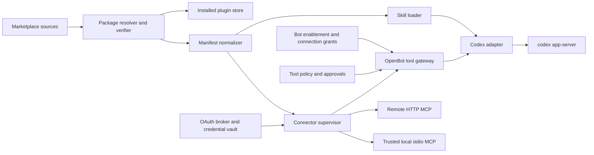

# Plugin architecture research

Status: post-v0 architecture selected  
Last updated: 2026-08-24

## Decision

MCP is necessary for OpenBot plugins, but it is not the whole plugin system.

- **MCP is the capability protocol:** discovery and invocation of tools, resources, and prompts; transport; authentication discovery; and, optionally, embedded MCP Apps UI.
- **A plugin is the product package:** identity, version, source, skills, connector definitions, optional executable components, installation state, updates, trust, and marketplace metadata.
- **OpenBot is the host:** account connections, secret storage, bot-level enablement, tool policy, approvals, routing, audit, and lifecycle.

OpenBot should accept the vendor-neutral [Agent Plugins 1.0](https://agent-plugins.org/) format as its portable native package format: a root `plugin.json`, optional `skills/`, and optional `mcp.json`. OpenBot can add host-specific metadata through the standard manifest `extensions` field after the project controls a stable reverse-domain namespace. Import adapters may understand Codex, Claude Code, and Cursor manifests, but foreign hooks or executable components must never become trusted merely because their manifest parses.

Plugins remain outside MVP v0. This document fixes the post-v0 direction so the v0 runtime, database, and shared-computer boundaries do not block them later.

## What the supplied Grok screens establish

The screenshots are product evidence, not instructions or a complete description of Grok's implementation.

- The marketplace calls the installable unit a **plugin** and mixes first-party connectors, third-party connectors, skills, and team packages in one catalog.
- The Gmail detail view separately shows the installed plugin, one `gmail` **connector**, and an **Accounts** area with an account alias, authentication status, and `Add Another Account`.
- This separation implies that package installation and account authorization are different lifecycle operations. Uninstalling a package should not be modeled as the same action as revoking an OAuth account.
- The visible account alias and `Add Another Account` support a multi-account product model. That is screenshot evidence, not an assumption about every Grok connector.

Official Grok documentation fills in the scope boundaries: connectors are currently presented as plugins; installed connectors and authenticated sessions belong to the user's shared computer/account rather than an individual bot; skills can be enabled per bot; and team policy can allow or deny MCP servers and plugins. See [Grok computer and apps](https://docs.x.ai/grok-bot/computer-and-apps), [skills and routines](https://docs.x.ai/grok-bot/skills-routines-and-automations), and [team controls](https://docs.x.ai/grok-bot/teams-and-enterprises).

The public Cursor Gmail plugin makes the layering concrete. Its package contains marketplace metadata and one remote MCP definition pointing at Google's Gmail MCP endpoint; OAuth is handled by the host. The package is more than an MCP server address because it is the installable catalog object, while the endpoint supplies the callable capability. See the [Cursor Gmail plugin source](https://github.com/cursor/plugins/tree/main/third_party/gmail) and [Google's Gmail MCP documentation](https://developers.google.com/workspace/gmail/api/guides/configure-mcp-server).

## Competitor model

| System | Installable package | Capability pieces | Host responsibilities |
| --- | --- | --- | --- |
| Grok/Cursor | Cursor plugin and marketplace listing | MCP servers, skills, rules, agents, commands, hooks, and variables | install/update, OAuth accounts, per-tool enablement, team policy, shared-account scope |
| Codex | `.codex-plugin/plugin.json` package | skills, MCP servers, hooks, assets, and optional MCP-provided UI | discovery/install, authentication, approval policy, marketplace, plugin data paths |
| Claude Code | `.claude-plugin/plugin.json` package | skills, agents, hooks, MCP servers, LSP servers, and monitors | marketplace/install scopes, activation, configuration, permissions |
| Agent Plugins 1.0 | root `plugin.json` | portable `skills/` and `mcp.json`; client-specific extensions | deliberately leaves OAuth interaction, credential storage, policy, and UI to the client |
| MCP | no required marketplace package | tools, resources, prompts, transports, authorization, optional MCP Apps UI | does not define installation, package updates, bot grants, catalog policy, or the complete approval UX |

Sources: [Cursor plugins](https://cursor.com/docs/plugins), [Codex plugin concepts](https://developers.openai.com/plugins/concepts/plugins), [Codex plugin structure](https://developers.openai.com/plugins/build/plugins), [Claude Code features](https://code.claude.com/docs/en/features-overview), [Claude Code plugins](https://code.claude.com/docs/en/plugins), [Agent Plugins specification](https://github.com/agentplugins/agent-plugins-spec/blob/main/spec/1.0.0.md), and the [MCP server specification](https://modelcontextprotocol.io/specification/2026-07-28/server/index).

The common pattern is consistent: MCP is a portable connector/runtime layer. A plugin system adds packaging, discovery, policy, credentials, activation, and sometimes host-specific automation around that layer.

## OpenBot vocabulary

- **Plugin:** an installed, versioned package from a known source.
- **Skill:** instruction and workflow content loaded into model context when relevant.
- **Connector definition:** a plugin component describing one remote HTTP or local stdio MCP server.
- **Tool:** one operation advertised by a connector.
- **Connection:** one authenticated instance of a connector, with an alias such as `work` or `personal`.
- **Bot enablement:** whether a bot may load a plugin's skills or see a connector.
- **Connection grant:** which named connection a bot may use.
- **Tool policy:** deny, prompt, or allow for a particular tool, augmented by a risk classification.
- **Marketplace source:** a local, Git, or remote catalog that supplies package releases and trust metadata.
- **Hook:** executable behavior triggered by a host lifecycle event. Hooks are a later, higher-risk feature.
- **MCP App:** optional sandboxed UI returned by an MCP tool. It is not needed for the first connector milestone.

Do not use `plugin`, `connector`, and `connection` interchangeably in code or UI. The distinction is what makes multi-account authorization and safe uninstall behavior tractable.

## Scope model

| Object | Initial scope | Reason |
| --- | --- | --- |
| Marketplace source | installation | one self-hosted operator controls trusted sources |
| Plugin install | installation/user | all bots share one computer and installed capability catalog |
| Connector connection | installation/user | OAuth accounts belong to the implicit user, not to a conversation |
| Skill enablement | bot | different bots can have different behavior and context |
| Connection grant | bot | a bot may use only selected account aliases even though accounts are stored centrally |
| Tool policy | installation default plus bot override | central safety baseline with narrower bot grants |
| One-turn attachment/selection | conversation turn | `@gmail:work` may select a capability without owning its credentials |
| Secrets | server-side credential vault | never renderer, plugin directory, shared browser profile, transcript, or ordinary Prisma columns |

This follows the current OpenBot shared-computer decision without pretending that shared installation state means every bot automatically gets every credential.

## Package and compatibility strategy

### Portable authoring format

Use Agent Plugins 1.0 as the preferred package input:

```text
example-plugin/
  plugin.json
  skills/
  mcp.json
  assets/
```

The initial supported subset is deliberately small:

1. manifest identity, version, description, and component declarations;
2. skills that pass path-containment and size validation;
3. remote HTTP MCP definitions;
4. later, explicitly trusted local stdio MCP definitions.

Store mutable plugin data outside the immutable installed package. Resolve all component paths relative to the package root, reject traversal and symlink escape, and pin a release checksum.

### Import adapters

The resolver may import:

- `.codex-plugin/plugin.json`;
- `.claude-plugin/plugin.json`;
- `.cursor-plugin/plugin.json`.

Each adapter normalizes supported components into one internal manifest. Unsupported host-specific components remain visible as `unsupported` or `requires_review`; OpenBot must not silently execute hooks, commands, agents, or setup scripts.

### Marketplace is separate

A marketplace source is an index of releases, not an execution protocol. Its records should include package locator, version, checksum, publisher, review/trust state, compatibility, requested capabilities, and update channel. The first release should support a built-in curated source and local development paths, not public publishing.

## Architecture



Add post-v0 packages or modules with narrow responsibilities:

- `packages/plugin-manifest`: schemas, compatibility adapters, path validation;
- `packages/plugin-registry`: source sync, resolution, checksums, install/update state;
- `packages/connector-runtime`: MCP lifecycle, discovery, health, timeouts, and transport;
- `packages/connection-broker`: OAuth transactions, connection aliases, refresh/revocation, credential references;
- `packages/tool-policy`: namespace, bot grants, risk classification, approval decisions;
- `apps/server/src/plugins`: orchestration and HTTP/SSE product APIs.

### One policy-enforcing tool gateway

All connector calls must pass through an OpenBot-owned gateway. It:

1. discovers tools, resources, and prompts from MCP servers;
2. assigns collision-safe identities such as `plugin.connector.connection.tool`;
3. filters visibility by install state, bot enablement, and connection grant;
4. combines server annotations with curated OpenBot risk overrides;
5. asks for approval before configured write or destructive calls;
6. applies timeouts, concurrency limits, rate limits, output-size limits, and redaction;
7. writes a durable audit event linked to the OpenBot run item.

MCP tool annotations are useful hints, not a security boundary. The MCP specification explicitly leaves human-in-the-loop interaction to the client, so OpenBot must own the approval experience. See [MCP tools](https://modelcontextprotocol.io/specification/2026-07-28/server/tools).

`13-native-tool-surface.md` defines the optional Grok-compatible `GetDynamicTools`/`CallDynamicTool` facade over this gateway. Discovery is filtered and invocation is re-authorized; the facade is not a generic escape hatch around the policy steps above.

## Installation and account flows

### Install

1. Resolve an exact plugin release from a trusted source.
2. Fetch to a staging directory and verify manifest, checksum, containment, supported components, and requested execution capabilities.
3. Show the user what will be installed: skills, remote domains, local commands, hooks, and required accounts.
4. Atomically move the immutable release into the plugin store and create the install/component records.
5. Do not authenticate accounts or trust executable hooks merely because installation succeeded.
6. Recompute bot-visible skills and tools, then emit a catalog event.

### Connect an account

1. The user chooses a connector and an alias such as `work`.
2. The connection broker performs MCP OAuth discovery and starts an expiring, state-bound OAuth transaction.
3. Electron opens the system browser; the server or registered desktop callback completes the exchange.
4. Store tokens in an encrypted credential vault and save only a `credentialRef`, safe subject metadata, scopes, status, and expiry in PostgreSQL.
5. The user grants that named connection to selected bots.

Agent Plugins intentionally does not prescribe OAuth configuration or credential storage; those are host concerns. MCP authorization uses OAuth at the transport layer. See [Agent Plugins 1.0](https://github.com/agentplugins/agent-plugins-spec/blob/main/spec/1.0.0.md) and [MCP authorization](https://modelcontextprotocol.io/specification/2026-07-28/basic/authorization).

Self-hosting adds one real constraint: some providers require pre-registered client credentials and HTTPS redirect URIs. Curated connectors must declare whether they support MCP client metadata/dynamic registration, a loopback/deep-link callback, or operator-supplied OAuth configuration. OpenBot must not promise that an arbitrary MCP URL will authenticate automatically.

### Invoke

1. Build the effective bot capability set from enabled skills, connector grants, and tool policy.
2. Expose only that filtered set to the Codex-driven turn.
3. Resolve an explicit account alias or a configured bot default; never guess across multiple accounts.
4. Route the call through the gateway and request approval if needed.
5. Execute with the connection's credential, return a bounded/redacted result, and append an audit event.

Disconnecting or revoking an account disables its calls immediately without uninstalling the plugin. Uninstalling disables package components immediately, but account revocation/deletion is a separate confirmed action.

## Codex integration boundary

Codex app-server is still the agent driver, but OpenBot must not delegate its product catalog to unstable runtime APIs.

- Codex documents rich plugin packaging, but app-server's `plugin/list`, `plugin/read`, `plugin/install`, and `plugin/uninstall` methods are currently under development and should not be called by production clients.
- Stable app-server surfaces already cover skill discovery/configuration and MCP status, OAuth login, resource reads, and tool calls.
- Experimental dynamic tools are not required for this plan.

Therefore OpenBot owns installation, accounts, grants, and policy, then adapts the effective capability set into the pinned stable app-server surface. See the [Codex app-server documentation](https://developers.openai.com/codex/app-server/) and [Codex plugin build guide](https://developers.openai.com/plugins/build/plugins).

There is one mandatory spike before shipping connectors: prove that different bot threads can receive different filtered MCP tool catalogs without relying on an experimental method. Preferred design is one OpenBot MCP gateway that enforces bot/thread identity and emits only the authorized catalog. If the pinned app-server cannot safely vary that catalog per thread, run a separate app-server process/configuration boundary for plugin-enabled bots. A UI-only filter is unacceptable because all bots share the computer.

Skills can use the stable Codex skill inputs and extra roots. Keep plugin skill directories immutable and enable them per bot through explicit turn/thread configuration rather than copying their contents into shared project instructions.

## Security requirements

- Installation is not trust. Manifest parsing does not authorize executable hooks, stdio commands, or setup scripts.
- Default-deny local stdio connectors until the user sees the command, package source, working directory, environment keys, and filesystem/network implications.
- Run local connector code as a non-root user with a dedicated mutable data directory, no Docker socket, no host-home mount, and the narrowest feasible filesystem/network access.
- Pin package versions and checksums; reject path traversal, symlink escape, ambiguous manifests, and mutable install roots.
- Store OAuth tokens in an encrypted server-side vault. Never put them in Prisma JSON, plugin files, logs, renderer state, transcripts, or the shared browser profile.
- Treat remote redirects and domain changes as new trust decisions. Do not forward authorization headers across unapproved origins.
- Treat MCP annotations as untrusted and allow curated policy overrides.
- Require approval for writes and destructive actions by default. External content, especially email and documents, is prompt-injection input; the agent must not follow embedded instructions as authority. Google's Gmail MCP guidance calls out this risk directly in its [security guidance](https://developers.google.com/workspace/gmail/api/guides/configure-mcp-server).
- Redact tool arguments/results in logs by schema and size. Keep safe audit metadata and user-visible summaries.
- Sandboxed MCP Apps, if later supported, need strict content security policy, capability mediation, and no direct credential access. See the [MCP Apps overview](https://modelcontextprotocol.io/extensions/apps/overview).
- Team allow/deny policy, signature verification, and publisher review are required before a public marketplace, even though teams are outside v0.

## Post-v0 data model

These are conceptual records for a later migration, not part of the initial v0 schema:

```text
MarketplaceSource
  id, kind(local | git | remote), locator, trustState, lastSyncAt

PluginRelease
  id, pluginKey, version, sourceId, manifestJson, checksum, verifiedAt

PluginInstall
  id, releaseId, scope, enabled, installedPath, dataPath, installedAt

PluginComponent
  id, installId, componentKey, kind(skill | mcpServer | hook | ui), metadataJson

ConnectorDefinition
  id, componentId, connectorKey, transport, endpointOrCommand, authStrategy, metadataJson

ConnectorConnection
  id, connectorDefinitionId, alias, externalSubject, credentialRef,
  scopes, status, expiresAt, lastError

BotPluginEnablement
  botId, pluginInstallId, enabled

BotConnectionGrant
  botId, connectorConnectionId, enabled, isDefault

ToolPolicy
  id, botId nullable, connectorDefinitionId, toolNamePattern,
  decision(deny | prompt | allow), riskClass, source

OAuthTransaction
  id, connectorDefinitionId, alias, stateHash, status, expiresAt

ToolInvocation
  id, runItemId, botId, connectorConnectionId, toolName,
  approvalId nullable, status, redactedMetadata, startedAt, completedAt
```

`credentialRef` points to an encrypted credential record or external secret store. OAuth verifier, access token, refresh token, client secret, and raw authorization response must not be ordinary Prisma fields.

## Delivery sequence after v0

### P1: skills-only packages

- local and built-in curated Agent Plugins;
- manifest validation, immutable store, checksum, install/uninstall;
- bot-level skill enablement through stable Codex skill APIs;
- no arbitrary code and no public marketplace publishing.

### P2: curated remote MCP connectors

- one OpenBot tool gateway;
- remote HTTP MCP discovery and health;
- OAuth broker plus encrypted credential vault;
- multiple account aliases per connector;
- bot connection grants and explicit defaults;
- per-tool deny/prompt/allow policy and audit;
- first read/write connector using only stable Codex integration.

### P3: compatibility and local connectors

- import supported Codex, Claude Code, and Cursor package components;
- trusted local stdio MCP with a clear code-execution trust screen and isolation;
- upgrade/rollback and source policy;
- richer connector diagnostics and revocation.

### P4: marketplace and richer components

- signed/reviewed remote marketplace and team allow/deny policy;
- MCP Apps UI in a sandbox;
- separately designed hooks, agents, routines, and setup flows;
- publisher tooling and compatibility testing.

## Connector milestone acceptance criteria

The first connector milestone is accepted only when:

1. OpenBot installs a pinned Agent Plugin from a curated source and detects tampering.
2. Skills can be enabled for Bot A without being injected into Bot B.
3. One plugin declares one remote HTTP MCP connector and exposes only its authorized tools.
4. The same connector can hold two named accounts without tokens appearing in the database, logs, renderer, or plugin directory.
5. Bot A can be granted `work` while Bot B is granted `personal`; a forged cross-account route is denied server-side.
6. A read tool completes, while a configured write tool produces a durable user approval before execution.
7. Server, desktop, and computer restarts retain installs and valid connections without unnecessary reauthentication.
8. Revocation takes effect immediately; uninstall removes skills/tools without silently revoking or deleting accounts.
9. A blocked source, plugin, connector, or tool returns a precise policy reason.
10. The implementation does not call app-server plugin methods marked under development or depend on experimental dynamic tools.

## Sources checked

Checked on 2026-08-24:

- [Grok Bot: Computer and apps](https://docs.x.ai/grok-bot/computer-and-apps)
- [Grok Bot: Skills, routines, and automations](https://docs.x.ai/grok-bot/skills-routines-and-automations)
- [Grok Bot: Teams and enterprises](https://docs.x.ai/grok-bot/teams-and-enterprises)
- [Cursor plugin documentation](https://cursor.com/docs/plugins)
- [Cursor plugin reference](https://cursor.com/docs/reference/plugins)
- [Cursor public plugin repository](https://github.com/cursor/plugins)
- [Cursor Gmail plugin source](https://github.com/cursor/plugins/tree/main/third_party/gmail)
- [Google Gmail MCP server](https://developers.google.com/workspace/gmail/api/guides/configure-mcp-server)
- [Codex plugin concepts](https://developers.openai.com/plugins/concepts/plugins)
- [Codex plugin build guide](https://developers.openai.com/plugins/build/plugins)
- [Codex plugin authentication](https://developers.openai.com/plugins/build/auth)
- [Codex app-server](https://developers.openai.com/codex/app-server/)
- [Claude Code feature overview](https://code.claude.com/docs/en/features-overview)
- [Claude Code plugins](https://code.claude.com/docs/en/plugins)
- [Claude Code plugin reference](https://code.claude.com/docs/en/plugins-reference)
- [Claude Code MCP](https://code.claude.com/docs/en/mcp)
- [Agent Plugins 1.0 specification](https://github.com/agentplugins/agent-plugins-spec/blob/main/spec/1.0.0.md)
- [MCP server primitives](https://modelcontextprotocol.io/specification/2026-07-28/server/index)
- [MCP tool protocol](https://modelcontextprotocol.io/specification/2026-07-28/server/tools)
- [MCP authorization](https://modelcontextprotocol.io/specification/2026-07-28/basic/authorization)
- [MCP Apps](https://modelcontextprotocol.io/extensions/apps/overview)
