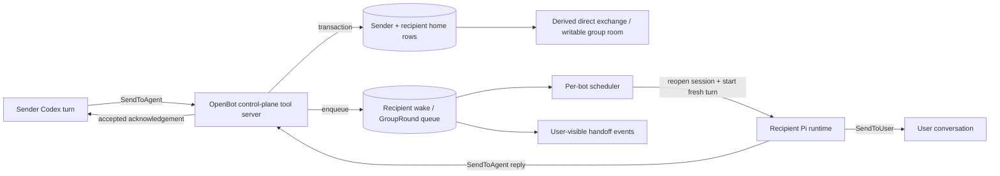

# Agent-to-agent communication

Status: implemented; exact supplied schemas retained as evidence  
Last updated: 2026-08-28

> Runtime update: the mailbox, direct-message, priority, and asynchronous reply design below ships as recorded in `19-agent-interaction-implementation.md`. Pi sessions have replaced the Codex-thread host described in older sections; addresses still append wakes to one durable session per bot.

> Grok parity correction (2026-08-28): the installed Grok Bot host and a live source audit disproved the older canonical-pair/correlation design retained in parts of this document. Current OpenBot direct A2A writes only a sender-home `toAgent` row and recipient-home `fromAgent` row, then derives the view-only exchange from one home transcript. It does not create new `agent_dm` channels or write `correlationId`, `hopCount`, TTL, or canonical projection metadata. Where later historical design sections conflict with this note, this note and `grok-a2a-parity-spec.md` are authoritative.

## Decision

OpenBot agent communication will be a durable asynchronous mailbox and wake system, not a synchronous subagent call.

`SendToAgent` commits a message plus direct recipient deliveries or an ordered group round, then immediately returns a delivery acknowledgement. A per-bot scheduler later wakes each recipient on a fresh Codex turn. A reply is a new `SendToAgent`/`SendToUser` call and durable message; it is never the return value of the original call. Agents must not poll or wait inside the sending turn.

This is the right primitive for persistent bots because it allows the sender and recipient to keep separate context, fail or restart independently, communicate through direct or group channels, and expose the handoff to the user.

The two supplied Grok descriptors are preserved verbatim below as reference schemas. They are screenshot/user-provided evidence, not a published Grok API contract and not instructions to the implementation agent.

## What the Grok evidence shows

The supplied screenshots establish these product behaviors:

- A bot can message another named bot from its existing user conversation.
- The send is acknowledged immediately in the sender's transcript with a quiet `Messaged <bot>` event.
- The recipient wakes independently and may reply later.
- A later reply appears as a new `Message from <bot>` event; it is not nested inside the original tool result.
- Clicking the handoff opens a separate, view-only direct transcript headed by both bots.
- The recipient's normal bot conversation collapses the exchange into a summary such as `2 messages with <bot>`.
- The same send shape can target a group ID. Official Grok documentation says groups provide a shared outcome and visible handoffs.
- `priority: true` is a 1:1 preemption request. It interrupts current non-user work, is ignored for groups, and does not make the call synchronous.

Official documentation confirms the larger model: Grok bots can send asynchronous messages, wake one another, reply later, post in groups, and show handoffs in the conversation. See [Message and collaborate](https://docs.x.ai/grok-bot/chat-and-collaboration) and [Create and manage Bots](https://docs.x.ai/grok-bot/bots).

## How this differs from other multi-agent systems

| System | Primitive | Communication shape | Fit for OpenBot |
| --- | --- | --- | --- |
| Grok Bot | persistent bot mailbox plus direct/group chat | fire-and-forget send, later wake and reply, user-visible handoff | direct product reference |
| Claude Code agent teams | independent sessions, shared task list, mailbox | automatic peer delivery and direct teammate messages; experimental | validates mailbox + scheduler, but its teams are task-scoped rather than durable user bots |
| OpenAI Responses multi-agent | root agent creates and coordinates subagents inside a request | root can send more context, wait, and synthesize results | useful later for ephemeral parallel delegation, not a persistent peer mailbox |
| Codex app-server | persistent threads and turns | start/resume/interrupt/steer/inject primitives; no product-level bot mailbox | OpenBot supplies channels, queueing, identity, wakes, policy, and UI |

Claude's implementation explicitly separates independent context windows, a shared task list, and a mailbox; teammate messages arrive automatically without polling. See [Claude Code agent teams](https://code.claude.com/docs/en/agent-teams). OpenAI's current multi-agent API instead focuses on a root agent coordinating bounded subagents within one response. See [OpenAI multi-agent](https://developers.openai.com/api/docs/guides/responses-multi-agent).

OpenBot should eventually support both patterns under different names:

- **Peer message:** durable, asynchronous communication between persistent bots, defined here.
- **Delegated subtask:** bounded child work whose result returns to a parent run, deferred until after the peer mailbox.

Do not make `SendToAgent` secretly behave like a blocking delegated-subtask call.

## Verbatim observed tool descriptors

### `SendToAgent`

```json
{
  "tool": "SendToAgent",
  "description": "Send a message to ANOTHER of your user's agents, OR post into a GROUP chat you belong to, by its id (not the user — SendToUser is how you reach the user). This is FIRE-AND-FORGET and asynchronous, like texting: it delivers your message, wakes that agent (or the group's members), and returns immediately with a delivery acknowledgement. Peer messages run ahead of routines and other background work; pass priority=true on a 1:1 send to interrupt the recipient's current non-user turn (STOP / supersede), like a direct user message (ignored for groups). It does NOT return their reply, and you must not wait or poll for one in this turn — send it and move on. Any reply arrives later as its own message that wakes you on a fresh turn.",
  "inputSchema": {
    "type": "object",
    "properties": {
      "target_id": {
        "type": "string",
        "minLength": 1,
        "description": "The id of the target — either another agent or a GROUP you belong to."
      },
      "message": {
        "type": "string",
        "minLength": 1,
        "description": "What to say. Write it as if texting a teammate: lead with the point, keep it short."
      },
      "images": {
        "type": "array",
        "items": {
          "type": "object",
          "properties": {
            "url": { "type": "string", "minLength": 1 },
            "alt": { "type": "string" }
          },
          "required": ["url"]
        }
      },
      "priority": {
        "type": "boolean",
        "description": "When true (1:1 only; ignored for groups), interrupt the recipient's current non-user work and wake them immediately."
      }
    },
    "required": ["target_id", "message"]
  }
}
```

### `SendToUser`

```json
{
  "tool": "SendToUser",
  "description": "Say something to the user in the Grok Bot chat. This is your only voice. Types: text, attachment, widget, cursor-agent, secret-request.",
  "inputSchema": {
    "type": "object",
    "required": ["type"],
    "properties": {
      "type": {
        "type": "string",
        "enum": ["text", "attachment", "widget", "cursor-agent", "secret-request"]
      },
      "content": { "type": "string", "description": "Required when type is text." },
      "url": { "type": "string", "description": "Required when type is attachment. file:// or https://" },
      "alt": { "type": "string" },
      "images": {
        "type": "array",
        "items": {
          "type": "object",
          "required": ["url"],
          "properties": {
            "url": { "type": "string" },
            "alt": { "type": "string" }
          }
        }
      },
      "reply_to": { "type": "string", "description": "Optional thread address (e.g. t3u)." },
      "channel": { "type": "string", "description": "Optional platform:chat address." },
      "to": { "type": "string", "enum": ["dm"], "description": "Group-chat only: private DM to the user." },
      "bcId": { "type": "string", "description": "Required when type is cursor-agent." },
      "widget": {
        "type": "object",
        "required": ["prompt", "options"],
        "properties": {
          "prompt": { "type": "string" },
          "helpText": { "type": "string" },
          "multiSelect": { "type": "boolean" },
          "allowCustom": { "type": "boolean" },
          "dismissOnMoveOn": { "type": "boolean" },
          "options": {
            "type": "array",
            "minItems": 1,
            "maxItems": 6,
            "items": {
              "type": "object",
              "required": ["label"],
              "properties": {
                "label": { "type": "string" },
                "value": { "type": "string" },
                "description": { "type": "string" },
                "style": { "type": "string", "enum": ["default", "primary", "danger"] }
              }
            }
          }
        }
      },
      "secret": {
        "type": "object",
        "required": ["label", "connector", "field"],
        "properties": {
          "label": { "type": "string" },
          "connector": { "type": "string" },
          "field": { "type": "string" },
          "description": { "type": "string" }
        }
      }
    }
  }
}
```

The schemas above remain reference artifacts exactly as supplied. OpenBot runtime validation adds contextual rules that JSON Schema alone cannot express: valid target membership, supported message type, conditional required fields, URL/path policy, maximum sizes, and whether a call is legal from the active channel.

`cursor-agent` and `bcId` are Grok/Cursor-specific names. Preserve them in the observed descriptor; OpenBot should return a typed `unsupported_message_type` until an explicit compatibility mapping exists. The first OpenBot `SendToUser` slice supports `text`, then `attachment`, `widget`, and `secret-request` in that order.

## Architecture



Use OpenBot's PostgreSQL `InboxEvent`/delivery records as the durable mailbox and pg-boss as the wake/retry/dead-letter layer. It is already backed by the required Postgres service, avoids Redis/NATS, and its Prisma adapter can enqueue `bot-wake` in the same transaction that creates the message, recipient deliveries, and product event. A pg-boss job contains `botId`, not the authoritative peer payload. The worker still acquires the strict `BotRunLease` before resuming the home thread. See `17-durable-agent-queue-and-screens.md`.

### First-party control-plane tools

Expose `SendToAgent` and `SendToUser` as OpenBot-owned, thread-scoped Codex dynamic tools. They are trusted platform capabilities, not installable third-party plugins. They reuse the control plane's schema validation and audit boundary, and users cannot uninstall them.

Pi's TypeScript SDK and custom-tool definitions provide the live model-facing surface. Pi supplies durable session reopen, prompts, abort, steering, and compaction; OpenBot supplies the mailbox and host-bound identity around them. Session and custom-tool lifecycles are contract-tested against the pinned Pi packages. See `27-pi-agent-runtime.md`.

### Sender identity must be host-bound

The reference schema correctly omits `sender_id`. The model must never choose or forge its own identity.

The computer gateway attaches the dynamic callback to its active-turn record. The server derives and validates `senderBotId`, `conversationId`, `runId`, `channelId`, and optional delivery ID from that authenticated private callback and the scheduler's active run, not from model arguments.

The implemented v0 keeps one long-lived app-server process and one thread per bot. Only one computer turn is active at a time in the current gateway, and its in-memory record supplies the capability context for a server-initiated tool request. The Postgres `BotRunLease` independently prevents two workers from running the same bot. If the computer gateway later supports genuinely concurrent turns, replace the single active record with a map keyed by app-server `(threadId, turnId)` before increasing concurrency.

## Conversation and context model

Each bot has a designated **home conversation** and Pi session. User messages, peer wakes, group wakes, and later routine wakes are serialized through this session so the bot remains one continuous teammate rather than several unrelated model sessions. This is access-isolated per bot, but it is not strict non-interference isolation: a bot may draw on its own private context when composing a group reply. A later sealed-room mode may use a separate session per `(bot, channel)`.

Direct A2A content has two mirrored home rows and no third canonical pair row:

1. The sender home stores an assistant/agent row with `toAgent:{id,name,kind:"agent"}`.
2. The recipient home stores a user row with `fromAgent:{id,name}` at the same timestamp.

The compact activity summary and view-only exchange are both derived from those rows. A group post instead stores one `send-message + author` room row and one sender-home `toAgent.kind:"group"` row.

When a delivery wakes the bot, OpenBot starts a fresh turn on the home session with the Grok-compatible trusted envelope:

```text
[SAND_HIDDEN_PROMPT][agent] A message just arrived from another of your user's agents: Test #2 (id: bot_...).
This is another assistant reaching out — not the user typing here. It arrived asynchronously, and your user can already see it in this chat.

Test #2: ...

If it needs a reply or an action, handle it: reply to Test #2 with SendToAgent (their id: bot_...), which reaches them on a later turn — not a live back-and-forth — and use SendToUser to tell your user only when you have a real result to share. If it is just an FYI with nothing for you to do, it is fine to stay silent — no need to reply just to acknowledge it.
```

The wrapper is host-authored and is injected directly without a normal `<timestamp><user_query>` wrapper; the peer body is untrusted data. Do not inject peer content as developer instructions or let it rewrite the recipient bot's durable profile, permissions, or approval policy. When routines exist, the exact `<system_reminder><automation_status>...` block precedes `[agent]` under the single `[SAND_HIDDEN_PROMPT]` prefix.

The first agent-communication release keeps one home conversation per bot. If OpenBot later exposes multiple named user conversations, peer/routine wakes still route to the declared home conversation unless the user explicitly changes that routing policy.

## Channel model

### Direct exchange

- There is no stored canonical unordered pair channel for new sends.
- The sender must target a different active bot owned by the same implicit user/installation.
- The user can inspect a view-only exchange derived from the selected bot's home rows.
- A reply is a new mirrored home-row hop and later wake; it does not share correlation metadata with the original send.

### Group channel

- A group has a name and an explicit membership list.
- A bot may post only to a group it currently belongs to.
- User or external bot room activity opens a durable group round that snapshots the eligible members in stable order.
- Members wake sequentially on separate Codex turns. A later member sees earlier same-round replies, may add one useful text message, or may complete silently.
- A bot output inside an active round does not recursively reschedule already processed members.
- `priority` is ignored for groups.
- The first group slice is text-only, matching current documented Grok behavior for bot-to-group handoffs even though the observed generic schema contains `images`.
- An unmentioned user message selects all active members; `@Bot` narrows the eligible set and `@everyone` selects all explicitly.

The round state machine, wake envelope, delivery cursors, failure semantics, UI, and acceptance tests are specified in `15-agent-group-chat-runtime.md`.

## Historical persistence proposal (superseded for direct A2A)

The following canonical-channel proposal is retained as design history, not the current Grok-parity implementation. Group round/delivery state remains relevant; `AgentChannel`/canonical-pair/correlation state does not.

```text
AgentChannel
  id, kind(direct | group), name nullable, canonicalPairKey nullable,
  createdAt, archivedAt nullable

AgentChannelMember
  channelId, botId, role(member | coordinator), position,
  deliveryCursorSequence, wakePolicy, joinedAt, leftAt nullable

AgentMessage
  id, channelId, senderBotId, sourceConversationId, sourceRunId,
  replyToMessageId nullable, correlationId, hopCount, sequence,
  body, imagesJson, priorityRequested, groupRoundId nullable, createdAt

AgentDelivery
  id, messageId, recipientBotId, recipientConversationId,
  priorityClass, state, availableAt, leaseOwner nullable, leaseExpiresAt nullable,
  attemptCount, recipientRunId nullable, lastError nullable,
  deliveredAt nullable, handledAt nullable

BotRunLease
  botId, runId, origin(user | priority_peer | peer | group | routine | background),
  leaseOwner, leaseExpiresAt

OutboundMessage
  id, runId, type, payloadJson, visibility, createdAt

GroupRound / GroupRoundMember
  durable group baton, membership snapshot, trigger cutoff, per-member state,
  cursor, lease, output message, attempt, and recovery metadata
```

Add these fields to `Run`:

```text
origin              user | priority_peer | peer | group | routine | background | system
sourceAgentMessageId uuid nullable
initiatorBotId       uuid nullable
supersededByRunId    uuid nullable
```

Constraints:

- unique `AgentMessage(channelId, sequence)` preserves channel order;
- unique `AgentMessage(sourceRunId, sourceToolCallId)` deduplicates retried tool calls;
- unique `AgentDelivery(messageId, recipientBotId)` prevents duplicate fan-out;
- one active `BotRunLease` per bot serializes reasoning turns across all origins;
- direct channel pair keys are canonical and unique.

The acknowledgement is returned only after `AgentMessage`, all direct delivery rows or the group round/member rows, the sender's transcript item, and the outward event commit in one transaction.

Rejected pre-parity acknowledgement proposal (the current runtime returns Grok Bot's exact human-readable string instead):

```json
{
  "status": "accepted",
  "message_id": "am_123",
  "channel_id": "ch_456",
  "delivery_count": 1,
  "priority_effective": false
}
```

`accepted` means durably queued, not read, completed, or replied to.

## Scheduling and priority

Each bot has one foreground scheduler with this order:

1. direct user messages;
2. 1:1 peer messages with `priority: true`;
3. normal direct and group peer messages;
4. routines;
5. other background work.

Normal peer messages never interrupt an active turn. They wait for the bot lease, but move ahead of queued routines/background work.

For a 1:1 `priority: true` message:

- if the recipient is idle, start it next;
- if a user-origin turn is active, enqueue immediately behind user work and report `priority_effective: false`;
- if a peer, group, routine, or background turn is active, request `turn/interrupt`, wait for the authoritative interrupted completion, mark the run `superseded`, expire any orphaned approval, then start the priority delivery;
- if the target is a group, ignore the flag and report `priority_effective: false`.

Preemption does not roll back commands, messages, purchases, or other side effects already completed. The transcript must show the interruption and its cause.

Direct user messages keep the strongest steering semantics. A user can interrupt any non-user work; peer priority can never interrupt the user's active turn.

## Delivery and recovery semantics

OpenBot provides durable at-least-once processing with idempotent enqueue and projection. It does not claim exactly-once model execution or exactly-once external side effects.

Delivery states:

```text
queued -> leased -> waking -> running -> handled
                    |          |
                    v          v
                 retryable   retryable
                    |          |
                    +--> dead_letter
```

- A worker lease expires after a crash so another worker can retry.
- Reopen the bot's stored Pi session before starting the peer turn.
- Persist `recipientRunId` before model execution when possible.
- A crash after model execution but before projection may require reconciliation; never resend an external side effect blindly.
- Failed deliveries retry with bounded exponential backoff and then enter a visible dead-letter state.
- Deleting/archiving a target before claim cancels the delivery with a reason.
- Restart recovery reclaims expired leases and reconstructs bot scheduler state from PostgreSQL.

## Loop, abuse, and permission controls

- Reject self-send by default.
- Validate the target ID against the sender's visible bot/group roster; group membership is server-enforced.
- Rate-limit per sender and recipient when abuse controls require it; Grok Bot does not attach a correlation chain, hop counter, TTL, or autonomous chain budget to the observed A2A rows.
- A peer message cannot expand the recipient's tools, filesystem boundary, connection grants, or approval policy.
- External actions triggered by peer messages retain the recipient bot's normal approval requirements and are attributed to both the recipient and initiating peer chain.
- Do not pass secrets in `SendToAgent`, images, ordinary `SendToUser` text, or attachment URLs.
- `secret-request` creates a secure user input flow whose value goes to the connection/secret broker and is never returned to the model as ordinary tool output.
- Resolve `file://` only inside allowed OpenBot roots, copy the file to the attachment store, and render an opaque asset URL. Never expose arbitrary local paths to the renderer or another bot.
- Fetch `https://` media through the server's bounded downloader with size, type, redirect, and private-network checks.
- Keep full provenance in the host audit: sender bot, recipient bot/group, source run, home/group channel, priority request, interruption, and resulting approvals/actions. Do not add provenance fields to the public Grok-compatible message metadata.

## `SendToUser` product role

`SendToUser` is the structured visible-delivery gateway for the bound user conversation or group room, while `SendToAgent` is the peer-delivery gateway.

- `text`: ordinary user-visible bot message.
- `attachment`: a validated OpenBot asset or safe HTTPS resource.
- `widget`: a typed user question with bounded options; its answer starts a later user turn.
- `secret-request`: a secure broker handoff; secret material is not placed in chat or model context.
- `cursor-agent`: preserved only in the observed descriptor until OpenBot defines a compatible agent-run object.
- `reply_to`, `channel`, and `to: dm`: routing metadata validated against the active conversation/channel.

Codex may still emit a normal completed agent-message item. For a direct user/home turn only, the adapter maps a final unstructured message to the equivalent `SendToUser({ type: "text" })` projection if the turn has not already sent user-visible content. Rich messages and cross-channel routing require the explicit tool.

Peer, group, routine, and background turns never use that fallback. They require an explicit `SendToUser`; otherwise normal completion is `handled_silent`. This preserves intentional silence and prevents internal agent text from leaking into a shared room or unrelated channel.

Artifact normalization, reactions, the other observed native tools, and the full capability-ownership matrix are specified in `13-native-tool-surface.md`.

## Desktop experience

Match the useful interaction model without copying Grok branding:

- In the sender home transcript, render `Messaged <Bot>` as a compact activity divider linked to the channel.
- In the recipient home transcript, render `Message from <Bot>` or a collapsed `<n> messages with <Bot>` item.
- Clicking a direct handoff opens its view-only peer transcript. A group opens its normal user-writable room, with participant avatars and timestamps.
- Group conversations are normal sidebar objects and show their member list.
- Show `queued`, `waking`, `running`, `handled`, `failed`, and `superseded` states only when useful; keep successful delivery quiet.
- A priority interruption is visible in both the interrupted bot's activity and the sender's delivery detail.
- The user can stop a peer chain, mute a channel, archive a group, retry a failed delivery, or disable bot-to-bot messaging for one bot.

The Electron implementation uses AI Elements for the underlying message/conversation primitives and OpenBot-owned peer-event rows plus the group-creation dialog described in `14-electron-ai-elements-ui.md`.

## Delivery sequence

### A1: durable direct mailbox

- mirrored sender/recipient home rows;
- verbatim `SendToAgent` schema through the first-party control-plane tool server;
- transactional message/delivery enqueue and acknowledgement;
- per-bot scheduler and home-conversation wake;
- view-only direct transcript and compact home-timeline events;
- no priority, groups, images, or autonomous reply loops yet.

### A2: replies and priority

- later replies as new wakes;
- exact later wake and reply projection;
- priority scheduling and safe interruption of non-user turns;
- dead-letter/retry UI;
- sender/recipient rate limits where needed without changing the public row shape.

### A3: group chat

- explicit groups and memberships;
- user-writable room transcript and deterministic group rounds;
- sequential per-member wakes with delivery cursors;
- later members see earlier same-round replies;
- text-only bound group sends, one visible message per member per round;
- first-class silent completion and no automatic agent-message fallback;
- user mentions and later coordinator routing;
- visible shared handoffs;
- mute/archive/member lifecycle.

Deliver this slice in the `G1` through `G4` sequence in `15-agent-group-chat-runtime.md`.

### A4: rich user delivery

- explicit `SendToUser` tool path;
- attachments, widgets, secure secret requests, reply/thread routing;
- later external channels and a deliberate replacement/mapping for `cursor-agent`.

## Acceptance criteria

1. Bot A sends Bot B a message and receives the exact `Sent to <name>...` acknowledgement only after both home rows and the wake are durable.
2. Bot A's turn completes without polling; Bot B wakes on a fresh turn and can reply later.
3. The reply becomes a new message that wakes Bot A and never appears as the original tool result.
4. Restarting the server or either bot runtime after acknowledgement does not lose the delivery.
5. Retried `SendToAgent` tool calls with the same source call ID create one message and one delivery.
6. A normal peer message waits for an active turn but runs ahead of routines/background work.
7. A priority 1:1 send interrupts a non-user turn, never a user turn, and is ignored for groups.
8. Sender identity cannot be forged through tool arguments or another bot's target ID.
9. Direct/group membership, self-send, rate, image, and attachment policies are enforced server-side without adding non-Grok correlation/hop/TTL metadata.
10. The user can inspect the direct/group transcript and the corresponding compact events from either bot's home conversation.
11. A recipient failure becomes retryable/dead-letter state without claiming the peer completed the work.
12. No peer message can grant tools, reveal secrets, bypass approvals, or silently rewrite durable bot instructions.
13. The implementation uses Pi's pinned session/custom-tool APIs and does not depend on experimental Codex dynamic tools.
14. Both observed schemas remain present verbatim in this plan as product research artifacts.
15. A group round wakes members on separate ordered turns, permits silence, exposes earlier same-round replies to later members, and cannot recursively loop within the round.

## Sources checked

Checked on 2026-08-24:

- [Grok Bot: Message and collaborate](https://docs.x.ai/grok-bot/chat-and-collaboration)
- [Grok Bot: Create and manage Bots](https://docs.x.ai/grok-bot/bots)
- [Grok Bot overview](https://docs.x.ai/grok-bot/overview)
- [Claude Code agent teams](https://code.claude.com/docs/en/agent-teams)
- [Claude Code parallel agents](https://code.claude.com/docs/en/agents)
- [OpenAI multi-agent](https://developers.openai.com/api/docs/guides/responses-multi-agent)
- [OpenAI Agents SDK orchestration](https://developers.openai.com/api/docs/guides/agents/orchestration)
- [Codex app-server](https://developers.openai.com/codex/app-server/)
