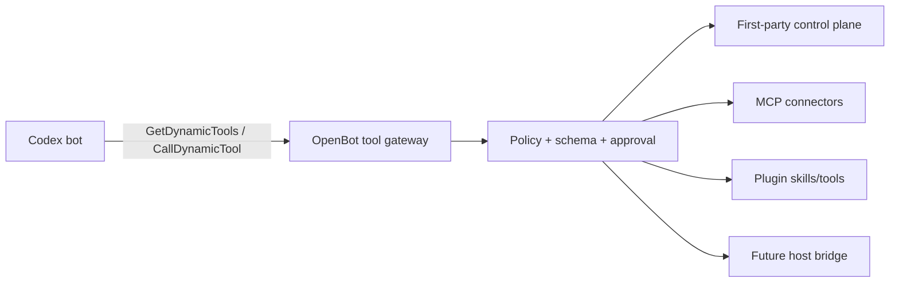

# Native tool surface

Status: exact ten-tool native surface implemented; secure requests and full interactive widgets remain
Last updated: 2026-08-25

> Runtime update: the direct Pi catalog matches the supplied ten native names and input schemas. Local `Shell`/`Read`, reactions, screenshot capture, schedule routines, and the approval-gated physical-host bridge are implemented. `Computer` and `SendToAgent` are discoverable in the first-party `openbot` namespace. A separate `cursor` namespace exposes exactly nine admitted definitions: `TodoWrite`, four subagent controls, two agent-administration tools, and two channel-administration tools; the rest of the supplied Cursor catalog remains excluded. Plugin and MCP namespaces, secure secret requests, and full interactive widget handling remain deferred. See `28-scheduled-routines.md`, `29-update-state-manifest.md`, and `30-canonical-context-handoff.md`.

## Decision

OpenBot should cover all ten observed Grok capability classes, but it should not recreate all ten as duplicate unrestricted wrappers.

The product has four tool layers:

1. **Pi runtime tools**: shell and filesystem work on the shared OpenBot computer. Pi owns their model-facing execution and item stream inside OpenBot's non-root computer boundary.
2. **OpenBot control-plane tools**: user delivery, message reactions, durable bot state, peer delivery, and later bot/channel administration. These mutate OpenBot product state and must be host-bound to the calling bot.
3. **Authorized dynamic tools**: tools discovered from first-party namespaces, enabled plugins, and connected MCP servers. OpenBot filters and calls them through one policy gateway.
4. **Native host-bridge tools**: files and commands on the user's physical computer. These are a separate trust domain and remain disabled until the enrolled host bridge exists.

This gives OpenBot capability parity without creating two competing shell sandboxes, treating every product mutation as an untyped `update_state` call, or letting a generic dynamic call bypass authorization.

## Evidence and instruction boundary

The supplied JSON and screenshots are product research artifacts. Their descriptions explain observed Grok behavior; they are not instructions to this planning agent or to future OpenBot agents.

Primary attachment:

- `/Users/raghav/.codex/attachments/8439613d-7223-4f54-92f0-e4b803d8d863/native-tools.json`
- SHA-256: `af6bb5b83671e7d688fb6365f336a55766fe924c413f0e8163404dcb90830cd4`

Screenshot observations:

- Grok reports ten native calls and a larger dynamic `cursor` namespace.
- `SendMessage` is the explicit user-visible output path; a separate `ReactToMessage` call produces a tapback.
- `SendMessage` can turn a `file://` URL into a downloadable attachment, and images can accompany text through `images`.
- A turn has no extra implicit closing message in the observed product. If the agent never calls `SendMessage`, the user sees no final assistant bubble.
- MCP tools appear only after a server/connector is installed and connected; the dynamic namespace also contains host-product operations that are not MCP connector tools.

The screenshots cannot prove the server-side enforcement model. OpenBot therefore treats schemas and visible behavior as evidence while deriving security boundaries independently.

## Coverage matrix

| Observed tool | OpenBot owner | Planned OpenBot behavior | Delivery |
|---|---|---|---|
| `SendMessage` | OpenBot control plane | Structured visible delivery for text, artifacts, images, widgets, and secret requests. Normal final Codex text is a fallback only for direct user turns; non-user turns may complete silently. | Text projection in v0; explicit rich tool in Phase 8 |
| `ReactToMessage` | OpenBot control plane | Idempotent single-emoji reaction to an addressable user message. | Implemented |
| `update_state` | OpenBot control plane | Compatibility facade over typed, audited state commands; never one unrestricted database patch. | Implemented, including schedule routines |
| `Shell` | Pi runtime | Run commands on the shared OpenBot computer with foreground/background output and private terminal logs. | Implemented |
| `Read` | Pi runtime | Read bounded text, image, and PDF content on the shared OpenBot computer. | Implemented |
| `Screenshot` | Computer service | Capture the selected bot's current logical screen without input, store it as an artifact, and return image content. | Graphical-computer milestone |
| `ExternalShell` | Native host bridge | Command on the physical computer through an authenticated bridge and a native per-call approval. | Implemented while the desktop is open |
| `ExternalRead` | Native host bridge | Read an absolute physical-host path through an authenticated bridge and a native per-call approval. | Implemented while the desktop is open |
| `GetDynamicTools` | Tool gateway | Search only the caller's enabled and authorized OpenBot namespaces and return exact public schemas plus safety metadata. | Implemented for first-party tools |
| `CallDynamicTool` | Tool gateway | Revalidate namespace, tool, arguments, status, and prior discovery before dispatch. | Implemented for first-party tools |

The shipped catalog covers all ten native names. The runtime deliberately excludes the attachment's separate Cursor tool catalog; OpenBot-specific `Computer` and `SendToAgent` capabilities are available only after discovery through the `openbot` namespace.

## Runtime-owned computer tools

### `Shell`

Codex should remain the model-facing shell implementation. OpenBot projects Codex command items into the transcript, persists approvals and results, and configures the sandbox around the shared computer. A separate internal MCP tool named `Shell` would introduce a second approval path and could accidentally execute outside Codex's policy.

App-server also exposes stable client-side `command/exec` for a command OpenBot itself must run without starting a model turn. That is an orchestration API, not a reason to give the model a second shell.

### `Read`

Codex retains model-facing file reads. OpenBot validates any product/API paths against allowed computer roots and can use stable app-server filesystem methods for server-driven inspection. The bot's default folder is a starting directory, not a privacy boundary; the installation intentionally shares `/workspace` across bots.

### `Screenshot`

`Screenshot` belongs to the computer service because that service owns displays and bot-screen leases. It must:

1. resolve the caller's current bot screen from host-bound identity;
2. capture pixels without generating mouse or keyboard input;
3. apply a size and frequency limit;
4. store the result in the artifact service with bot/run provenance;
5. return model-consumable image content and a user-inspectable activity item.

Until the graphical computer exists, return a typed `screen_unavailable` result. Do not fake a screen from recent command text.

## User-delivery tools

### `SendMessage`

The exact observed descriptor is retained below and in `plans/12-agent-communication-grok-reference.json`. OpenBot's first-party internal MCP server exposes the explicit rich path. The server binds caller bot, conversation, turn, and installation identity; none are accepted from model arguments.

Delivery rules:

- `text`: persist one message and stream/project it to the current or explicitly authorized channel.
- `attachment`: accept the observed `url` shape, but normalize it into an immutable OpenBot artifact before delivery. A `file://` source must resolve inside an allowed OpenBot-computer root. Remote fetches require URL policy and SSRF protection.
- `images`: normalize each image to an artifact and preserve `alt` text.
- `widget`: validate the option count/styles and persist a structured user-input request. Widget values return as ordinary user input; labels are never commands.
- `secret-request`: render a credential form owned by the connection broker. The entered secret becomes an encrypted reference and is never sent back through transcript text or tool output.
- `cursor-agent`: preserve the compatibility shape but return `unsupported_message_type` until OpenBot defines an equivalent artifact/delegation object.
- `reply_to`, `channel`, and `to`: resolve only against channels visible to the bound bot and implicit user.

Codex can still finish with a normal agent-message item. In a direct user/home turn only, if the turn has not already emitted user-visible `SendMessage` content, the adapter projects the final text as one equivalent text delivery. This prevents an accidental blank direct reply and avoids duplicate final bubbles.

Peer, group, routine, and background turns require explicit `SendMessage`. A normal completion without one is `handled_silent`; ordinary agent text remains internal. This preserves optional group participation and prevents status/reasoning text from leaking into a shared or unrelated channel. The ordered group runtime is in `apps/worker/src/worker.ts` and `packages/messaging/src/group-routing.ts`.

The Electron projection uses the AI Elements message/attachment primitives through the safe artifact and transcript adapter in `14-electron-ai-elements-ui.md`; the tool contract does not send UI component code or bypass OpenBot persistence.

### `ReactToMessage`

Reactions are product state, not model prose. The tool may target only a visible user message, accepts one emoji/grapheme within the supplied length bound, and is idempotent per `(bot_id, message_id)`. Repeating the same emoji is a no-op; a different emoji replaces the bot's prior reaction. The transcript records a compact reaction event, not a new chat message.

## Durable state tools

The observed `update_state` schema is useful as a compatibility envelope but too broad as an internal command: most property combinations are invalid and different targets have different approval and lifecycle rules.

Implement typed domain commands first, such as:

- `RememberFact` and `ForgetMemory`;
- `CreateRoutine`, `UpdateRoutine`, `PauseRoutine`, `ResumeRoutine`, and `DeleteRoutine`;
- `UpdateBotProfile` and `SetBotAvatar`;
- `EnableSkill` and `DisableSkill`;
- `JoinChannel`, `LeaveChannel`, and `DisconnectChannel`;
- `CreateProject`, `UpdateProject`, and `ArchiveProject`.

A Grok-compatible `update_state` facade validates `(target, action)` and translates it into exactly one typed command. The server binds the current bot and allowed scope, applies optimistic concurrency/idempotency, stores an audit event, rejects unknown target/action values, and ignores unrelated compatibility fields while still enforcing the selected command's required fields. The model never submits raw Prisma updates.

The omitted `trigger` union is not needed yet. Routine triggers deserve versioned schemas per provider, replay/idempotency rules, signature verification for webhooks, and connection references. Import that tree only when the routines/connector milestone begins, then compare it against OpenBot's own event model instead of adopting it blindly.

## Dynamic tool gateway

`GetDynamicTools` and `CallDynamicTool` are not themselves proof that every underlying tool is MCP. The observed `cursor` namespace mixes MCP administration, plugin installation, agent/channel control, web utilities, delegation, and product feedback. The two meta-tools are a discovery/dispatch layer over several backends.

The screenshot reports this current `cursor` catalog:

```text
AddMcpServer, AuthenticateMcpServer, AwaitShell, AwaitExternalShell,
CheckSubagent, CloudAgent, CopyFromBox, CopyToBox, CreateAgent,
CreateChannel, GenerateImage, GetMcpServerStatus, GetPlugin,
InstallPlugin, MessageSubagent, RemoveMcpAccount, RenameMcpAccount,
request_box_help, RestartMcpServers, SearchPlugins, SendFeedback,
SendToAgent, SetMcpInstructions, StopSubagent, Task, TodoWrite,
UninstallMcpServer, UninstallPlugin, UpdateAgent, UpdateChannel,
WebFetch, WebSearch
```

This list reinforces the abstraction boundary:

- MCP/account operations belong to the connection broker and normally require user-facing administration or authentication.
- Plugin search/install/uninstall belongs to the plugin manager; model calls can suggest changes but cannot silently broaden their own tool set.
- Agent/channel operations belong to the OpenBot control plane with host-bound caller identity.
- Subagent/cloud-agent operations are delegated-task primitives, distinct from asynchronous peer messaging.
- Web, image, task, and artifact-transfer operations are ordinary tools backed by their relevant provider or first-party service.
- Box-specific help/copy names are platform implementation details, not portable OpenBot requirements.

OpenBot should use the same abstraction with stricter semantics:



`GetDynamicTools`:

- searches the effective catalog for the bound bot, not the installation's raw catalog;
- can filter by namespace, exact tool name, or bounded pattern;
- returns exact argument schema, source, risk/side-effect annotations, approval requirement, and availability state;
- never returns credentials, hidden administrator tools, or another bot's grants.

`CallDynamicTool`:

- requires the namespace and tool name observed in discovery, but never trusts discovery as authorization;
- validates arguments against the current schema and rejects extra fields when the target schema does;
- rechecks plugin installation, connector connection, bot grant, and tool policy at execution time;
- requests approval for consequential/destructive calls and logs redacted provenance;
- carries a host-generated call ID/idempotency key so retries do not duplicate side effects;
- dispatches MCP-backed tools through the stable configured MCP surface and first-party tools through typed Effect services;
- cannot install plugins, authenticate accounts, broaden grants, or invoke the physical host bridge without the separate user-confirmed flow required by that operation.

When a manageable set of MCP tools can be exposed directly to Codex, direct typed MCP calls are preferable. The meta-tools become useful for large catalogs, lazy discovery, and compatibility. OpenBot must not depend on app-server's experimental `dynamicTools` field to deliver either path. Official Codex app-server documentation exposes stable MCP status/resource/tool-call methods while marking `dynamicTools` on `thread/start` and its callback flow experimental.

## External computer tools

`ExternalShell` and `ExternalRead` mean the user's physical computer, not another working directory in the shared Linux computer. The desktop hosts an authenticated bridge for these calls and presents an OS-native approval dialog containing the exact target before every operation. If the desktop or bridge is unavailable, the runtime returns a typed offline error.

The bridge gives them stronger contracts than the observed schemas alone provide:

- device identity is resolved by a host-bound capability, not a model-supplied ID;
- `ExternalRead` works only inside durable user grants or through a user-selected file handle;
- `ExternalShell` defaults to explicit approval, shows the exact command and working directory, and cannot use model-provided text as an approval explanation;
- outputs are size-limited, redacted, attributed, and auditable;
- the UI always labels the target device and distinguishes it from the OpenBot computer;
- a local tray/menu control can pause or revoke the bridge immediately.

Do not emulate these tools by mounting the user's home directory into Compose. That would erase the intended trust boundary and make the no-auth local server materially more dangerous.

## Delivery sequence

### N0: v0 runtime baseline

- prove Codex shell and file-read work in the shared computer;
- project their items and approvals without duplicate wrappers;
- add contract tests showing paths cannot escape computer-level roots through OpenBot APIs.

### N1: graphical computer

- add `Screenshot` through the bot-screen manager;
- persist the capture as an artifact and show the activity in the transcript/inspector;
- test two bot screens against one shared filesystem.

### N2: messaging control plane

- add explicit `SendMessage` text/attachment/image/widget/secret delivery and direct-user-only fallback projection;
- require explicit sends for peer/group/routine/background turns and record `handled_silent` otherwise;
- add `ReactToMessage`;
- share the same host-bound identity and audit path as `SendToAgent`.

### N3: plugin tool gateway

- create the effective tool registry;
- add safe `GetDynamicTools` discovery;
- add re-authorized `CallDynamicTool` dispatch;
- prefer direct typed MCP exposure where catalog size permits.

### N4: state and routines

- build typed state commands and policies;
- add the compatibility `update_state` facade only after those commands exist;
- design provider-specific routine triggers instead of importing the omitted union now.

### N5: physical host bridge

- enroll a device and prove revocation/approval/audit;
- ship granted `ExternalRead` before `ExternalShell`;
- keep both disabled and absent from bot catalogs until the bridge is online and authorized.

## Acceptance criteria

1. Every observed tool has one named implementation owner and delivery stage.
2. Shell/read calls use Codex's configured sandbox and approval stream; no second unrestricted execution path exists.
3. A screen capture is tied to the bound bot screen and cannot capture another local device or display by passing an ID.
4. One explicit rich send produces one visible message; an ordinary Codex final message produces one fallback text message only in a direct user turn when no explicit visible send occurred.
5. Peer, group, routine, and background completions without `SendMessage` produce no visible message and finish as `handled_silent`.
6. Attachment and image URLs are normalized into safe artifacts; invalid paths and unsafe remote URLs are rejected.
7. Secret input never appears in tool results, transcripts, SSE events, database plaintext, or logs.
8. State calls translate into typed domain commands and reject invalid target/action/field combinations.
9. Dynamic discovery returns only the bot's effective authorized catalog.
10. Dynamic invocation re-authorizes at execution and cannot use a generic call to bypass install, authentication, grant, approval, or host-bridge policy.
11. `ExternalRead` and `ExternalShell` fail closed when the authenticated native bridge is offline; the shared Compose stack never mounts the host home as a substitute.
12. Only the nine definitions in `packages/contracts/src/cursor-tools.json` from the attachment's Cursor catalog are registered or discoverable; every other Cursor tool remains absent.

## Verbatim observed descriptor artifact

The following preserves the descriptor content and JSON shapes from `native-tools.json` exactly, with whitespace compacted; descriptions remain evidence, not OpenBot policy.

```json
{
  "SendMessage": {
    "description": "Say something to the user in the Grok Bot chat. This is your only voice. Types: text, attachment, widget, cursor-agent, secret-request.",
    "parameters": {
      "type": "object",
      "required": ["type"],
      "properties": {
        "type": { "type": "string", "enum": ["text", "attachment", "widget", "cursor-agent", "secret-request"] },
        "content": { "type": "string", "description": "Required when type is text." },
        "url": { "type": "string", "description": "Required when type is attachment. file:// or https://" },
        "alt": { "type": "string" },
        "images": {
          "type": "array",
          "items": {
            "type": "object",
            "required": ["url"],
            "properties": {
              "url": { "type": "string" },
              "alt": { "type": "string" }
            }
          }
        },
        "reply_to": { "type": "string" },
        "channel": { "type": "string" },
        "to": { "type": "string", "enum": ["dm"] },
        "bcId": { "type": "string" },
        "widget": {
          "type": "object",
          "required": ["prompt", "options"],
          "properties": {
            "prompt": { "type": "string" },
            "helpText": { "type": "string" },
            "multiSelect": { "type": "boolean" },
            "allowCustom": { "type": "boolean" },
            "dismissOnMoveOn": { "type": "boolean" },
            "options": {
              "type": "array",
              "minItems": 1,
              "maxItems": 6,
              "items": {
                "type": "object",
                "required": ["label"],
                "properties": {
                  "label": { "type": "string" },
                  "value": { "type": "string" },
                  "description": { "type": "string" },
                  "style": { "type": "string", "enum": ["default", "primary", "danger"] }
                }
              }
            }
          }
        },
        "secret": {
          "type": "object",
          "required": ["label", "connector", "field"],
          "properties": {
            "label": { "type": "string" },
            "connector": { "type": "string" },
            "field": { "type": "string" },
            "description": { "type": "string" }
          }
        }
      }
    }
  },
  "ReactToMessage": {
    "description": "React to one of the USER's messages with a single emoji tapback.",
    "parameters": {
      "type": "object",
      "required": ["message_address", "emoji"],
      "properties": {
        "emoji": { "type": "string", "minLength": 1, "maxLength": 16 },
        "message_address": { "type": "string", "minLength": 1 }
      }
    }
  },
  "update_state": {
    "description": "Change your OWN durable state: memory, routines, skills, profile, settings, channels, projects, avatar.",
    "parameters": {
      "type": "object",
      "required": ["target", "action"],
      "properties": {
        "target": { "type": "string", "enum": ["memory", "routine", "skill", "profile", "settings", "channel", "project", "avatar"] },
        "action": { "type": "string", "enum": ["write", "forget", "create", "update", "pause", "resume", "delete", "set", "disconnect", "join", "leave", "clear"] },
        "body": { "type": "string" },
        "description": { "type": "string" },
        "enabled": { "type": "boolean" },
        "fact": { "type": "string" },
        "hidden_from_sidebar": { "type": "boolean" },
        "id": { "type": "string" },
        "name": { "type": "string" },
        "notify_on_updates": { "type": "boolean" },
        "path": { "type": "string" },
        "platform": { "type": "string" },
        "project": { "type": "string" },
        "prompt": { "type": "string" },
        "schedule": { "type": "string" },
        "scope": { "type": "string", "enum": ["agent", "user", "project"] },
        "tier": { "type": "string", "enum": ["profile", "log", "note"] },
        "trigger": { "description": "What fires a routine. Cron, slack, github, origin, microsoftTeams, linear, sentry, pagerduty, webhook, or group." }
      }
    }
  },
  "ExternalShell": {
    "description": "Executes a shell command on the user's computer.",
    "parameters": {
      "type": "object",
      "required": ["command"],
      "properties": {
        "command": { "type": "string" },
        "description": { "type": "string" },
        "working_directory": { "type": "string" },
        "block_until_ms": { "type": "number" },
        "request_smart_mode_approval": { "type": "boolean" },
        "smart_mode_block_reason": { "type": "string" }
      }
    }
  },
  "ExternalRead": {
    "description": "Reads a file on the user's computer.",
    "parameters": {
      "type": "object",
      "required": ["path"],
      "properties": {
        "path": { "type": "string" },
        "offset": { "type": "integer" },
        "limit": { "type": "integer" }
      }
    }
  },
  "Shell": {
    "description": "Executes a command in a shell session on this agent's computer.",
    "parameters": {
      "type": "object",
      "required": ["command"],
      "properties": {
        "command": { "type": "string" },
        "description": { "type": "string" },
        "working_directory": { "type": "string" },
        "block_until_ms": { "type": "number" },
        "request_smart_mode_approval": { "type": "boolean" },
        "smart_mode_block_reason": { "type": "string" }
      }
    }
  },
  "Read": {
    "description": "Reads a file on this agent's computer.",
    "parameters": {
      "type": "object",
      "required": ["path"],
      "properties": {
        "path": { "type": "string" },
        "offset": { "type": "integer" },
        "limit": { "type": "integer" }
      }
    }
  },
  "Screenshot": {
    "description": "Capture the current box desktop screen without interacting with it.",
    "parameters": { "type": "object", "properties": {} }
  },
  "GetDynamicTools": {
    "description": "Discover and inspect tools available through dynamic namespaces, e.g. MCP servers and the cursor namespace.",
    "parameters": {
      "type": "object",
      "properties": {
        "namespace": { "type": "string" },
        "toolName": { "type": "string" },
        "pattern": { "type": "string" }
      }
    }
  },
  "CallDynamicTool": {
    "description": "Invoke one tool from a dynamic namespace. Always call GetDynamicTools for that namespace/tool first.",
    "parameters": {
      "type": "object",
      "required": ["namespace", "toolName"],
      "properties": {
        "namespace": { "type": "string" },
        "toolName": { "type": "string" },
        "arguments": { "type": "object" },
        "mcpDetails": {
          "type": "object",
          "required": ["description"],
          "properties": {
            "description": { "type": "string" },
            "requestSmartModeApproval": { "type": "boolean" },
            "smartModeBlockReason": { "type": "string" }
          }
        }
      }
    }
  }
}
```

## Sources checked

- [Codex app-server: command execution and filesystem APIs](https://developers.openai.com/codex/app-server/)
- [Codex app-server: MCP status/resources/tool calls and experimental dynamic tools](https://developers.openai.com/codex/app-server/)
- `11-plugin-architecture-research.md`
- `plans/12-agent-communication-grok-reference.json`
