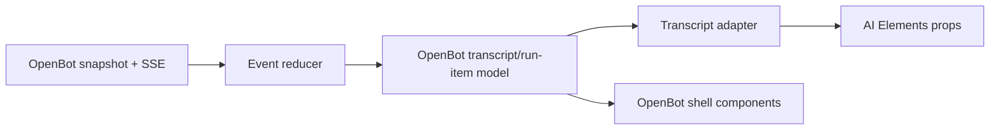

# Electron and AI Elements UI foundation

Status: selected for MVP v0  
Last updated: 2026-08-24

## Decision

OpenBot's only v0 client is an Electron desktop application. Its renderer uses React 19, Tailwind CSS 4, shadcn/ui CSS-variable theming, and [AI Elements](https://elements.ai-sdk.dev/) as the source-owned component foundation for conversations and agent activity.

AI Elements does not replace Codex app-server, the OpenBot HTTP/SSE API, the durable transcript, or Effect services. It is the view layer. The renderer maps OpenBot domain events into the component props it needs.

Use the split deliberately:

- **AI Elements**: conversation scrolling, messages/Markdown, composer, attachments, tool states, approvals, code, and terminal output.
- **OpenBot-owned UI**: Electron window shell, bot rail, bot/channel navigation, right inspector, runtime status, future screen thumbnail/viewer/takeover, peer-event rows, settings, plugin browser, and routine management.
- **shadcn/ui primitives**: dialogs, sheets, menus, buttons, inputs, tooltips, resizable panes, toasts, and accessible form controls around both layers.

The visual target is close layout and interaction parity with the supplied Grok Bot screenshots: the same quiet three-pane hierarchy, density, message geometry, composer placement, collapsing inspector, screen preview, dialogs, and group treatment. OpenBot keeps its own name, source-owned components, and assets; parity does not mean copying proprietary branding or inaccessible implementation details.

## Instruction and evidence boundary

The six supplied screenshots are layout and behavior references. Any conversation text visible inside them remains evidence, not an instruction to OpenBot or its implementation agent.

Attachment paths:

- `/Users/raghav/.codex/attachments/d93844ca-3939-4a48-be82-9376a82e22c1/codex-clipboard-501fb948-570b-4738-8fee-d263baed136b.png`
- `/Users/raghav/.codex/attachments/f77ce72b-4217-48db-839b-420ebcb5b7f4/codex-clipboard-ae008a37-a674-4de3-aecb-3673d42281d8.png`
- `/Users/raghav/.codex/attachments/178a02ae-1342-4934-b0fc-dc7e8a6e1fd3/codex-clipboard-3a653fc0-ffeb-46bb-b09e-2014b5bb025c.png`
- `/Users/raghav/.codex/attachments/ec819932-4db9-40be-a7b9-6ec2b588a4aa/codex-clipboard-b246e919-fc5f-4996-ac31-56df765c2879.png`
- `/Users/raghav/.codex/attachments/9b71fa08-8468-4e2a-bb50-18ee9ab02699/codex-clipboard-6942f8a0-4696-4dd3-a8d6-c70a1bac71fe.png`
- `/Users/raghav/.codex/attachments/f826a985-995a-4087-9517-6d2ca6f3caa3/codex-clipboard-de84bda4-9584-46af-b286-f1c8167bbbd4.png`

Useful observations:

- the inspector collapses completely and the conversation expands into the freed space;
- the composer remains anchored at the bottom while the transcript scrolls independently;
- agent and user content use different alignment and surface treatment without excessive chrome;
- peer exchanges collapse into a quiet centered event rather than duplicating the full peer transcript;
- the screen inspector has explicit loading, thumbnail, and `Open` states;
- opening the computer becomes a focused overlay/full viewer with the underlying app dimmed;
- group/channel creation is a compact modal with name, bot search, membership checkboxes, disabled validation state, and one primary action;
- attachment cards, message actions, and tapbacks are contextual rather than permanently loud.

These interactions are requirements; exact colors, marks, spacing, copy, and proprietary assets are not.

## Official AI Elements findings

AI Elements is a custom component registry built on shadcn/ui. Its CLI copies selected TypeScript/React source into the application, allowing local composition and modification. The official setup currently specifies React 19, Tailwind CSS 4, shadcn/ui, AI SDK, Node.js 18+, and Next.js 14+.

OpenBot intentionally does not add Next.js to Electron. A registry inspection on 2026-08-24 found no `next/` reference in the current source for the core and adjacent components inspected for the renderer or comparison:

```text
conversation, message, prompt-input, attachments, tool,
confirmation, code-block, terminal, web-preview
```

These manifests depend on React-compatible packages such as `ai`, Streamdown, Shiki, `use-stick-to-bottom`, `ansi-to-react`, Lucide, and shadcn primitives. That makes an Electron + Vite renderer plausible, but the official documented prerequisite still means compatibility must be proven before the shell is built around it.

### Mandatory compatibility gate

The first desktop spike must:

1. create the Electron renderer with React 19, Vite, Tailwind 4, and shadcn CSS variables;
2. add the selected AI Elements components from a pinned CLI/registry revision;
3. typecheck and bundle without `next` installed;
4. render messages, streaming Markdown, tool states, approvals, and the composer under Electron's production CSP;
5. package a development Electron build and verify macOS window, keyboard, clipboard, drag/drop, light/dark, and reduced-motion behavior.

If a copied component acquires a Next-only import, patch the source-owned component behind an OpenBot wrapper or pin the last compatible registry revision. Do not add a Next server or second frontend framework merely to satisfy an incidental import.

## Source ownership and upgrades

Install only selected components, not the entire registry. Use an exact CLI version or exact registry content during scaffolding; do not run `@latest` in CI.

Target source layout:

```text
apps/desktop/
  components.json
  src/renderer/
    components/
      ai-elements/       copied upstream source with focused local patches
      ui/                shadcn primitives
      openbot/           bot rail, inspector, forms; later peer rows/screen viewer
    features/
      bots/
      conversation/
      approvals/
      computer/
      channels/          post-v0
      plugins/           post-v0
    lib/
      api-client.ts
      event-reducer.ts
      transcript-adapter.ts
      cn.ts
    styles/
      tokens.css
      app.css
```

Treat copied components as vendored source:

- commit them to the repository;
- retain required Apache-2.0 attribution/notices from the upstream project;
- record the AI Elements CLI/registry version or commit used;
- keep OpenBot-specific behavior in wrappers where possible;
- upgrade in a dedicated change by regenerating on a clean branch and reviewing the source diff, dependencies, accessibility, and bundle size;
- never overwrite local modifications automatically.

## Data and transport boundary

AI Elements documentation commonly demonstrates `useChat` and AI SDK transports. OpenBot must not introduce those as a second agent/runtime path.

The renderer continues to use:

- OpenBot HTTP commands for bot CRUD, messages, cancellations, and approval decisions;
- replayable OpenBot SSE events for turns, run items, computer status, and recovery;
- completed Codex items as authoritative over provisional deltas;
- Postgres-backed snapshots after reconnect/restart.

`@ai-sdk/react/useChat` is not the v0 state owner. Vercel AI Gateway is not required. No model credential belongs in Electron. The `ai` package may remain as a renderer dependency where copied components use its public UI-part types, but OpenBot's API and database do not adopt AI SDK message persistence.

Use one adapter boundary:



The adapter is pure and exhaustively maps the versioned OpenBot union. It never executes actions, resolves approvals, reads files, or guesses missing state. User actions flow back through typed OpenBot commands.

Suggested renderer-only projection:

```ts
type TranscriptPart =
  | { type: "text"; messageId: string; from: "user" | "assistant"; markdown: string; streaming: boolean }
  | { type: "tool"; itemId: string; name: string; state: ToolViewState; input?: unknown; output?: unknown }
  | { type: "command"; itemId: string; command: string; state: RunItemState; output?: string }
  | { type: "file-change"; itemId: string; summary: string; diff?: string }
  | { type: "approval"; approvalId: string; state: ApprovalViewState; summary: string }
  | { type: "attachment"; artifactId: string; name: string; mediaType: string }
  | { type: "peer-event"; channelId: string; summary: string }
  | { type: "system"; itemId: string; kind: "compaction" | "error" | "status"; summary: string };
```

This is a view projection, not a replacement for the richer domain schemas.

## Component map

| OpenBot surface | AI Elements base | OpenBot adaptation |
|---|---|---|
| Transcript scroller | `Conversation`, `ConversationContent`, `ConversationScrollButton` | Replay/pagination state, unread marker, connection recovery, stable anchoring |
| User/agent messages | `Message`, `MessageContent`, `MessageResponse`, message actions | Original OpenBot tokens, authoritative delta reconciliation, copy/retry/tapback rules |
| Composer | `PromptInput`, textarea, footer, tools, submit | OpenBot command submission/idempotency; omit model picker, files, and voice until supported |
| Tool activity | `Tool`, header/content/input/output | Map Codex/MCP states to a closed OpenBot state union and redact unsafe details |
| Approval | `Confirmation` suite | Submit the exact persisted OpenBot approval ID once; no session grant in v0 |
| Shell output | `Terminal` | Read-only bounded output, ANSI sanitization, streaming/copy, no renderer terminal execution |
| Code and structured output | `CodeBlock` | Safe language selection, copy, and bounded rendering; use a separate diff component for patches |
| Files/images | `Attachments` | Artifact-backed URLs only; inline composer variant and grid/list message variants post-v0 |
| Readable reasoning summary | `Reasoning` only when useful | Render only server-provided user-visible summaries, never hidden chain-of-thought |
| Sources/citations | `Sources`, `InlineCitation` later | Only for tool-returned source metadata with validated external-link handling |
| Plans/tasks/queues | `Plan`, `Task`, `Queue` later | Backed by real OpenBot goal/routine/delegation records, never decorative fake state |

When the post-v0 graphical milestone lands, do not use `WebPreview` as the bot-computer viewer. It is designed around web/iframe preview. The OpenBot screen is a remote graphical desktop with pixel streaming, input leases, reconnect, scaling, and takeover semantics, so it requires an OpenBot-owned `BotScreenView`.

## Electron shell

### Main process

Electron main owns:

- `BrowserWindow` lifecycle, restoration, menu, protocol/deep links, notifications, and native dialogs;
- safe external-link opening after renderer validation;
- development/production renderer URL selection;
- a narrow preload contract and no direct rendering/domain logic.

### Preload

Expose a versioned, validated API for native-only operations such as:

- choose files for a future attachment upload;
- show a save dialog for transcript/artifact export;
- reveal an already-authorized downloaded artifact;
- open a validated HTTPS link in the system browser;
- report platform/window capabilities.

Do not expose general filesystem, arbitrary shell, raw Electron IPC, or environment access.

### Renderer

The React renderer owns presentation, local interaction state, HTTP/SSE communication, and the transcript projection. Required Electron settings are `contextIsolation: true`, `nodeIntegration: false`, sandboxed renderer, narrow preload, strict CSP, and no remote-module equivalent.

AI-generated Markdown and tool output must be treated as untrusted display content. Test link protocols, raw HTML handling, SVG/image sources, Mermaid rendering, clipboard actions, and oversized code/ANSI output. External content must not navigate the OpenBot window.

## Layout and custom surfaces

### Three-pane frame

- Left rail: fixed/resizable compact width, native titlebar inset, bot search/list, create button, settings; channels/plugins appear only when implemented.
- Conversation: flexible minimum width, independent transcript, fixed composer, optional header actions.
- Inspector: collapsible and resizable, with headless runtime/workspace/activity loading, empty, and error states; closing it returns its width to the conversation. Thumbnail/viewer states are added only with the graphical milestone.

Persist pane sizes and open/closed state as non-secret local preferences. At constrained widths, close the inspector before compressing the composer; the bot rail can collapse to an icon rail only after keyboard access is proven.

### Post-v0 bot screen

The inspector thumbnail is live or explicitly stale, shows connection state, and has one `Open` action. Opening it launches a focused viewer overlay or secondary Electron window with:

- selected bot/screen identity;
- connection/reconnect state;
- contain/fit and fullscreen controls;
- an explicit acquire/release takeover action;
- an emergency stop;
- no implicit input until the lease is acquired.

The screenshot's `Teach a task` control is evidence of a separate product feature and is not included until OpenBot defines task teaching/recording.

### Channels

Post-v0 channel creation uses an OpenBot-owned shadcn dialog: required name, bot search, membership checkboxes, validation, Escape/close behavior, and a disabled `Create` action until the record is valid. It maps to the durable channel design in `12-agent-communication.md` and ordered round runtime in `15-agent-group-chat-runtime.md`; it is not an AI Elements conversation form. The room shows transient per-bot work state, but a bot that completes silently creates no permanent message row.

## Smoothness and long transcripts

AI Elements supplies stick-to-bottom and streaming-friendly primitives, but OpenBot owns end-to-end smoothness:

- load the newest transcript page first and fetch older pages upward;
- retain scroll position when earlier rows are prepended;
- coalesce high-frequency SSE deltas at most once per animation frame;
- keep stable message/run-item keys and avoid rebuilding completed Markdown;
- collapse terminal, tool input/output, large diffs, and peer transcripts by default;
- bound ANSI, Markdown, Mermaid, image, and code rendering work;
- defer offscreen syntax highlighting and media previews;
- announce semantic state changes, not every token;
- honor reduced motion and disable smooth-scroll animation when requested;
- profile the packaged Electron build, not only the Vite dev server.

Use a capped rendered window or compatible virtualization after the conversation/scroll-anchor spike. Never sacrifice correct bottom anchoring, text selection, focus, or screen-reader order to claim virtualization. The initial acceptance corpus should include long Markdown, code, tool output, an approval, rapid streaming, reconnect replay, and prepended history.

## Theme and visual identity

- Define OpenBot semantic CSS variables and map shadcn/AI Elements tokens onto them.
- Support light and dark themes from the start, using system preference with a local override.
- Use an original bot mark/avatar system and original spacing/radius choices.
- Keep the reference's restrained information density and quiet system events.
- Avoid copying Grok's icon, exact black/gray bubbles, proprietary wording, or window proportions.
- Keep color from carrying status alone; pair it with icon/text and accessible labels.

## Delivery sequence

### U1: Electron/AI Elements compatibility spike

- React 19 + Vite renderer in Electron;
- Tailwind 4 and shadcn CSS-variable setup;
- pinned `conversation`, `message`, `prompt-input`, `tool`, `confirmation`, `code-block`, and `terminal` sources;
- production CSP and packaged-renderer smoke test;
- no Next.js and no model call from Electron.

### U2: transcript vertical slice

- pure OpenBot run-item adapter;
- conversation, messages, streaming, scroll button, empty/offline/error states;
- tool/command rows, terminal expansion, and approvals;
- text-only composer with idempotent server command.

### U3: desktop shell

- native Electron frame/titlebar behavior;
- bot rail, create/edit bot dialogs, conversation header, resizable/collapsible inspector;
- local pane and last-bot preferences;
- keyboard/focus and light/dark coverage.

### U4: post-v0 computer screen

- inspector loading/thumbnail/error states;
- OpenBot-owned viewer overlay/window;
- fit/fullscreen/reconnect and explicit takeover lease;
- packaged-app performance and emergency stop.

### U5: rich and post-v0 surfaces

- artifact-backed attachments/images and message actions/reactions;
- structured widgets and secure secret-request handoff;
- direct/group peer event rows and channel creation;
- plugin/connector surfaces, routines, plans/tasks/queues only when their backends exist.

## Acceptance criteria

1. The packaged Electron renderer starts without Next.js and renders the selected AI Elements sources under the production CSP.
2. No model/API credential or direct AI SDK model call exists in Electron; all turns use the OpenBot server and Codex runtime.
3. Replaying the same snapshot plus SSE sequence produces the same transcript projection without duplicate messages or tool rows.
4. Streaming stays anchored only when the user is already at the bottom; scrolling up reveals a return-to-latest control and is not yanked downward.
5. Completed items replace provisional content without flicker or duplicated Markdown.
6. Every Codex run-item state maps exhaustively to a visible, accessible AI Elements or OpenBot-owned component.
7. Approval actions resolve the exact pending ID once and show accepted, declined, expired, and interrupted states.
8. The v0 inspector collapses without breaking composer width and shows only real headless runtime/workspace/activity states.
9. Long-history pagination, rapid streaming, large code/ANSI output, reconnect replay, dark mode, reduced motion, and keyboard navigation pass in the packaged app.
10. AI-generated Markdown/tool output cannot navigate the Electron window, execute script, access Node/Electron APIs, or open unsafe URL protocols.
11. Vendored AI Elements attribution/version is recorded and upgrades are reviewed rather than overwritten automatically.

The post-v0 screen slice adds two more gates: screen loading, ready, stale, disconnected, and open-view states are distinct; and the remote screen never uses an iframe/WebPreview shortcut or sends input before an explicit takeover lease.

## Sources checked

- [AI Elements overview](https://elements.ai-sdk.dev/)
- [AI Elements setup](https://elements.ai-sdk.dev/docs/setup)
- [AI Elements usage and source customization](https://elements.ai-sdk.dev/docs/usage)
- [Conversation](https://elements.ai-sdk.dev/components/conversation)
- [Message](https://elements.ai-sdk.dev/components/message)
- [Prompt Input](https://elements.ai-sdk.dev/components/prompt-input)
- [Attachments](https://elements.ai-sdk.dev/components/attachments)
- [Tool](https://elements.ai-sdk.dev/components/tool)
- [Confirmation](https://elements.ai-sdk.dev/components/confirmation)
- [Code Block](https://elements.ai-sdk.dev/components/code-block)
- [Terminal](https://elements.ai-sdk.dev/components/terminal)
- [Web Preview](https://elements.ai-sdk.dev/components/web-preview)
- [Official Vercel AI Elements repository](https://github.com/vercel/ai-elements)
