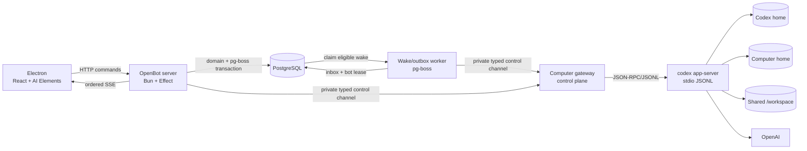

# v0 release plan

> Implementation update (2026-08-24): this historical release cut began headless, but the repository now also ships the first graphical-computer slice. See `18-v0-implementation-status.md` and `20-graphical-computer-implementation.md` for current scope and evidence.

Status: canonical execution plan  
Last updated: 2026-08-24

## The decision

OpenBot v0 is a local, self-hosted, desktop-first home for persistent Codex bots.

It ships one complete, restart-safe loop:

```text
create a bot
  -> chat with it
  -> watch its real work
  -> approve or cancel when needed
  -> let it read/write the shared OpenBot workspace
  -> restart the desktop and service stack
  -> continue the same bot, chat, Codex thread, and files
```

v0 is not yet a full Grok Bot clone. Its OpenBot computer is real and always-on, but headless. The Electron inspector shows actual runtime, workspace, command, file-change, and approval state. Chrome/Chromium, Thunar, graphical desktops, separate bot screens, screen streaming, screenshots, and human takeover are the next computer milestone.

This cut tests the product's most important premise without tying the first release to the unresolved problem of safely combining parallel graphical sessions with shared browser authentication.

## What a user can do

### First launch

1. The operator supplies the upstream Codex credential outside the UI.
2. `docker compose up --build` starts PostgreSQL, the OpenBot server, and the shared headless Linux computer.
3. The Electron app connects to `localhost` and shows server, computer, Codex, and credential readiness separately.
4. With a missing or invalid credential, bot settings and existing history remain usable; turns are disabled with a precise operator-facing explanation.

### Create bots

1. Click `+ New bot`.
2. Enter a name and short instructions; optionally choose an icon/color.
3. OpenBot creates the durable bot and an organizational folder such as `/workspace/bots/researcher`.
4. The folder is a default working directory, not a privacy boundary. Every bot intentionally shares the same computer and can read shared files.
5. The default conversation appears immediately, but its Codex thread is created lazily on the first message.

### Chat and work

1. Send a text message.
2. The message is durably accepted once using a client idempotency key.
3. Codex starts or resumes the conversation's native thread and works from the bot's default directory.
4. The conversation streams agent text plus compact command, file-change, tool, compaction, and approval rows.
5. The user may allow once, decline, or cancel the active turn.
6. Completed Codex items replace provisional deltas and become the durable product projection.

### Share work through the computer

1. Bot A creates `/workspace/shared/brief.md`.
2. Bot B is asked to review that file.
3. Bot B can read and update it while keeping a separate persona, chat transcript, and Codex thread.
4. The UI explains that this sharing is intentional; separate bots are not separate operating-system users or security principals.

### Close and resume

1. Quit Electron while the Compose stack stays up.
2. Reopen Electron and restore the last-selected bot and durable transcript.
3. Recreate the Compose containers with named volumes retained.
4. OpenBot initializes app-server, resumes the stored Codex thread, and starts the next turn in the same workspace.
5. If native thread state is missing, keep the transcript and files readable, mark the conversation detached, and require an explicit new thread. Never silently fake continuity.

## The v0 desktop

```text
┌──────────────────┬──────────────────────────────────────┬──────────────────────┐
│ Bots             │ Conversation                         │ Activity inspector   │
│                  │                                      │                      │
│ + New bot        │ bot header + runtime status          │ server/computer      │
│ search           │                                      │ Codex readiness      │
│                  │ user + agent messages                │ working directory    │
│ bot rows         │ command/file/tool activity           │ current run          │
│                  │ approvals                            │ recent activity      │
│                  │                                      │ diagnostics          │
│ settings         │ text composer                        │                      │
└──────────────────┴──────────────────────────────────────┴──────────────────────┘
```

The renderer uses React 19, Vite, Tailwind CSS 4, shadcn/ui CSS variables, and pinned source-owned AI Elements conversation primitives. OpenBot owns the shell, domain adapter, state, transport, and inspector. Electron never calls a model or holds the upstream credential.

The v0 UI includes:

- bot list, filter, create/edit/archive;
- one exposed default conversation per bot;
- streaming Markdown messages;
- collapsible command, terminal, tool, file-change, compaction, and error rows;
- inline one-time approval cards;
- cancel, retry-safe submission, offline, degraded, detached, and recovery states;
- light/dark theme, keyboard access, reduced motion, and correct long-transcript anchoring;
- a headless activity inspector with no fake screen thumbnail, plugin button, routine button, voice button, or attachment control.

## Hard scope boundary

### In v0

- one implicit local user;
- Electron desktop client, tested on macOS first;
- Bun/Turborepo/TypeScript monorepo;
- Bun + Effect server;
- Prisma + PostgreSQL product persistence;
- a durable `InboxEvent` mailbox and pg-boss wake worker;
- one Compose-managed shared headless Linux computer;
- pinned `codex app-server` as the agent driver;
- create/edit/archive bots;
- one visible default conversation per bot;
- text input and streaming output;
- Codex-native shell/read/file work inside the shared computer policy;
- command and file approvals;
- cancel and explicit terminal run states;
- native Codex thread continuation and compaction;
- snapshot plus replayable SSE desktop state;
- restart, recovery, backup, and local self-hosting documentation.

### Not in v0

- OpenBot accounts, sessions, teams, or public deployment;
- browser client or remote server connection;
- graphical Linux desktop, Chrome/Chromium, Thunar, screen streaming, takeover, or screenshots;
- access to the user's physical Mac/Windows/Linux computer;
- plugins, MCP marketplace, connectors, OAuth, or secret requests;
- agent-to-agent messages, group rooms, delegation, or background agent wakes;
- routines, schedules, proactive notifications, or user-visible queue controls;
- explicit long-term memory, semantic retrieval, vector databases, or cross-chat user memory;
- attachments, images, voice, reactions, widgets, or rich outbound `SendMessage`;
- multiple visible conversations, forks, branching, or steering an active turn;
- model picker and per-bot model overrides;
- code signing, notarization, auto-update, or Windows/Linux packages.

The architecture reserves clean boundaries for these features, but the first migration and UI do not contain dead placeholder records or controls for them.

## Runtime architecture



Compose contains four services:

1. `postgres`: product database;
2. `server`: public localhost API, transactions, event stream, run coordination, and recovery;
3. `worker`: pg-boss wake/outbox/recovery workers, using pinned Bun if verified or Node 22 otherwise;
4. `computer`: private, non-root runtime gateway plus the pinned Codex binary and agent execution environment.

Electron is a native process outside Compose. Only the server port is published, and it binds to `127.0.0.1` because v0 has no user auth. The database and computer gateway are reachable only on the internal Compose network.

The gateway must not expose the agent's shell as an OpenBot control-plane credential. Server-to-gateway calls use a typed, authenticated private channel; the gateway does not pass that credential into the Codex child or agent command environment. The computer container drops unnecessary capabilities, exposes no Docker socket or host-home mount, and runs Codex as a non-root agent user.

Named volumes are separate and backed up together:

- `openbot_postgres` for product records;
- `openbot_codex_home` for native thread rollouts/configuration;
- `openbot_computer_home` for durable user-level computer state;
- `openbot_workspace` for files shared by all bots.

## Codex contract

Use the official [Codex app-server](https://developers.openai.com/codex/app-server/) rich-client protocol rather than inventing a Chat Completions history loop.

The adapter:

- starts the pinned binary over stdio;
- sends `initialize` and `initialized` once per process;
- uses `thread/start` for the first turn and stores the returned `thread.id` and `thread.sessionId`;
- uses `thread/resume` after a cold process/server restart;
- sends text through `turn/start`;
- consumes item/message deltas and authoritative completed items;
- maps server-initiated approval requests to durable OpenBot approvals;
- uses `turn/interrupt` for cancel;
- renders native compaction events and may expose manual compaction later;
- avoids experimental app-server capabilities in v0;
- commits generated TypeScript protocol types from the exact pinned Codex version.

Each v0 bot owns one home conversation that maps immutably to one non-ephemeral Codex thread. Postgres is the UI/product source of truth; the Codex rollout is the model-history source of truth. OpenBot does not rebuild model history from displayed message bubbles on every turn.

## Minimal persistence model

The first Prisma migration contains only records required by the release:

| Record | Purpose |
|---|---|
| `Computer` | One installation-scoped runtime host and its health/capabilities. |
| `Bot` | Name, icon/color, instructions, default directory, status, timestamps. |
| `Conversation` | Bot ownership, Codex thread/session IDs, continuity status. |
| `Message` | Durable user/assistant text projection and lifecycle. |
| `Run` | One submitted turn and durable terminal status. |
| `InboxEvent` | Durable bot mailbox event; pg-boss jobs only wake its consumer. |
| `BotRunLease` | Strict one-active-turn-per-bot lease. |
| `OutboxDelivery` | Idempotent visible/tool delivery after durable commit. |
| `RunItem` | Commands, file changes, tools, summaries, compaction, and errors. |
| `Approval` | Durable user decision mapped to a live app-server request. |
| `Event` | Monotonic sequence for SSE replay and recovery. |
| `IdempotencyRecord` | Exactly-once product command acceptance. |

Do not put plugin, connection, OAuth, memory, routine, peer-channel, group-round, artifact, reaction, screen, or host-device tables in the first migration. The internal bot inbox/run lease/outbox are v0 infrastructure and do not expose peer messaging yet.

## Required invariants

1. At most one active run exists per bot home thread.
2. A client message id creates at most one user message and run in that conversation.
3. A conversation's Codex thread association is immutable after attachment.
4. Completed Codex items override provisional deltas.
5. One approval decision resolves one pending runtime request at most once.
6. A path from the renderer never broadens the computer's configured roots.
7. Bot default folders organize work but never imply bot-to-bot secrecy.
8. Closing Electron never owns or terminates the server/computer lifecycle.
9. A hard runtime crash produces an explicit interrupted/expired state; v0 does not claim exactly-once model execution.
10. No credential, hidden chain-of-thought, raw process environment, or unredacted secret is stored in the transcript or ordinary Prisma columns.

## Implementation milestones

### M0 — lock contracts

Deliver:

- monorepo folders and package boundaries;
- Effect Schema configuration/API/event contracts;
- pinned toolchain/version policy;
- initial Prisma schema;
- AI Elements source/version list;
- a fake app-server fixture protocol.

Gate: the repo installs, typechecks, tests, and builds from its root.

### M1 — prove the three technical risks

Run three short spikes before the product UI grows:

1. Bun child-process/app-server spike: initialize, start/resume thread, start/cancel turn, receive deltas/completed items, and resolve an approval.
2. Electron/Vite/AI Elements spike: package the selected source-owned components with React 19, Tailwind 4, strict CSP, no Next.js, and no renderer model credential.
3. pg-boss worker spike: atomically enqueue through the Prisma adapter, verify transaction rollback, claim and heartbeat work, kill a worker mid-job, recover it, and verify `LISTEN/NOTIFY` reconnects with polling as a backstop.

Gate: all three spikes work in production-like builds. If Bun cannot reliably supervise app-server, isolate only the protocol adapter in a tiny Node sidecar. If pg-boss does not pass its contract suite under Bun, run only `apps/worker` on Node 22. Do not migrate the whole server away from Bun.

### M2 — make persistence boring

Deliver:

- Compose services, health checks, localhost binding, and named volumes;
- Prisma migration/startup flow;
- bot CRUD and idempotent workspace-folder provisioning;
- conversation/message/run/run-item/approval/event repositories;
- authoritative `InboxEvent`, `BotRunLease`, and `OutboxDelivery` repositories;
- pg-boss schema setup plus wake, retry, dead-letter, and startup recovery behavior;
- event replay and startup recovery;
- fake-runtime integration suite.

Gate: create two bots, atomically commit each accepted message with its wake, restart/recreate services with volumes retained, and recover all product records, pending inbox work, and shared files.

### M3 — complete the API/runtime vertical slice

Deliver:

- lazy thread creation and durable mapping;
- turn start/resume, item projection, cancel, approval, and error mapping;
- per-bot active-run lease for the immutable home thread;
- hot thread resume/subscription at startup without starting an idle model turn;
- idempotent message command;
- activity and safe diagnostics endpoints;
- real Codex smoke test when a credential is available.

Gate: Bot A and Bot B complete separate streamed turns, share a file intentionally, restart the runtime, and each continue the correct native thread.

### M4 — build the desktop product loop

Deliver:

- secure Electron main/preload/renderer boundary;
- bot rail and create/edit/archive flows;
- AI Elements transcript, activity rows, approvals, and text composer;
- activity inspector and failure/recovery states;
- snapshot plus SSE reducer with reconnect/replay;
- packaged macOS test build, light/dark theme, keyboard and long-history checks.

Gate: every v0 user flow works without developer tools or direct database access.

### M5 — harden and release

Deliver:

- full restart matrix and app-server crash tests;
- duplicate submission, wrong approval, and cancellation tests;
- missing credential, missing rollout, corrupt event, and offline desktop handling;
- database plus volume backup/restore runbook;
- clean-checkout self-hosting guide and limitation disclosure;
- dependency/license inventory and secret/redaction review.

Gate: every release criterion below passes from a clean checkout.

## Release criteria

v0 is done only when all of these are demonstrated:

| Area | Required proof |
|---|---|
| Bootstrap | A clean checkout reaches healthy services with one `docker compose up --build` after the operator supplies the documented upstream credential. |
| Bots | Electron creates, edits, lists, switches, and archives two bots. |
| Isolation model | The bots keep separate instructions, transcripts, and Codex threads while intentionally sharing `/workspace`. |
| Streaming | A real turn streams text/activity and reconciles to authoritative completed items without duplicates. |
| Safety | Allow-once, decline, cancel, path containment, non-root execution, and localhost-only exposure work as documented. |
| Persistence | Electron, server, computer, app-server, and full Compose recreation preserve the expected database, threads, and files. |
| Recovery | App-server crash, stale approval, interrupted run, and missing rollout become explicit recoverable or detached states. |
| Durable queue | Message plus wake commits atomically; duplicate wakes do not duplicate a turn or visible output; a killed worker recovers eligible work. |
| Idempotency | Retrying one client message key never creates two messages or two turns. |
| UI | The packaged renderer passes CSP, sanitization, long-history, scroll anchoring, keyboard, dark, and reduced-motion tests. |
| Honesty | The app exposes no fake screen, plugin, routine, memory, attachment, voice, group, or physical-computer control. |
| Operations | Backup/restore and version-pinned upgrade instructions reproduce the tested state. |

## Post-v0 order

After the release gate, build outward in this order unless user evidence changes the priority:

1. **Graphical computer:** Chrome/Chromium, Thunar, terminal, bot-specific work surfaces, safe shared browser-state design, screen stream, screenshot, takeover lease, emergency stop.
2. **Direct agent communication:** durable fire-and-forget `SendToAgent`, one-active-turn-per-bot scheduler, view-only peer transcript, priority semantics, loop budgets.
3. **Group rooms:** deterministic sequential rounds, per-member cursor, explicit-send-only output, silence as success.
4. **Plugin foundation:** Agent Plugin packaging, skills, MCP connectors, encrypted account connections, bot grants, approval and audit gateway.
5. **Routines and durable memory:** typed records and state commands; no generic unvalidated state blob.
6. **Physical host bridge:** separately enrolled native daemon with explicit capabilities and approvals.

The deeper specifications remain in `10-grok-computer-research.md` through `15-agent-group-chat-runtime.md`; they inform boundaries but do not expand v0.

## Build-start checklist

Before scaffolding the first implementation commit:

- accept this document and `02-mvp-v0.md` as the release boundary;
- pin Bun, Electron, PostgreSQL, Prisma, Effect, React, Tailwind, AI Elements revision, and Codex CLI/app-server versions;
- verify the pinned app-server generated schemas and instruction-injection field;
- choose the one documented upstream credential mode;
- define the private server-to-computer authentication mechanism without exposing it to the agent environment;
- record the two spike outcomes as ADRs;
- create the first migration without post-v0 placeholder tables.

No remaining product choice blocks scaffolding. The only v0 architecture fallback already has a boundary: if Bun cannot supervise app-server reliably, use a Node protocol sidecar while keeping the server, domain, and monorepo on Bun.
