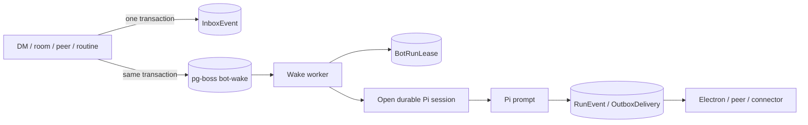

# Durable agents, wake queue, and shared screens

Status: durable queue, ScreenBroker, and BrowserBroker implemented  
Last updated: 2026-08-25

> Runtime update: each durable actor now owns one Pi session rather than one Codex thread. The Postgres/pg-boss mailbox model is unchanged. The encrypted computer-scoped cookie broker described as future work in older passages now ships; non-cookie browser state remains deferred. See `21-shared-workspaces-and-browser-authority.md` and `27-pi-agent-runtime.md`.

## Decision

OpenBot treats a bot as a durable actor, not a permanently executing model process.

Each bot owns one non-ephemeral Pi session, one durable Postgres inbox, and one stable logical screen identity on the installation's shared computer. The implemented ScreenBroker materializes that identity as an Xvfb display and noVNC endpoint. The session is reopened on demand, and the bot consumes model tokens only when a turn starts. Runtime state and screens can be recreated from Postgres plus the persistent Pi/computer volumes.

Use [pg-boss](https://pgboss.io/) as the Postgres-backed wake, retry, scheduling, and dead-letter mechanism. Keep OpenBot's own `InboxEvent` and `OutboxDelivery` records authoritative; pg-boss jobs are delivery hints and work leases, not the product transcript or sole record that a user/peer event existed.

## Durable actor flow



The enqueue path commits the domain event and pg-boss wake atomically through pg-boss's Prisma transaction adapter. If that transaction rolls back, neither exists. Enable pg-boss `LISTEN/NOTIFY` for low-latency wakes while retaining polling as the correctness backstop.

The first queues are fixed infrastructure names, not one queue per bot:

```text
bot-wake
outbox-delivery
maintenance
```

`bot-wake` jobs contain only `botId`. The worker reads the authoritative inbox ordered by priority and creation time. Repeated messages may coalesce into one outstanding wake without losing any message.

Direct user follow-ups have a live delivery path without giving up that durable inbox. When the
bot is already executing a user run in the same DM, the accepted `InboxEvent` uses `steer` delivery
mode and Pi inserts it after the current assistant/tool step, before the next model call. Pi emits an
`input.delivered` acknowledgement through the existing turn stream. An unacknowledged steer is
atomically promoted to `turn` mode with its own queued `Run` when the active run ends, the computer
rejects delivery, or recovery finds it without a live bot lease.

Direct user input never steers a peer, group, or bootstrap delivery because doing so would blur the
active channel and tool capability. Those non-user runs are interrupted and the user input keeps
its own DM run. Ordinary peer and group messages continue to queue as fresh turns.

Use a pg-boss singleton/stately key of `botId` to reduce redundant concurrent wake jobs, and still acquire an OpenBot `BotRunLease` before `turn/start`. The database lease is the strict final guard: queue policy is not the bot-session security or correctness boundary.

## Delivery guarantees

OpenBot claims:

- exactly-once acceptance for an idempotent product command;
- at-least-once wake execution;
- idempotent tool and outbox projection keyed by model tool-call ID or delivery ID;
- one active Pi turn per bot;
- explicit `unknown`/`interrupted` recovery for an ambiguous toolful crash.

It does not claim exactly-once model execution or exactly-once external side effects. A worker crash after an email, shell command, or computer action but before acknowledgement can leave an ambiguous result. `SendMessage` and `SendToAgent` must use transactional outbox/idempotency records; non-idempotent shell/computer actions are never blindly replayed.

## Runtime choice and Bun compatibility

The current pg-boss release documents Node 22.12+ and PostgreSQL 13+ as supported runtimes. Its Prisma adapter requires Prisma 7+ with `@prisma/adapter-pg`.

The monorepo, package manager, server, shared packages, and source remain Bun/TypeScript. Before choosing the worker runtime, run the pg-boss contract suite under the pinned Bun version:

1. enqueue in a Prisma transaction and verify rollback;
2. claim, heartbeat, complete, fail, retry, and dead-letter;
3. kill a worker during a long bot turn and verify recovery;
4. verify `LISTEN/NOTIFY` reconnect plus polling fallback;
5. verify singleton/stately behavior for many bot IDs.

If any supported contract fails, run only `apps/worker` on Node 22 from the same TypeScript monorepo. A small Node worker sidecar is preferable to maintaining a home-grown queue. Graphile Worker is the runner-up, but it also documents a Node runtime requirement and has no architectural advantage for this stack.

## Durable Pi sessions

OpenBot reopens a bot's persistent Pi JSONL session when its mailbox receives work. The worker/computer process may retain a hot session while a turn is active, but durable identity never depends on an in-memory subscription.

Loaded does not mean running:

- no turn exists while the inbox is empty;
- no model request is made merely to keep a bot online;
- a cold restart reopens the stored `runtimeSessionPath`;
- a missing session file marks the bot detached rather than silently creating a replacement identity;
- idle sessions can be released and reopened on the next durable wake without changing product semantics.

One embedded Pi host can serve many bot sessions while OpenBot binds every custom tool call to the active bot and run. A per-bot process pool is needed only if a later executable plugin or isolation boundary cannot be enforced safely in the shared host.

## How Grok can show different screens over one filesystem

xAI publicly documents the contract, not the display implementation: every bot for one user uses the same persistent computer, files, browser cookies, signed-in sessions, and CLI credentials, while each bot receives a separate screen. Those screens are parallel work surfaces rather than isolation boundaries. See [Use the computer and apps](https://docs.x.ai/grok-bot/computer-and-apps).

Processes, display sessions, and filesystem namespaces are independent. One Linux VM/container can run several windows, virtual monitors, workspaces, nested compositors, or remote-desktop surfaces under one OS user and one mounted home/workspace. Therefore two bots can see different pixels and operate different Chrome windows while both read `/workspace/project/file.md` immediately.

The exact Grok mechanism is unpublished. Plausible implementations include:

- one compositor with one virtual output/workspace per bot;
- nested compositors or virtual displays under the same Linux user;
- a browser broker with a computer-scoped persistent profile and bot-scoped windows/tabs;
- multiple desktop processes with a shared filesystem and a separate safe authentication/session broker.

Separate bot containers mounting the same `/workspace` would share files, but independent Chrome profiles would not automatically share Grok-like cookies and signed-in sessions. Mounting one writable Chrome profile into several concurrent Chrome processes is unsafe because of profile locking and corruption risk. Container-per-bot is therefore not the default Grok-parity design.

## Selected OpenBot computer boundary

Use one Compose `computer` service per installation in the no-auth v0. The durable core, `ScreenBroker`, and encrypted cookie `BrowserBroker` share this boundary without changing bot, filesystem, or queue identity:

```text
computer service
├── one non-root openbot OS user
├── shared persistent /home/openbot
├── shared persistent /workspace
├── embedded Pi host and durable bot sessions
├── ScreenBroker
│   ├── Bot A logical screen + input lease
│   └── Bot B logical screen + input lease
└── BrowserBroker
    ├── computer-scoped durable authentication/profile
    ├── Bot A windows/targets
    └── Bot B windows/targets
```

The completed first spike chose one Xvfb-backed XFCE desktop per bot inside the same computer container. This delivered correct independent pixels, focus, capture, input, and shared-file behavior quickly. Chromium profiles remain bot-scoped to prevent concurrent profile locking/corruption, while BrowserBroker synchronizes ordinary cookies through loopback CDP and an encrypted computer-scoped jar. Local storage, IndexedDB, saved passwords, extensions, and explicit focus-independent target routing remain outside that parity boundary.

If one shared compositor cannot provide safe parallel focus/input, test nested compositors or virtual displays while preserving a central browser/session broker. Do not solve screen separation by silently changing filesystem, credential, or cookie scope.

LinuxServer Webtop is useful as an image/streaming reference and can provide a browser-visible desktop, but a stock single Webtop session does not itself implement Grok's dynamic bot-screen broker. OpenBot still needs `ScreenBroker`, per-screen capture/stream routing, input leases, recovery, and a global emergency stop.

## Compose topology

```text
postgres   PostgreSQL plus pg-boss schema
server     Bun + Effect HTTP/SSE/product transactions
worker     pg-boss wake/outbox/recovery workers
computer   Pi + shared files + graphical screen/browser brokers
desktop    Electron process outside Compose
```

The server and allocated noVNC viewer range bind only to `127.0.0.1`; the computer gateway, raw VNC ports, PostgreSQL, and Docker socket remain inaccessible. Viewer URLs are returned through the authenticated-local server API, while noVNC websocket traffic connects to loopback ports directly. Bot screens are logical sessions managed inside the computer boundary, not dynamically spawned sibling containers.

## Acceptance gates

The durable-agent slice is complete when:

1. A message and its pg-boss wake commit or roll back together.
2. Two bots run in parallel while one bot never has two active turns.
3. Killing server, worker, app-server, or the full Compose stack preserves inboxes, threads, messages, and `/workspace`.
4. A loaded idle bot makes no model request but begins promptly after a wake.
5. Duplicate wakes do not duplicate visible messages or peer delivery.
6. An ambiguous non-idempotent crash is surfaced rather than automatically replayed.

The graphical-computer slice additionally requires:

1. Bot A and Bot B show independent live screen streams.
2. Both immediately observe the same `/workspace` files.
3. A supported browser sign-in made on one screen is available from the other through the brokered computer-scoped session.
4. Parallel browser work does not corrupt the profile or route input to the wrong bot.
5. Human takeover, reconnect, restart, and emergency stop are tested.
