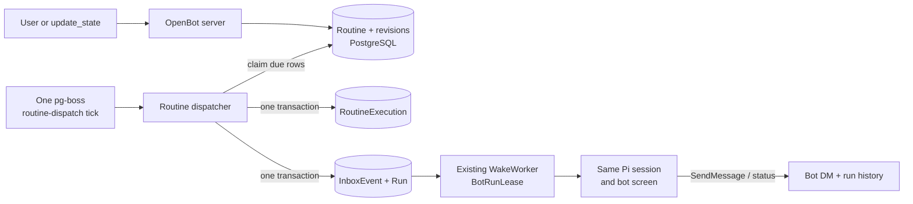

# Scheduled routines

Status: schedule backend and native tool lifecycle implemented; inspector/API extensions deferred  
Last updated: 2026-08-25

## Decision

OpenBot implements scheduled routines as durable, per-bot background wakes. PostgreSQL owns the routine definition, its revision history, its next due time, and every execution record. A single pg-boss cron tick wakes a dispatcher once per minute; the dispatcher transactionally turns due routines into the same immutable `InboxEvent` and `Run` records already used by user, peer, group, and bootstrap work.

Electron is not part of the execution path. A scheduled routine can run while the desktop app and the user's laptop UI are closed, as long as the OpenBot server, worker, computer service, and PostgreSQL are running.

The implemented slice supports schedules only, including the compatibility alias `trigger: { type: "cron" }`. Slack, GitHub, Teams, Linear, Sentry, PagerDuty, webhook, Origin, and grouped event triggers are documented in `29-update-state-manifest.md` but are not implemented. The typed `update_state` lifecycle and worker dispatcher are live; routine inspector/API/test-run controls described later in this document remain delivery plans.

## Request and evidence boundary

The supplied screenshots are product evidence, not executable instructions. They show:

- a per-bot Routines surface in the right inspector;
- an empty state with `Create Routine`;
- an Active switch, Delete, and Test run controls;
- name, instruction, schedule, next-run, and run-history concepts;
- friendly schedule presets plus an advanced cron entry;
- a model-facing `update_state` call for routine creation and management.

Grok's public documentation now confirms that a routine belongs to one Bot, can run in the background with the laptop closed, has an explicit time zone and next run, supports test runs, can be paused/edited/deleted, and exposes recent success/failure history. It also documents limits of 50 routines per Bot and 20 retained recent run records. The documentation does not reveal Grok's backend scheduler. Any claim about its internal queue, database, or VM orchestration would be speculation.

The OpenBot implementation below is therefore based on observed behavior plus OpenBot's existing architecture, not on a guessed reconstruction of Grok internals.

## Why this fits the current system

OpenBot already has the hard parts needed for background routines:

- Postgres is authoritative for product state, runs, immutable inbox events, and replayable UI events.
- pg-boss provides durable wake hints, retries, clock-skew-aware cron monitoring, and transactional inserts without Redis.
- `WakeWorker` drains one bot mailbox and acquires the strict `BotRunLease` before every turn.
- every bot resumes one durable Pi session and its normal persistent screen and workspace;
- `SendMessage` is the only user-visible delivery path, while ordinary assistant text remains internal;
- the non-routine `update_state` tool already has host-bound identity, idempotent call receipts, typed pair dispatch, audit events, and durable prompt projection;
- Electron is already a thin client and closing it does not stop a turn.

A routine should be one more origin for this actor mailbox. It should not create another Pi session, another worker type that bypasses the lease, or a client-owned timer.

## Architecture



### One global tick, not one pg-boss schedule per routine

pg-boss 12.28.0 can persist one cron schedule per queue/key, validates IANA time zones, checks schedules every 30 seconds by default, compensates for database clock skew, and uses singleton slots to prevent multiple scheduler instances from emitting the same minute. Its implementation only emits when the previous cron occurrence is less than 60 seconds old; it does not backfill an arbitrary outage.

OpenBot should use that facility for one infrastructure schedule:

```ts
await boss.schedule("routine-dispatch", "* * * * *");
```

The domain `Routine.nextRunAt` remains authoritative. This gives OpenBot one transactional place to implement pause, resume, update, deletion, next-run display, missed-run policy, overlap suppression, test runs, and restart recovery. Registering every user routine directly in pg-boss would split authority between the product tables and pg-boss's private schedule table and make those semantics harder to audit.

The server's pg-boss instance should start with scheduling disabled; the computer service does not use pg-boss. The worker is the scheduler leader, although pg-boss and the database claim logic must still be safe if more than one worker instance is started.

## Domain model

### Enum changes

- add `routine` to `RunOrigin`;
- add `scheduled` and `test` to a new `RoutineExecutionKind`;
- add `queued`, `running`, `waiting_approval`, `completed`, `failed`, `cancelled`, and `skipped` to `RoutineExecutionStatus`.

### `Routine`

| Field | Meaning |
|---|---|
| `id` | Opaque UUID returned through APIs and `update_state` |
| `botId` | Owning bot; ownership never comes from model arguments |
| `name` | User-facing name, 1-80 characters |
| `prompt` | Instruction injected on every execution, up to 50,000 characters |
| `scheduleText` | Original accepted schedule for display and compatibility |
| `scheduleKind` | `cron` or `interval` |
| `cronExpression` | Canonical five-field cron for cron schedules |
| `intervalSeconds` | Fixed elapsed interval for `@every` schedules |
| `timezoneMode` | `installation` or `pinned` |
| `timezone` | Current resolved IANA time zone for cron evaluation |
| `enabled` | Whether future scheduled occurrences may be created |
| `revision` | Monotonic optimistic-concurrency and stale-wake fence |
| `nextRunAt` | Authoritative next due instant, null while paused/deleted |
| `pausedAt` | Most recent pause time |
| `deletedAt` | Soft-delete marker; deleted routines disappear from normal reads |
| timestamps | Creation and last update audit fields |

Indexes:

- `(enabled, nextRunAt)` with deleted rows excluded where practical;
- `(botId, deletedAt, updatedAt)` for the inspector;
- enforce at most 50 non-deleted routines per bot in the command transaction.

### `RoutineRevision`

Every create or content update appends an immutable snapshot containing the routine ID, revision number, name, prompt, normalized schedule, time-zone resolution, enabled state, source (`ui` or `agent`), initiating run/call IDs when present, and timestamp.

`Routine` holds the current projection. `RoutineRevision` is the history promised by the compatibility manifest and ensures an already-running execution can always be explained after later edits.

### `RoutineExecution`

| Field | Meaning |
|---|---|
| `id` | One scheduled or test occurrence |
| `routineId` / `routineRevisionId` | Definition and exact immutable revision used |
| `runId` | Existing OpenBot run, null only for a skipped occurrence |
| `kind` | `scheduled` or `test` |
| `status` | Execution/run-history state |
| `dedupeKey` | Unique occurrence key |
| `scheduledFor` | Intended wall-clock instant; test runs use request time |
| `enqueuedAt`, `startedAt`, `completedAt` | Timing and latency audit |
| `skipReason` | `misfire`, `overlap`, `paused`, `deleted`, or `stale_revision` |
| `error` | Bounded structured terminal failure |

A scheduled dedupe key is `routine:<id>:revision:<n>:at:<ISO instant>`. A test uses its idempotent client request ID. The unique key makes dispatcher retries harmless.

`Run` gains an optional one-to-one relation to `RoutineExecution`. The hidden input `Message` is role `system`; scheduled work must never appear as a user-authored chat bubble.

## Schedule contract

### Accepted input

The compatibility `schedule` string accepts:

- exactly five cron fields, such as `0 7 * * 1-5`;
- an optional `CRON_TZ=<IANA>` prefix, such as `CRON_TZ=America/New_York 0 7 * * 1-5`;
- `@hourly`, `@daily`, `@weekly`, and `@monthly`;
- a fixed interval such as `@every 30m`, with `m`, `h`, or `d` units;
- the equivalent compatibility wrapper `{ type: "cron", schedule: "..." }` when supplied through `trigger`.

Aliases are expanded before storage. Six-field cron is rejected because pg-boss checks schedules on a sub-minute cadence but the public contract promises minute precision. `@every` is parsed as an elapsed interval anchored at create, schedule update, or resume time; it is not rewritten into a misleading wall-clock cron. `CRON_TZ` is rejected on an interval because elapsed intervals do not have a wall-clock zone.

Use `cron-parser` 5.10.x as a direct pinned dependency for parsing and next-run calculation. Do not depend on the transitive copy hidden under pg-boss.

### Time zones

OpenBot needs an installation-scoped IANA time-zone setting as part of this milestone. Initialize it from `OPENBOT_TIME_ZONE`, falling back to `UTC`, and let the desktop show/edit it. A browser-detected zone may be offered as a suggestion but must not silently rewrite existing schedules.

- schedules without `CRON_TZ` use `timezoneMode=installation` and are recalculated when the installation zone changes;
- schedules with `CRON_TZ` use `timezoneMode=pinned` and do not move with the installation setting;
- API views always return the resolved zone and the next run as an absolute timestamp plus a display label.

The pinned parser handles DST. Contract tests must pin its behavior: a nonexistent spring-forward time advances according to the library's documented transition behavior, and a repeated fall-back wall time fires once, not twice.

### Frequency bounds

Initial guardrails:

- minimum effective interval: 5 minutes;
- maximum `@every` interval: 30 days;
- maximum 50 active/non-deleted routines per bot;
- no more than one nonterminal execution for one routine.

Cron validation should inspect a bounded sequence of future occurrences and reject schedules whose gap falls below five minutes. These bounds prevent accidental usage storms while keeping the five-field contract.

## Dispatch transaction

The `routine-dispatch` handler drains due rows in bounded batches. Each batch uses database time and row locks:

```sql
SELECT id
FROM "Routine"
WHERE enabled = true
  AND "deletedAt" IS NULL
  AND "nextRunAt" <= clock_timestamp()
ORDER BY "nextRunAt", id
FOR UPDATE SKIP LOCKED
LIMIT 100;
```

For each locked routine, in one Prisma transaction:

1. Re-read the current routine/revision and capture `scheduledFor = nextRunAt`.
2. Calculate the first next occurrence strictly after database `now` so missed intervals do not create a replay storm.
3. Update `nextRunAt` before releasing the lock.
4. If disabled, deleted, stale, outside the misfire grace window, or overlapping, insert one skipped `RoutineExecution` and stop.
5. Otherwise insert the unique `RoutineExecution`, a hidden system `Message`, `Run(origin=routine)`, and immutable `InboxEvent(type=routine.scheduled)`.
6. Insert the normal `bot-wake` pg-boss hint through `fromPrisma(tx)` so the hint commits atomically with the inbox.
7. Append `routine.execution.queued` and `routine.next_run_changed` replay events.

PostgreSQL documents `FOR UPDATE SKIP LOCKED` as appropriate for queue-like consumers. It is not the source of correctness on its own; the unique `dedupeKey`, row revision, and immutable inbox idempotency key are the duplicate fences.

## Missed and overlapping runs

These semantics are explicit for the first release:

- **Short outage:** enqueue one occurrence when it is no more than 15 minutes late.
- **Long outage:** write one `skipped/misfire` history row and advance to the first future occurrence. Do not replay every missed run.
- **Overlap:** if the same routine already has a queued, running, or waiting execution, write `skipped/overlap` and advance. Do not build a backlog.
- **Bot contention:** a queued routine may wait behind user, peer, and group work under the existing bot lease. That is not overlap with another routine execution unless it is the same routine.
- **Delivery:** scheduled work has mailbox priority 100, below group work at 150. A user-requested Test run has priority 290.

The product must describe execution as durable at-least-once work, not exactly-once external side effects. A process can crash after a website or external service accepted an action but before OpenBot committed completion. Routine prompts and future connector tools should use source-system idempotency keys whenever possible.

## Lifecycle commands

All UI and tool paths call one typed `RoutineService` rather than patching Prisma rows directly.

### Create

- validate name, prompt, and schedule;
- bind the active bot from the host tool context or URL, never from a model field;
- append revision 1;
- set `nextRunAt` when enabled, otherwise leave it null;
- return the full view including normalized schedule, resolved time zone, and next run.

### Update

- omitted fields stay unchanged;
- append a new revision only when definition fields or enabled state change;
- recompute `nextRunAt` after a schedule/time-zone change;
- cancel a not-yet-started scheduled occurrence whose prompt/schedule snapshot is now stale;
- never rewrite a running execution; its revision snapshot remains authoritative.

### Pause and resume

- pause prevents future occurrences and cancels not-yet-started scheduled occurrences;
- pause does not abort a turn that is already running;
- resume calculates the next occurrence strictly after resume time and performs no catch-up;
- both are idempotent.

### Delete

- soft-delete the routine, clear `nextRunAt`, and cancel its not-yet-started scheduled occurrence;
- do not silently abort an already-running turn;
- hide it from normal reads immediately while retaining audit/revision history;
- deleting a Bot cascades its routine records as part of the existing Bot lifecycle.

### Test run

- performs real work through the same Pi session, tools, workspace, and screen;
- is allowed while the schedule is paused and does not change `nextRunAt`;
- snapshots the current revision and appears in run history as `test`;
- rejects with `409 routine_already_running` when that routine already has a nonterminal execution;
- requires an idempotency key because double-clicks must not create two tests.

## Wake envelope

The scheduled wake content should be explicit and stable:

```text
[OpenBot scheduled routine]
Routine: <name>
Routine ID: <id>
Execution ID: <execution-id>
Scheduled for: <absolute timestamp> (<local time and IANA zone>)

Instruction:
<prompt snapshot>

This is an unattended background wake, not a user message.
Use current sources; report missing or stale inputs instead of inventing data.
Use SendMessage to publish a useful result or a failure that needs attention in your direct conversation.
Finishing without SendMessage is a valid silent completion.
Do not create, edit, resume, or delete routines unless the instruction explicitly requires routine management.
```

The wake uses the bot's home DM `channelId`, default workspace, screen, and one existing Pi session. `SendMessage` therefore publishes to the bot's normal direct conversation. Plain Pi assistant output stays internal run activity, consistent with peer/group/background behavior.

## `update_state` routine slice

Extend the shipped Pi `update_state` tool and its existing authenticated internal route. Keep the current non-routine pairs unchanged and add these routine pairs:

- `routine/create`
- `routine/update`
- `routine/pause`
- `routine/resume`
- `routine/delete`

Rules:

- `create` requires `name`, `prompt`, and exactly one of `schedule` or a cron trigger; non-cron triggers return `unsupported_trigger` in this release;
- `update` requires `id` and at least one supported field;
- pause/resume/delete require only `id`;
- `botId`, owner, caller, run, and idempotency key are host-bound;
- the existing `DurableStateService.execute(botId, callId, input)` boundary must receive a trusted routine mutation context containing the validated run origin and channel kind; these are never added as model fields;
- repeat calls with the same `(runId, callId)` return the prior result;
- calls cannot target another Bot's routine even if its UUID is known;
- agent-initiated create/update/resume is allowed only from a direct user-origin run in the first release;
- a routine run may pause itself as a circuit breaker, but unattended runs cannot create, resume, or broaden schedules;
- the response includes exact normalized schedule, zone, enabled state, and next run so the Bot can report what changed.

The tool facade validates `(target, action)` and dispatches to typed commands. It is never an unrestricted durable-state or Prisma patch.

## HTTP and client contract

Add ordinary idempotent endpoints:

```text
GET    /api/v0/bots/:botId/routines
POST   /api/v0/bots/:botId/routines
GET    /api/v0/routines/:routineId
PATCH  /api/v0/routines/:routineId
POST   /api/v0/routines/:routineId/pause
POST   /api/v0/routines/:routineId/resume
POST   /api/v0/routines/:routineId/test
DELETE /api/v0/routines/:routineId
GET    /api/v0/routines/:routineId/executions?limit=20&before=<cursor>
```

Do not put full run history into `ClientSnapshot`. Fetch routine summaries and execution history lazily when the inspector opens, cache by bot/routine, and invalidate those caches on `routine.*` SSE events. This preserves the renderer's current fast-switching and bounded-snapshot work.

Required view fields include `id`, `botId`, `name`, `prompt`, original and normalized schedule, resolved zone, `enabled`, current revision, `nextRunAt`, latest execution summary, and timestamps.

## Desktop experience

Extend the existing inspector instead of building a separate workflow-builder page:

1. The bot summary shows existing routines or the current `Create Routine` empty state.
2. Create opens a compact Routine inspector with Name, Instruction, and When to run.
3. The schedule picker offers Every hour, Every day, Weekdays, Every week, Every month, Interval, and Advanced cron.
4. The detail view uses an Active switch, icon-backed Delete command, Test run button, exact next run, resolved time zone, and recent execution rows.
5. Test run is disabled only while the same routine is active or the draft is invalid; its confirmation explains that it performs real work.
6. Run rows distinguish scheduled/test and success/failure/skipped, show start time and duration, and expand to the associated run activity/error.
7. Inputs must not autosave an incomplete new routine. Existing routine edits may use the current debounced-save pattern, with visible saving/error state and server revision conflict handling.

The first screen remains the working conversation. Routines live in its right-side bot inspector, matching the supplied references and the current OpenBot information architecture.

## Safety and operational policy

- A Test run is not a dry run.
- Routine creation must show the interpreted schedule, zone, and next run before or immediately after persistence.
- Consequential actions remain governed by the same tool and computer boundaries as an ordinary turn. Scheduling never grants a new connector, filesystem root, local-host bridge, or approval rule.
- The current Pi file, shell, and browser paths do not provide a human approval callback. This milestone does not pretend otherwise or silently add one; it keeps external connector/event actions out of scope and labels Test run as real work.
- Prompt text should specify output destination, no-data/stale-data behavior, and approval boundaries.
- Notifications use the owning Bot's existing notification preference.
- Repeated terminal failures should be visible, but automatic pause after inactivity or failure streaks is deferred until its threshold and recovery UX are deliberately designed.
- Secrets never belong in routine prompts or schedule strings.

## Recovery and observability

Worker startup must:

1. create the `routine-dispatch` queue;
2. upsert its one-minute infrastructure schedule;
3. reconcile nonterminal `RoutineExecution` rows against their linked `Run` rows;
4. rely on the next dispatcher tick to recover due `nextRunAt` rows;
5. expose scheduler readiness separately from Pi authentication readiness.

Record metrics/log fields for dispatch lag, due rows claimed, queued, skipped by reason, duplicate fences hit, execution duration, terminal status, and next-run calculation failures. Logs include routine/execution/run IDs but never prompts or tool secrets.

## Implementation slices

### R0: Schedule parser

- add a small `packages/routines` package with the pinned parser;
- implement normalization, IANA validation, next-run calculation, aliases, intervals, and frequency bounds;
- add deterministic clock and DST tests.

### R1: Persistence and contracts

- add Routine, RoutineRevision, and RoutineExecution migrations and relations;
- extend `RunOrigin` and API/SSE schemas;
- add typed command inputs and views;
- add installation time-zone configuration.

### R2: Commands and `update_state`

- implement `RoutineService` lifecycle transactions and idempotency;
- add REST endpoints;
- extend `UpdateStateInput`, `UPDATE_STATE_TOOL`, and `DurableStateService` to dispatch routine pairs into `RoutineService` without regressing the shipped non-routine pairs;
- pass validated run origin and channel kind from `AppService.handleDynamicTool` into the routine command policy;
- enforce bot ownership and origin policy.

### R3: Background dispatch

- add the one pg-boss schedule and dispatcher worker;
- enqueue routine wakes through `AgentMessaging` with priority 100;
- project execution state from linked Run transitions;
- add startup reconciliation, misfire, overlap, and stale-revision handling.

### R4: Inspector and history

- enable the existing `Create Routine` control;
- add list/create/detail/schedule-picker/run-history states;
- implement Test run and pause/resume/delete behavior;
- add lazy routine caches invalidated by routine SSE events.

### R5: End-to-end verification

- run full monorepo checks;
- execute live short-interval, paused, updated, test, overlap, restart, late, failure, and deletion scenarios;
- close Electron before a due time and verify the server completes the run and the reopened client restores it;
- verify two due bots still respect their independent bot leases and one due bot never overlaps itself.

## Acceptance criteria

1. A routine created from the UI or a direct user-origin `update_state` call shows its exact next run and survives all service restarts.
2. Closing Electron has no effect on dispatch or execution.
3. Every scheduled occurrence creates at most one `RoutineExecution`, InboxEvent, and Run despite duplicate ticks or worker retries.
4. Routine runs use the owning bot's one existing Pi session, default workspace, home DM, and strict BotRunLease.
5. Pause/resume/update/delete have the lifecycle behavior defined above and never mutate a running revision snapshot.
6. Missed runs do not replay without bound, and overlapping occurrences do not accumulate.
7. Test run performs real work, is idempotent, appears in history, and does not move the next scheduled run.
8. Plain model text from a routine is not shown as a forged user-facing result; `SendMessage` is required for visible delivery.
9. A bot cannot mutate another bot's routines or use background execution to broaden its schedule authority.
10. The inspector remains responsive and run history is fetched lazily rather than added wholesale to every client snapshot.
11. UTC, pinned IANA zones, installation-zone changes, spring-forward, and fall-back cases have deterministic contract tests.
12. The full typecheck, test, build, Compose restart, and authenticated Pi smoke suite stays green.

## References

- [Grok Bot: Skills and routines](https://docs.x.ai/grok-bot/skills-routines-and-automations)
- [Grok Bot: Settings and notifications](https://docs.x.ai/grok-bot/settings-and-notifications)
- [Grok Bot: Approvals, security, and privacy](https://docs.x.ai/grok-bot/approvals-security-and-privacy)
- [pg-boss 12.28 scheduling](https://pgboss.io/api/scheduling)
- [pg-boss workers and LISTEN/NOTIFY](https://pgboss.io/api/workers)
- [cron-parser](https://www.npmjs.com/package/cron-parser)
- [PostgreSQL locking clause and `SKIP LOCKED`](https://www.postgresql.org/docs/current/sql-select.html#SQL-FOR-UPDATE-SHARE)

These sources were checked on 2026-08-25. Grok sources support product behavior only; the selected OpenBot backend is an implementation decision.
